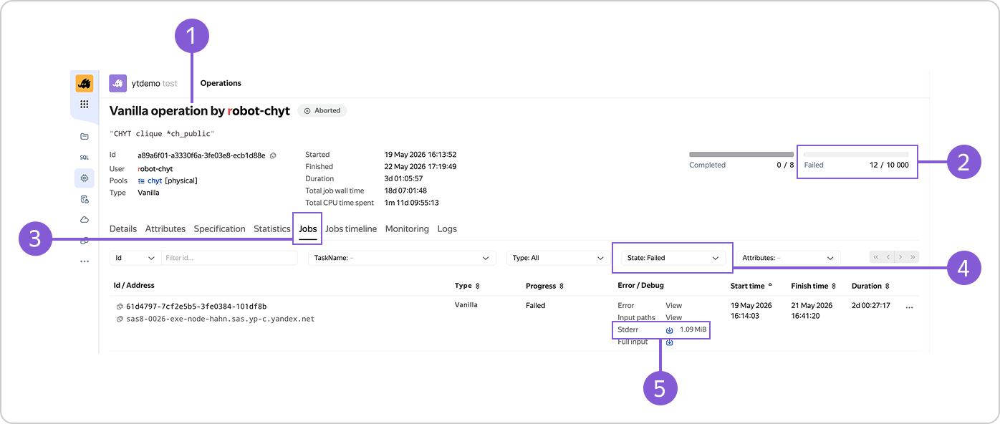

# Проверка упавших джобов

При работе с кликами в {{product-name}} иногда возникают сбои — например, запросы выполняются с ошибками или прерываются. Из-за этих сбоев внутри YT‑операции падают джобы (задания). Чтобы оперативно выявить и устранить проблему, нужно уметь анализировать логи упавших джобов.



Если число упавших джобов операции превысит 100, логирование остановится — логи не сохранятся. Поэтому важно оперативно реагировать на сбои, чтобы избежать потери информации.



## Как посмотреть и проанализировать логи { #instruction }

{ .center }

1. Откройте веб-интерфейс YT‑операции (1), как описано в разделе [Как попасть в веб-интерфейс YT-операции](../../../../../user-guide/data-processing/chyt/cliques/yt-operation-ui.md#get-to-section).
1. Справа в блоке **Failed** (2) проверьте количество упавших джобов.
1. Перейдите на вкладку **Jobs** (3) на панели вкладок.
1. В открывшемся списке джобов с помощью фильтра `State`: `Failed` (4) найдите те, которые упали.
1. В строке с упавшим джобом найдите столбец **Error / Debug**.
1. Чтобы выгрузить лог джоба, в поле **Stderr** (5) нажмите {width=24 height=24}.
1. Изучите лог и обратите внимание на следующее:

    - сообщения об ошибках (обычно содержат ключевые слова *Error*, *Exception*, *Failed*);
    - временные метки (чтобы понять, когда именно произошёл сбой);
    - упоминания ресурсов (например, таблиц или файлов), с которыми работал джоб.



Сохраняйте логи упавших джобов — они пригодятся для:

- мониторинга стабильности системы;  
- анализа повторяющихся ошибок;  
- предоставления данных в в службу поддержки.


