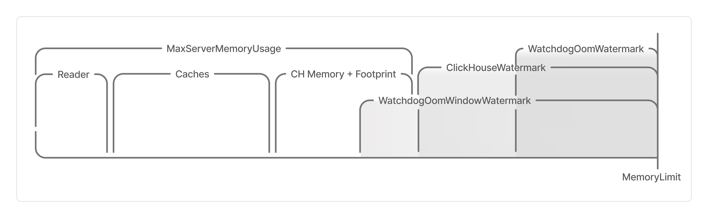
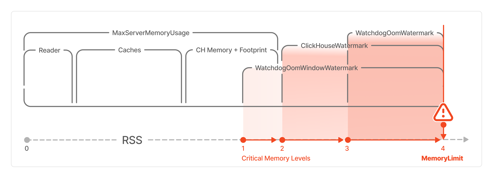

# Настройка продвинутых параметров

В этом разделе описано, как работать с продвинутыми настройками клики. В веб-интерфейсе они находятся в разделе *Advanced settings*. Полный список продвинутых настроек приведён в разделе [Продвинутые настройки](../../../../../user-guide/data-processing/chyt/cliques/configs.md#options).



Настройки, которые упомянуты в разделе, предназначены только для продвинутых пользователей. Если вы не уверены, что они вам нужны, рекомендуется оставить значения по умолчанию.



Продвинутые настройки включают в себя:

- конфигурирование запросов в рамках клики — блок [Query settings](#query-settings);
- конфигурирование серверных настроек — блок [{{clickhouse}} config](#ch-config);
- конфигурирование YT‑части инстансов — блок [YT config](#yt-config);
- выделение памяти — блок [Instance memory](#memory);
- кеширование запросов — блок [Sticky query distribution](#sticky-query).

## Query settings { #query-settings }

Параметры из раздела *Query settings* — это подмножество [настроек сессии {{clickhouse}}](https://clickhouse.com/docs/ru/operations/settings/settings), которые будут применены для всех запросов в рамках клики.

Чтобы изменить поведение запроса, переопределите значения параметров по умолчанию с помощью:



- Веб-интерфейса

    1. В [документации {{clickhouse}}](https://clickhouse.com/docs/ru/operations/settings/settings) найдите нужные настройки и скопируйте их названия.
    1. Откройте интерфейс клики, как описано в разделе [Как перейти в интерфейс клики](../../../../../user-guide/data-processing/chyt/cliques/ui.md#where).
    1. Нажмите кнопку {width=24 height=24} в блоке [Кнопки действий](../../../../../user-guide/data-processing/chyt/cliques/ui.md#action-menu) или **Edit speclet** на вкладке **Speclet** на [Панели вкладок](../../../../../user-guide/data-processing/chyt/cliques/ui.md#tabs).
    1. Выберите слева раздел **Advanced**.
    1. Найдите раздел **Query settings**.
    1. В поле *Use JSON syntax* введите параметры и их значения в JSON-синтаксисе, в виде пар `ключ: значение`, заключённых в фигурные скобки `{ }`. Например:

        ```json
        {
            "max_execution_time": 200000,
            "max_insert_threads": 32,
            "max_threads": 32,
            "parallel_distributed_insert_select": 2
        }
        ```

    1. Чтобы применить изменения, нажмите кнопку **Confirm**.

- CLI

    1. Установите [CHYT CLI](../../../../../user-guide/data-processing/chyt/cli-and-api.md) в составе пакета `ytsaurus-client`, если вы этого ещё не сделали.
    1. Сохраните адрес прокси в переменную окружения. Это нужно, чтобы не указывать кластер {{product-name}} в каждой команде через аргумент `--proxy`.
    
        ```bash
        export YT_PROXY=<cluster_name>
        ```
    
    1. Задайте переменную окружения с адресом контроллера:
    
        ```bash
        export CHYT_CTL_ADDRESS=<address>
        ```
    
        , где `<address>` — адрес контроллера. Например, для демо-кластера адрес имеет вид: `https://strawberry-XXXXXXXX.demo.ytsaurus.tech`.
        Адрес контроллера можно получить из поля `controller` из результата выполнения команды
    
        ```bash
        yt get //sys/strawberry/chyt/<alias>/@strawberry_info_state
        ```
    
    1. Сохраните в переменную окружения имя кластера:
    
        ```bash
        export CLUSTER_NAME=<cluster_name>
        ```
    
        , где `<cluster_name>` — имя кластера. Например, имя демо-кластера: `ytdemo`.
    1. В [документации {{clickhouse}}](https://clickhouse.com/docs/ru/operations/settings/settings) найдите нужные настройки и скопируйте их названия.
    1. Установите нужные параметры с помощью опции `query_settings`. Например:

        ```bash
        yt clickhouse ctl set-option query_settings "{\"max_execution_time\": 200000,\"max_insert_threads\": 32,\"max_threads\": 32,\"parallel_distributed_insert_select\": 2}"
        ```



## {{clickhouse}} config { #ch-config }

Для управления конфигурацией {{clickhouse}}-части предназначена настройка *Clickhouse config*. Задайте её так, чтобы она соответствовала стандартной XML-конфигурации {{clickhouse}}.

Правила преобразования XML-конфигурации {{clickhouse}} в YSON-конфигурацию CHYT можно описать следующим образом:

- Любой не множественный по смыслу в конфигурации {{clickhouse}} узел конфигурации является словарём (`map`).
- Множественный узел представлен списком (`list`).



#|
|| **XML** | **YSON** ||
||

```xml
<foo>42</foo>
<bar>qwe</bar>
<baz>
    <quux>3.14</quux>
</baz>
<baz></baz>
<baz>hi!</baz>
```

|

```json
{
    foo = 42;
    bar = "qwe";
    baz = [
        {quux = 3.14};
        {};
        "hi!";
    ];
}
```

 ||
|#



### Опции конфига {{clickhouse}}, которые могут оказаться удобны в CHYT { #ch-options }

Основная опция — это `dictionaries` — конфигурация внешних словарей. Значением должен быть список конфигураций словарей.
Каждый словарь конфигурируется map'ом со следующими полями, сохраняющими смысл оригинальной конфигурации {{clickhouse}}:

- `name` — имя внешнего словаря;
- `source` — [источник данных](https://clickhouse.com/docs/en/sql-reference/dictionaries/external-dictionaries/external-dicts-dict-sources/) для внешнего словаря;
- `layout` — [представление](https://clickhouse.com/docs/en/sql-reference/dictionaries/external-dictionaries/external-dicts-dict-layout/) внешнего словаря в памяти инстанса;
- `structure` — [схема данных](https://clickhouse.com/docs/en/sql-reference/dictionaries/external-dictionaries/external-dicts-dict-structure/), хранящихся в словаре;
- `lifetime` — [время жизни](https://clickhouse.com/docs/en/sql-reference/dictionaries/external-dictionaries/external-dicts-dict-lifetime/) словаря.

Остальные опции можно найти в конфиге {{clickhouse}} в [репозитории](https://github.com/ytsaurus/ytsaurus/blob/main/yt/chyt/server/clickhouse_config.h).



Конфиг {{clickhouse}} также имеет опцию `settings`, в которой содержатся настройки, описанные в разделе [**Query settings**](#query-settings). Таким образом, настройки запроса также могут быть определены внутри конфига {{clickhouse}}.



### Как изменить конфигурацию {{clickhouse}} { #ch-instruction }



- Веб-интерфейс

    1. Откройте интерфейс клики, как описано в разделе [Как перейти в интерфейс клики](../../../../../user-guide/data-processing/chyt/cliques/ui.md#where).
    1. Нажмите кнопку {width=24 height=24} в блоке [Кнопки действий](../../../../../user-guide/data-processing/chyt/cliques/ui.md#action-menu) или **Edit speclet** на вкладке **Speclet** на [Панели вкладок](../../../../../user-guide/data-processing/chyt/cliques/ui.md#tabs).
    1. Выберите слева раздел **Advanced**.
    1. Найдите раздел **Clickhouse config**.
    1. В поле *Use JSON syntax* введите параметры и их значения в виде JSON конфигурации.
        Пример конфигурации простого словаря и установки [**Query settings**](#query-settings) в `settings` части:

        ```json
        {
            "settings": {
                "max_execution_time": 30
            },
            "dictionaries": [
                {
                    "name": "dict",
                    "layout": {"flat": {}},
                    "structure": {
                        "id": {"name": "key"},
                        "attribute": [
                            {"name": "value_str", "type": "String", "null_value": "n/a"},
                            {"name": "value_i64", "type": "Int64", "null_value": 42}
                        ]
                    },
                    "lifetime": 0,
                    "source": {"yt": {"path": "//home/user/table"}}
                }
            ]
        }
        ```

    1. Чтобы применить изменения, нажмите кнопку **Confirm**.

- CLI

    1. Установите [CHYT CLI](../../../../../user-guide/data-processing/chyt/cli-and-api.md) в составе пакета `ytsaurus-client`, если вы этого ещё не сделали.
    1. Сохраните адрес прокси в переменную окружения. Это нужно, чтобы не указывать кластер {{product-name}} в каждой команде через аргумент `--proxy`.
    
        ```bash
        export YT_PROXY=<cluster_name>
        ```
    
    1. Задайте переменную окружения с адресом контроллера:
    
        ```bash
        export CHYT_CTL_ADDRESS=<address>
        ```
    
        , где `<address>` — адрес контроллера. Например, для демо-кластера адрес имеет вид: `https://strawberry-XXXXXXXX.demo.ytsaurus.tech`.
        Адрес контроллера можно получить из поля `controller` из результата выполнения команды
    
        ```bash
        yt get //sys/strawberry/chyt/<alias>/@strawberry_info_state
        ```
    
    1. Сохраните в переменную окружения имя кластера:
    
        ```bash
        export CLUSTER_NAME=<cluster_name>
        ```
    
        , где `<cluster_name>` — имя кластера. Например, имя демо-кластера: `ytdemo`.
    1. Найдите в списке [настроек {{clickhouse}}](https://clickhouse.com/docs/ru/operations/settings/settings) нужные параметры и скопируйте их названия.
    1. Установите нужные параметры с помощью опции `clickhouse_config`. Например:

        ```bash
        yt clickhouse ctl set-option clickhouse_config "{ ... some JSON params}"
        ```



## YT config { #yt-config }

YT-часть конфигурации инстанса задаётся в опции `yt_config`. Через эту опцию можно задать продвинутые настройки, которые не вынесены в отдельные опции спеклета.

Вы можете посмотреть список доступных параметров YT-конфигурации в разделе [Конфигурация инстанса](../../../../../user-guide/data-processing/chyt/reference/configuration.md#yt_config).

### Как изменить конфигурацию YT { #yt-instruction }



- Веб-интерфейс

    1. Откройте интерфейс клики, как описано в разделе [Как перейти в интерфейс клики](../../../../../user-guide/data-processing/chyt/cliques/ui.md#where).
    1. Нажмите кнопку {width=24 height=24} в блоке [Кнопки действий](../../../../../user-guide/data-processing/chyt/cliques/ui.md#action-menu) или **Edit speclet** на вкладке **Speclet** на [Панели вкладок](../../../../../user-guide/data-processing/chyt/cliques/ui.md#tabs).
    1. Выберите слева раздел **Advanced**.
    1. Найдите раздел **YT config**.
    1. В поле *Use JSON syntax* введите параметры и их значения в виде JSON конфигурации, например:

        ```json
        {
            "subquery": {
                "max_data_weight_per_subquery": 12942417591810
            }
        }
        ```

    1. Чтобы применить изменения, нажмите кнопку **Confirm**.

- CLI

    1. Установите [CHYT CLI](../../../../../user-guide/data-processing/chyt/cli-and-api.md) в составе пакета `ytsaurus-client`, если вы этого ещё не сделали.
    1. Сохраните адрес прокси в переменную окружения. Это нужно, чтобы не указывать кластер {{product-name}} в каждой команде через аргумент `--proxy`.
    
        ```bash
        export YT_PROXY=<cluster_name>
        ```
    
    1. Задайте переменную окружения с адресом контроллера:
    
        ```bash
        export CHYT_CTL_ADDRESS=<address>
        ```
    
        , где `<address>` — адрес контроллера. Например, для демо-кластера адрес имеет вид: `https://strawberry-XXXXXXXX.demo.ytsaurus.tech`.
        Адрес контроллера можно получить из поля `controller` из результата выполнения команды
    
        ```bash
        yt get //sys/strawberry/chyt/<alias>/@strawberry_info_state
        ```
    
    1. Сохраните в переменную окружения имя кластера:
    
        ```bash
        export CLUSTER_NAME=<cluster_name>
        ```
    
        , где `<cluster_name>` — имя кластера. Например, имя демо-кластера: `ytdemo`.
    1. Установите нужные параметры с помощью опции `yt_config`. Например:

        ```bash
        yt clickhouse ctl set-option yt_config "{\"subquery\":{\"max_data_weight_per_subquery\": 12942417591810}}"
        ```
  


## Instance memory { #memory }

Для точной настройки распределения памяти полезно понять схему выделения памяти в инстансе CHYT, разобраться, какие параметры отвечают за каждый объём и как их изменять.



В терминах работы с памятью:

- вотермарк (Watermark) — объём памяти, который отмеряется от верхней границы выделенного лимита памяти и при попадании в который инстанс CHYT инициирует завершение по одному из заложенных сценариев;
- окно (window) — это временной интервал (по умолчанию 15 минут), в течение которого вычисляется *среднее* значение превышений нижней границы вотермарка. Это помогает не учитывать случайные скачки памяти;
- RSS (Resident Set Size) — фактический объём используемой оперативной памяти процесса;
- OOM (out of memory) — переполнение памяти.



### Распределение памяти в инстансе CHYT { #memory-allocation }

На схеме показано, как распределяется память внутри инстанса CHYT: из каких объёмов складывается общий лимит и какие пороги определяют поведение системы при нехватке памяти.



Ниже описан каждый параметр схемы — объёмы памяти, которые входят в общий лимит инстанса, и пороги:

- `MaxServerMemoryUsage` — общий лимит на используемую память в рамках инстанса CHYT, суммарный объём, который включает:

  - `Reader` — объём памяти, который выделяется под кеши ридеров для предварительной загрузки и ускорения чтения данных;
  - `Caches` — условное обозначение на схеме объёма памяти под кеши, в который входят:

    - `CompressedBlockCache` — кеш *сжатых* блоков данных. Вмещает большие объёмы, поскольку данные хранятся в сжатом виде (поведение по умолчанию), но требует время на повторную распаковку. Используется при перечитывании *больших* блоков данных;
    - `UncompressedBlockCache` — кеш для *несжатых* блоков данных. Полезен при большом количестве последовательных запросов к одним и тем же данным, потому что экономит ресурсы не только на чтении, но и на распаковке данных;
    - `ChunkMetaCache` — кеш метаданных чанков. Чтение метаданных чанка предшествует любой операции чтения. Полезно при повторном чтении данных, позволяет экономить ресурсы на получении одних и тех же метаданных;

  - `CH Memory` — специальный объём памяти, зарезервированный для внутренних нужд {{clickhouse}};
  - `Footprint` — специальный резервный «запас» памяти, который нужен, чтобы процесс мог превысить пороги и суммарно не вызвать превышение критических значений;

- `MemoryLimit` — условная жёсткая граница на RSS (потребление памяти) инстанса CHYT, которая используется для категорий `WatchdogOomWatermark` и `WatchdogOomWindowWatermark`;
- `WatchdogOomWatermark` — некоторый добавочный объём памяти, используется в проверках, не случился ли OOM: сумма текущего значения RSS и `WatchdogOomWatermark` сравнивается с заданным `MemoryLimit`;
- `WatchdogOomWindowWatermark` — некоторый добавочный объём памяти, используется в проверках, не случился ли OOM. Проверка выполняется по следующему алгоритму:

  - вычисляется среднее значение RSS во временном окне `Window` (15 минут по умолчанию);
  - к рассчитанному значению добавляется `WatchdogOomWindowWatermark`;
  - сумма сравнивается с заданным `MemoryLimit`.

- `ClickHouseWatermark` — добавочный объём памяти, чтобы отделить `MaxServerMemoryUsage` от общего `MemoryLimit`.

### Критические области значений RSS (потребления памяти) { #critical-limits }

На шкале RSS на схеме распределения памяти цифрами отмечены критические области значений, при достижении которых система прерывает процесс.



Если объём физической оперативной памяти процесса достигает интервала:

- `1` (среднее значение RSS в течение более 15 минут превышает нижнюю границу интервала `WatchdogOomWindowWatermark`) — инстанс выполняет плавное завершение работы (graceful shutdown): прекращает принимать новые запросы, ждёт завершения активных и выключается;
- `2` (среднее значение RSS превышает нижнюю границу порога `ClickHouseWatermark`) — {{clickhouse}} прекращает выделение памяти под любые операции, система сообщает о нехватке памяти;
- `3` (RSS превышает нижнюю границу интервала `WatchdogOomWatermark`) — инстанс резко прекращает работу, активные запросы завершаются ошибкой;
- `4` (RSS превышает `MemoryLimit`) — {{product-name}} удаляет инстанс.

### Как задать пороги памяти { #memory-instruction }

Рекомендуем использовать веб-интерфейс:

1. Откройте интерфейс клики, как описано в разделе [Как перейти в интерфейс клики](../../../../../user-guide/data-processing/chyt/cliques/ui.md#where).
1. Нажмите кнопку {width=24 height=24} в блоке [Кнопки действий](../../../../../user-guide/data-processing/chyt/cliques/ui.md#action-menu) или **Edit speclet** на вкладке **Speclet** на [Панели вкладок](../../../../../user-guide/data-processing/chyt/cliques/ui.md#tabs).
1. Выберите слева раздел **Advanced**.
1. Найдите раздел **Instance memory**.
1. В поле *Use JSON syntax* введите параметры и их значения в виде JSON конфигурации. В качестве шаблона можно использовать пример конфигурации:

    ```json
    {
        "clickhouse": 10500000000,
        "chunk_meta_cache": 100000000,
        "compressed_cache": 4000000000,
        "uncompressed_cache": null,
        "reader": 500000000,
        "clickhouse_watermark": 10,
        "watchdog_oom_watermark": 0,
        "watchdog_oom_window_watermark": 0,
        "footprint": 2000000000
    }
    ```

1. Чтобы применить изменения, нажмите кнопку **Confirm**.

## Sticky query distribution { #sticky-query }

Продвинутые опции **Enable sticky query distribution** и **Query sticky group size** управляют распределением запросов по инстансам с учётом кеширования.

Если запросы повторяются с заданной периодичностью, полезно кешировать их результаты. Кеш запроса сохраняется на том инстансе, на котором он выполнился.

По умолчанию запросы распределяются по инстансам в случайном порядке. Чтобы перенаправить запросы на инстансы, где они выполнялись ранее и где хранится их кеш, используют настройки:

- **Enable sticky query distribution** — опция включает распределение запросов по инстансам с учётом хешей этих запросов;
- **Query sticky group size** — опция задаёт размер группы инстансов, выбранных детерминированно по хешу запроса. Среди этих инстансов будет равномерно выбран координатор для исполнения запроса. Имеет смысл только при включённой опции **Enable sticky query distribution**.

### Как включить перенаправление запросов на инстансы с кешем { #cache-instruction }

Рекомендуем использовать веб-интерфейс:

1. Откройте интерфейс клики, как описано в разделе [Как перейти в интерфейс клики](../../../../../user-guide/data-processing/chyt/cliques/ui.md#where).
1. Нажмите кнопку {width=24 height=24} в блоке [Кнопки действий](../../../../../user-guide/data-processing/chyt/cliques/ui.md#action-menu) или **Edit speclet** на вкладке **Speclet** на [Панели вкладок](../../../../../user-guide/data-processing/chyt/cliques/ui.md#tabs).
1. Выберите слева раздел **Advanced**.
1. Найдите опцию **Enable sticky query distribution** и включите её.
1. Найдите опцию **Query sticky group size** и в поле введите число — размер группы инстансов. Запрос будет случайно направлен координатором на один из инстансов группы.
1. Чтобы применить изменения, нажмите кнопку **Confirm**.
