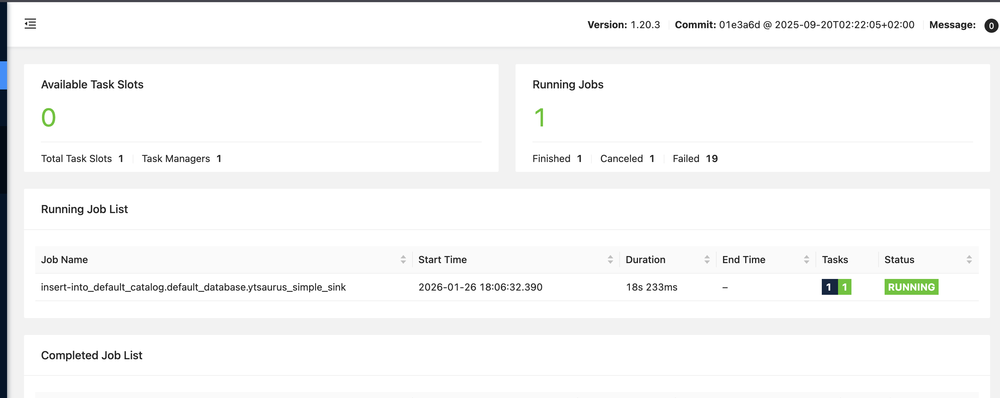
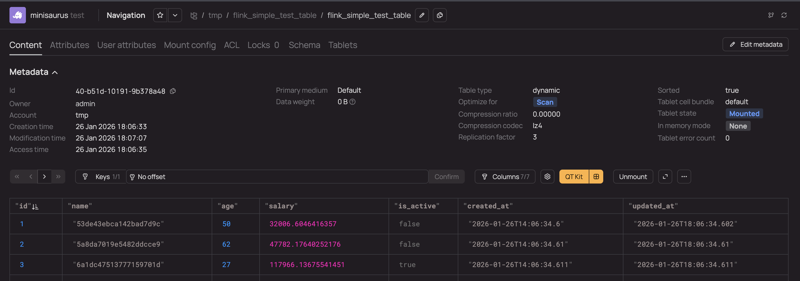
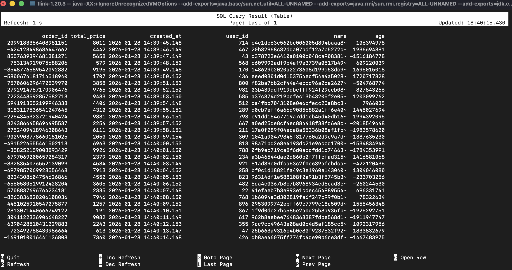

# Apache Flink Connector {{product-name}}

Apache Flink Connector {{product-name}} — это коннектор для потоковой и пакетной обработки данных на Apache Flink. Работает с [сортированными динамическими таблицами](../../../../user-guide/dynamic-tables/sorted-dynamic-tables.md) {{product-name}} и поддерживает запись, чтение ограниченных потоков и Lookup-операции.

Исходный код коннектора доступен на [GitHub](https://github.com/ytsaurus/ytsaurus-flyt/tree/main/flink-connector-ytsaurus).

## Возможности {#features}

- запись в динамические таблицы {{product-name}} — поддержка потоковой записи данных; базовый сценарий приведён в разделе [Быстрый старт](#quick-start-guide);
- автоматическое создание таблиц — таблицы создаются автоматически перед записью, если они не существуют;
- предварительное решардирование таблиц — настраиваемые стратегии решардирования таблиц для оптимальной производительности. Подробнее см. в разделе [Решардирование таблиц](#table-resharding);
- партиционирование данных — поддержка партиционирования различной гранулярности: час, день, неделя, месяц, год. Подробнее см. в разделе [Партиционирование данных](#data-partitioning);
- синхронные и асинхронные Lookup-операции — поддержка обоих режимов выполнения Lookup-операций из динамических таблиц {{product-name}}. Подробнее см. в разделе [Lookup-операции](#lookup-operations);
- кеширование Lookup-запросов — поддержка стратегий кеширования `FULL` и `PARTIAL` для оптимизации производительности. Подробнее см. в разделе [Lookup-операции](#lookup-operations);
- поддержка Lookup из нескольких кластеров — возможность выполнять Lookup из нескольких кластеров {{product-name}} в зависимости от доступности. Пример см. в разделе [Примеры](#examples);
- отслеживаемые поля — возможность отслеживать значения полей через метрики.

## Установка {#installation}



Текущая версия коннектора требует:
- Java 11
- Apache Flink {{flink-version}}



Замените `connectorVersion` на актуальную версию со страницы [Maven Central](https://central.sonatype.com/artifact/tech.ytsaurus.flyt.connectors.ytsaurus/flink-connector-ytsaurus).



- Maven

  ```xml
  <dependency>
      <groupId>tech.ytsaurus.flyt.connectors.ytsaurus</groupId>
      <artifactId>flink-connector-ytsaurus</artifactId>
      <version>${connectorVersion}</version>
      <classifier>all</classifier>
  </dependency>
  ```

- Gradle

  ```kotlin
  implementation("tech.ytsaurus.flyt.connectors.ytsaurus:flink-connector-ytsaurus:$connectorVersion:all")
  ```



## Быстрый старт {#quick-start-guide}

### 1. Установите кластер {{product-name}} {#quick-start-install-ytsaurus}

Этот шаг можно пропустить, если кластер уже существует.

Для локальной разработки и тестирования рекомендуется воспользоваться официальной документацией по [установке кластера {{product-name}} через Kind](../../../../overview/try-yt.md)[установке кластера {{product-name}} через Kind](https://ytsaurus.tech/docs/ru/overview/try-yt). Для продакшн процессов следуйте [руководству администратора {{product-name}}](../../../../admin-guide/install-ytsaurus.md).



`flink-connector-ytsaurus` использует [Java-клиент {{product-name}}](../../../../api/java/examples.md)[Java-клиент {{product-name}}](https://ytsaurus.tech/docs/ru/api/java/examples). Перед началом работы уточните, какой адрес прокси требуется указать в параметре `proxy` для вашего окружения.



### 2. Установите кластер Apache Flink {#quick-start-install-flink}

Установите кластер Apache Flink, следуя [официальной документации](https://nightlies.apache.org/flink/flink-docs-release-1.20/docs/try-flink/local_installation/#downloading-flink). Коннектор требует Apache Flink версии `{{flink-version}}`.

### 3. Установите Flink Connector {{product-name}} в кластер Apache Flink {#quick-start-install-connector}

Соберите коннектор из исходного кода (см. [Building from Source](https://github.com/ytsaurus/ytsaurus-flyt/tree/main/flink-connector-ytsaurus#build-steps)) или скачайте его из [репозитория Maven](https://central.sonatype.com/artifact/tech.ytsaurus.flyt.connectors.ytsaurus/flink-connector-ytsaurus). После сборки или загрузки поместите полученный jar-файл в директорию `${FLINK_ROOT}/lib`.

### 4. Измените порт Flink Web UI {#quick-start-change-flink-port}

Откройте файл `conf/config.yaml` и измените параметр `rest.port` с `8081` на `8083`, чтобы избежать конфликта портов с {{product-name}}.

### 5. Запустите кластер Apache Flink с Flink SQL Client {#quick-start-start-flink}

Запустите кластер Apache Flink:
```bash
./bin/start-cluster.sh
```

Запустите Flink SQL Client:
```bash
./bin/sql-client.sh
```

### 6. Запустите демо-джобу {#quick-start-run-demo-job}

1. Создайте источник Datagen:

   ```sql
   CREATE TABLE simple_datagen_source (
       id BIGINT,
       name STRING,
       age INT,
       salary DOUBLE,
       is_active BOOLEAN,
       created_at TIMESTAMP(3)
   ) WITH (
       'connector' = 'datagen',
       'rows-per-second' = '50',
       'number-of-rows' = '1000',
       'fields.id.kind' = 'sequence',
       'fields.id.start' = '1',
       'fields.id.end' = '100000',
       'fields.name.length' = '20',
       'fields.age.min' = '22',
       'fields.age.max' = '65',
       'fields.salary.min' = '30000.0',
       'fields.salary.max' = '150000.0'
   );
   ```

2. Создайте приёмник {{product-name}}:

   ```sql
   CREATE TABLE ytsaurus_simple_sink (
       id BIGINT,
       name STRING,
       age INT,
       salary DOUBLE,
       is_active BOOLEAN,
       created_at TIMESTAMP(3),
       updated_at TIMESTAMP(3),
       PRIMARY KEY (id) NOT ENFORCED
   ) WITH (
       'connector' = 'ytsaurus',
       'proxy' = 'localhost:8081',
       'path' = '//tmp/flink_simple_test_table',
       'credentials-source' = 'options',
       'username' = 'admin',
       'token' = 'password',
       'schema' = '[
           {"name"="id";"type"="int64";"required"=%false;"sort_order"="ascending"};
           {"name"="name";"type"="string";"required"=%false};
           {"name"="age";"type"="int64";"required"=%false};
           {"name"="salary";"type"="double";"required"=%false};
           {"name"="is_active";"type"="boolean";"required"=%false};
           {"name"="created_at";"type"="string";"required"=%false};
           {"name"="updated_at";"type"="string";"required"=%false}
       ]'
   );
   ```

3. Запустите джобу, которая будет записывать сгенерированные данные в динамическую таблицу {{product-name}}:

   ```sql
   INSERT INTO ytsaurus_simple_sink
   SELECT
       id,
       name,
       age,
       salary,
       is_active,
       created_at,
       CURRENT_TIMESTAMP AS updated_at
   FROM simple_datagen_source;
   ```

4. Следите за работой джобы по адресу [localhost:8083](http://localhost:8083)

   

5. Таблица `flink_simple_test_table` будет создана в директории `/tmp/flink_simple_test_table` и будет содержать результаты выполнения Flink джобы.

   

Поздравляем! Вы запустили свою первую джобу с {{product-name}} и Apache Flink.

## Параметры конфигурации {#configuration-options}

<!--Коннектор {{product-name}} поддерживает широкий набор параметров конфигурации для настройки его поведения.

Ниже параметры сгруппированы по назначению. Для большинства сценариев записи и Lookup требуется указать путь к таблице через `path`. В конфигурациях с несколькими кластерами вместо `path` используется `path-map`.

В разделе описаны:-->

- [Обязательные параметры](#required-options);
- [Конфигурация пути](#path-configuration);
- [Параметры аутентификации](#auth-options);
- [Конфигурация таблицы](#table-configuration);
- [Параметры партиционирования](#partitioning-options);
- [Параметры решардирования](#resharding-options);
- [Параметры транзакций и производительности](#transaction-performance-options);
- [Параметры Lookup-операции](#lookup-options);
- [Параметры кеша для Lookup-операции](#lookup-cache-options);
- [Прочие параметры](#other-options).

#### Обязательные параметры {#required-options}

| Параметр | Тип | Описание |
|----------|-----|----------|
| `proxy` | String | Адрес прокси {{product-name}} |
| `schema` | String | Определение схемы в формате YSON для таблицы {{product-name}}. См. [Определение схемы](#schema-definition) |
| `credentials-source` | String | Метод аутентификации (`options`, `env`, `your-custom-provider`) |

#### Конфигурация пути {#path-configuration}

| Параметр | Тип | По умолчанию | Описание                                                                   |
|----------|-----|--------------|----------------------------------------------------------------------------|
| `path` | String | - | Путь к таблице {{product-name}} |
| `path-map` | Map<String, String> | - | Map соответствия кластер–путь к таблице для Lookup из нескольких кластеров |

Укажите один из параметров:

- `path` — для работы с одной таблицей в одном кластере;
- `path-map` — для Lookup-сценариев с несколькими кластерами.

#### Параметры аутентификации {#auth-options}

| Параметр | Тип | По умолчанию | Описание |
|----------|-----|--------------|----------|
| `username` | String | - | Имя пользователя (при использовании источника учётных данных `options`) |
| `token` | String | - | Токен (при использовании источника учётных данных `options`) |

#### Конфигурация таблицы {#table-configuration}

| Параметр | Тип | По умолчанию | Описание                                         |
|----------|-----|--------------|--------------------------------------------------|
| `optimize-for` | Enum | - | Режим оптимизации таблицы (`LOOKUP`, `SCAN`)     |
| `primary-medium` | Enum | - | primary-medium таблицы (`DEFAULT`, `SSD_BLOBS`)  |
| `tablet-cell-bundle` | String | - | Название бандла                                  |
| `enable-dynamic-store-read` | Boolean | `true` | Атрибут чтения из динамического хранилища        |
| `custom-attributes` | String | - | Пользовательские атрибуты таблицы в формате YSON |

#### Параметры партиционирования {#partitioning-options}

| Параметр | Тип | По умолчанию | Описание                                                                                                        |
|----------|-----|--------------|-----------------------------------------------------------------------------------------------------------------|
| `partition-key` | String | - | Имя столбца, по которому будет выполняться партиционирование                                                    |
| `partition-scale` | Enum | - | Гранулярность партиционирования (`HOUR`, `HOUR_T`, `DAY`, `WEEK`, `MONTH`, `SHORT_MONTH`, `YEAR`, `SHORT_YEAR`) |
| `partition-ttl-day-cnt` | Integer | - | Количество дней хранения партиции                                                                               |
| `partition-ttl-in-days-from-creation` | Integer | - | TTL в днях с момента создания партиции                                                                          |
| `min-partition-ttl` | Integer | `20` | Минимальный TTL партиции в днях                                                                                 |

#### Параметры решардирования {#resharding-options}

| Параметр | Тип | По умолчанию | Описание                                                      |
|----------|-----|--------------|---------------------------------------------------------------|
| `reshard.strategy` | Enum | `NONE` | Стратегия решардирования (`NONE`, `FIXED`, `LAST_PARTITIONS`) |
| `reshard.tablet-count` | Integer | - | Количество таблетов при решардировании                        |
| `reshard.uniform` | Boolean | `false` | Использовать ли uniform при партиционировании                 |
| `reshard.last-partitions-count` | Integer | `7` | Количество партиций для анализа в стратегии `LAST_PARTITIONS` |

#### Параметры транзакций и производительности {#transaction-performance-options}

| Параметр | Тип | По умолчанию | Описание                                             |
|----------|-----|--------------|------------------------------------------------------|
| `commit-transaction-period` | Duration | - | Период фиксации транзакций                           |
| `transaction-timeout` | Duration | - | Таймаут транзакции                                   |
| `transaction-atomicity` | Enum | - | Уровень атомарности транзакции                       |
| `rows-in-transaction-limit` | Integer | - | Максимальное количество строк в транзакции           |
| `rows-in-modification-limit` | Integer | - | Максимальное количество строк в одной модификации    |
| `retry-strategy` | Enum | `EXPONENTIAL` | Стратегия попыток записи (`EXPONENTIAL`, `NO_RETRY`) |

#### Параметры Lookup-операции {#lookup-options}

| Параметр | Тип | По умолчанию | Описание                                                                                                                                                                                               |
|----------|-----|--------------|--------------------------------------------------------------------------------------------------------------------------------------------------------------------------------------------------------|
| `lookup.async` | Boolean | `false` | Включить асинхронный Lookup                                                                                                                                                                            |
| `lookup-method` | Enum | `LOOKUP` | Метод Lookup (`LOOKUP`, `SELECT`). Метод `LOOKUP` работает только с ключевыми столбцами, но обеспечивает лучшую производительность. Метод `SELECT` работает с любыми столбцами, но работает медленнее. |
| `cluster-pick-strategy` | String | `FirstAvailableClusterPickStrategy` | Стратегия выбора кластера в конфигурации с несколькими кластерами. Можно указать собственную реализацию стратегии.                                                                                     |

#### Параметры кеша для Lookup-операции {#lookup-cache-options}

| Параметр | Тип | По умолчанию | Описание                                               |
|----------|-----|--------------|--------------------------------------------------------|
| `lookup.cache` | Enum | `NONE` | Тип кеша (`NONE`, `PARTIAL`, `FULL`)                   |
| `lookup.partial-cache.max-rows` | Long | - | Максимальное количество строк в partial кеше           |
| `lookup.partial-cache.expire-after-write` | Duration | - | Время жизни кеша после записи                          |
| `lookup.partial-cache.expire-after-access` | Duration | - | Время жизни кеша после обращения                       |
| `lookup.partial-cache.cache-missing-key` | Boolean | - | Кешировать отсутствующие ключи                         |
| `lookup.full-cache.reload-strategy` | Enum | - | Стратегия перезагрузки full кеша (`PERIODIC`, `TIMED`) |
| `lookup.full-cache.periodic-reload-interval` | Duration | - | Интервал периодического обновления full кеша           |
| `lookup.full-cache.timed-reload-iso-time` | String | - | Время перезагрузки по расписанию в формате ISO         |

#### Прочие параметры {#other-options}

| Параметр | Тип | По умолчанию | Описание                                          |
|----------|-----|--------------|---------------------------------------------------|
| `trackable-field` | String | - | Имя поля для отслеживания его значений в метриках |
| `proxy-role` | String | - | Прокси роль                                       |

Параметр `trackable-field` полезен в сценариях, где важно наблюдать за значениями одного из полей через метрики коннектора.

## Определение схемы {#schema-definition}

Таблицы {{product-name}} требуют определения схемы в формате YSON. Схема должна быть предоставлена в виде YSON-списка с описанием столбцов.

Формат схемы:

```yson
[
    {"name"="column_name";"type"="data_type";"required"=%false;"sort_order"="ascending"};
    {"name"="another_column";"type"="string";"required"=%false}
]
```

Подробнее о схемах {{product-name}} см. в [документации](../../../../user-guide/storage/static-schema.md).


## Аутентификация {#authentication}

Коннектор поддерживает несколько методов аутентификации:

- [Аутентификация через параметры](#auth-via-options);
- [Аутентификация через переменные окружения](#auth-via-env);
- [Пользовательская аутентификация](#custom-auth).

#### Аутентификация через параметры {#auth-via-options}

Учётные данные передаются непосредственно в конфигурации таблицы:

```sql
'credentials-source' = 'options',
'username' = 'your-username',
'token' = 'your-token'
```

#### Аутентификация через переменные окружения {#auth-via-env}

Учётные данные считываются из переменных окружения:

```sql
'credentials-source' = 'env'
```

Задайте следующие переменные окружения:
- `YT_USER` — имя пользователя
- `YT_TOKEN` — токен

#### Пользовательская аутентификация {#custom-auth}

Чтобы создать собственный метод аутентификации, реализуйте интерфейс [`CredentialsProvider`](https://github.com/ytsaurus/ytsaurus-flyt/blob/main/flink-connector-ytsaurus/src/main/java/tech/ytsaurus/flyt/connectors/ytsaurus/common/credentials/CredentialsProvider.java).

## Партиционирование данных {#data-partitioning}

Коннектор поддерживает автоматическое партиционирование данных на основе полей с временными метками.

Чтобы настроить партиционирование, укажите столбец с датой или временем в параметре `partition-key` и выберите нужную гранулярность в параметре `partition-scale`. Коннектор будет автоматически вычислять значение партиции по значению указанного поля. Рабочую конфигурацию см. в разделе [Пример использования партиционирования](#partitioning-example).

#### Поддерживаемые масштабы партиций {#supported-partition-scales}

- `HOUR` — почасовые партиции (формат: `YYYY-MM-DD HH:00:00`)
- `HOUR_T` — почасовые партиции с разделителем T (формат: `YYYY-MM-DDTHH:00:00`)
- `DAY` — ежедневные партиции (формат: `YYYY-MM-DD`)
- `WEEK` — еженедельные партиции (формат: `YYYY-MM-DD` с датой понедельника)
- `MONTH` — ежемесячные партиции (формат: `YYYY-MM-01`)
- `SHORT_MONTH` — короткие ежемесячные партиции (формат: `YYYY-MM`)
- `YEAR` — ежегодные партиции (формат: `YYYY-01-01`, то есть первый день года)
- `SHORT_YEAR` — короткие ежегодные партиции (формат: `YYYY`)

#### Пример использования партиционирования {#partitioning-example}

```sql
CREATE TABLE partitioned_data_source (
id BIGINT,
data STRING,
event_time TIMESTAMP(3)
) WITH (
'connector' = 'datagen',
'rows-per-second' = '50',
'number-of-rows' = '1000',
'fields.id.kind' = 'sequence',
'fields.id.start' = '1',
'fields.id.end' = '100000',
'fields.data.length' = '20',
'fields.event_time.max-past' = '7d'
);
```

```sql
CREATE TABLE partitioned_table (
    id BIGINT,
    data STRING,
    event_time TIMESTAMP(3),
    PRIMARY KEY (id) NOT ENFORCED
) WITH (
    'connector' = 'ytsaurus',
    'proxy' = 'localhost:8081',
    'credentials-source' = 'options',
    'username' = 'admin',
    'token' = 'password',
    'path' = '//tmp/partitioned_table',
    'partition-key' = 'event_time',
    'partition-scale' = 'DAY',
    'partition-ttl-day-cnt' = '30',
    'schema' = '[
        {"name"="id";"type"="int64";"required"=%false;"sort_order"="ascending"};
        {"name"="data";"type"="string";"required"=%false};
        {"name"="event_time";"type"="string";"required"=%false}
    ]'
);
```

```sql
INSERT INTO partitioned_table
SELECT *
FROM partitioned_data_source;
```

Результат:


## Решардирование таблиц {#table-resharding}

Коннектор поддерживает автоматическое решардирование таблиц при их создании. Решардирование позволяет задать количество таблетов заранее — фиксированно или на основе статистики уже существующих партиций. Это помогает равномерно распределить нагрузку на запись с самого начала.

#### Стратегии решардирования {#resharding-strategies}

- **`NONE`** — отключить решардирование
- **`FIXED`** — решардирование с фиксированным количеством таблетов
- **`LAST_PARTITIONS`** — решардирование на основе среднего количества таблетов в последних N партициях

#### Пример настроек решардирования {#resharding-example}

```sql
'reshard.strategy' = 'FIXED',
'reshard.tablet-count' = '10',
'reshard.uniform' = 'true'
```

## Lookup-операции {#lookup-operations}

Коннектор поддерживает как синхронные, так и асинхронные Lookup-операции с возможностью кеширования. Lookup-операции используются для обогащения потока данными из внешней таблицы по ключу. В терминах SQL это соответствует сценарию `Lookup Join`. Подробнее о lookup join см. в разделе [{#T}](../../../../user-guide/dynamic-tables/dyn-query-language.md#lookup-joins).

Этот раздел относится к сценарию обогащения потока данными из {{product-name}}. Если вам нужен базовый сценарий записи данных, достаточно выполнить шаги из раздела [Быстрый старт](#quick-start-guide).

В разделе описаны:

- [Методы Lookup](#lookup-methods);
- [Типы кеша](#lookup-cache-types);
- [Пример Lookup](#lookup-example).

#### Методы Lookup {#lookup-methods}

- **`LOOKUP`** — стандартная Lookup-операция
- **`SELECT`** — Lookup-операция на основе SELECT запроса

#### Типы кеша {#lookup-cache-types}

- **`NONE`** — без кеширования
- **`PARTIAL`** — частичное кеширование с настраиваемым размером и TTL
- **`FULL`** — полное кеширование таблицы с периодической или плановой перезагрузкой

#### Пример Lookup {#lookup-example}

Для Lookup-коннектора требуется YSON-форматтер. Соберите или загрузите форматтер YSON согласно [документации](https://github.com/ytsaurus/ytsaurus-flyt/tree/main/flink-yson) и поместите его в `$FLINK_ROOT/lib`.

Подготовьте данные для Lookup-операции.

```sql
CREATE TABLE users_datagen (
    id BIGINT,
    name STRING,
    age INT,
    created_at TIMESTAMP(3)
) WITH (
    'connector' = 'datagen',
    'rows-per-second' = '50',
    'number-of-rows' = '1000',
    'fields.id.kind' = 'sequence',
    'fields.id.start' = '1',
    'fields.id.end' = '1000'
);
```

```sql
CREATE TABLE lookup_table_sink (
    id BIGINT,
    name STRING,
    age INT,
    created_at TIMESTAMP(3),
    PRIMARY KEY (id) NOT ENFORCED
) WITH (
    'connector' = 'ytsaurus',
    'proxy' = 'localhost:8081',
    'path' = '//tmp/lookup_table',
    'credentials-source' = 'options',
    'username' = 'admin',
    'token' = 'password',
    'schema' = '[
        {"name"="id";"type"="int64";"required"=%false;"sort_order"="ascending"};
        {"name"="name";"type"="string";"required"=%false};
        {"name"="age";"type"="int64";"required"=%false};
        {"name"="created_at";"type"="string";"required"=%false}
    ]'
);
```

```sql
INSERT INTO lookup_table_sink
SELECT
    id,
    name,
    age,
    created_at
FROM users_datagen;
```

Объедините данные заказов с данными пользователей.

```sql
CREATE TABLE orders_datagen (
    order_id BIGINT,
    user_id BIGINT,
    total_price INT,
    created_at TIMESTAMP(3),
    proc_time AS PROCTIME()
) WITH (
    'connector' = 'datagen',
    'rows-per-second' = '1',
    'number-of-rows' = '100',
    'fields.user_id.min' = '1',
    'fields.user_id.max' = '1000',
    'fields.total_price.min' = '1',
    'fields.total_price.max' = '10000'
);
```

```sql
CREATE TABLE lookup_table (
    id BIGINT,
    name STRING,
    age INT,
    PRIMARY KEY (id) NOT ENFORCED
) WITH (
    'connector' = 'ytsaurus',
    'format' = 'yson',
    'proxy' = 'localhost:8081',
    'credentials-source' = 'options',
    'username' = 'admin',
    'token' = 'password',
    'path' = '//tmp/lookup_table',
    'lookup.async' = 'true',
    'lookup.cache' = 'PARTIAL',
    'lookup.partial-cache.max-rows' = '10000',
    'lookup.partial-cache.expire-after-access' = '1h',
    'lookup-method' = 'LOOKUP',
    'schema' = '[
        {"name"="id";"type"="int64";"required"=%false;"sort_order"="ascending"};
        {"name"="name";"type"="string";"required"=%false}
    ]'
);
```

```sql
SELECT
    o.order_id,
    o.total_price,
    o.created_at,
    l.id as user_id,
    l.name,
    l.age
FROM orders_datagen o
LEFT JOIN lookup_table FOR SYSTEM_TIME AS OF o.proc_time AS l
ON o.user_id = l.id;
```

Проверьте интерфейс Apache Flink по адресу [localhost:8083](http://localhost:8083).


Flink SQL Client отобразит результаты операции Lookup Join в режиме реального времени.




## Примеры {#examples}

- [Минимальная конфигурация](#example-minimal-config);
- [Партиционированная таблица с решардированием](#example-partitioned-resharding);
- [Lookup-таблица с FULL кешем](#example-lookup-full-cache);
- [Конфигурация с Lookup из нескольких кластеров](#example-multicluster-lookup).

#### Минимальная конфигурация {#example-minimal-config}

```sql
CREATE TABLE ytsaurus_sink (
    user_id BIGINT,
    username STRING,
    email STRING,
    created_at TIMESTAMP(3),
    PRIMARY KEY (user_id) NOT ENFORCED
) WITH (
    'connector' = 'ytsaurus',
    'proxy' = 'localhost:8081',
    'path' = '//home/your-user/users_table',
    'credentials-source' = 'options',
    'username' = 'your-username',
    'token' = 'your-token',
    'schema' = '[
        {"name"="user_id";"type"="int64";"required"=%false;"sort_order"="ascending"};
        {"name"="username";"type"="string";"required"=%false};
        {"name"="email";"type"="string";"required"=%false};
        {"name"="created_at";"type"="string";"required"=%false}
    ]'
);
```

#### Партиционированная таблица с решардированием {#example-partitioned-resharding}

```sql
CREATE TABLE events_table (
    event_id BIGINT,
    user_id BIGINT,
    event_type STRING,
    event_data STRING,
    event_time TIMESTAMP(3),
    PRIMARY KEY (event_id) NOT ENFORCED
) WITH (
    'connector' = 'ytsaurus',
    'proxy' = 'localhost:8081',
    'path' = '//home/your-user/events',
    'credentials-source' = 'options',
    'username' = 'your-username',
    'token' = 'your-token',
    'partition-key' = 'event_time',
    'partition-scale' = 'DAY',
    'partition-ttl-day-cnt' = '90',
    'reshard.strategy' = 'LAST_PARTITIONS',
    'reshard.tablet-count' = '20',
    'reshard.last-partitions-count' = '7',
    'reshard.uniform' = 'true',
    'optimize-for' = 'SCAN',
    'schema' = '[
        {"name"="event_id";"type"="int64";"required"=%false;"sort_order"="ascending"};
        {"name"="user_id";"type"="int64";"required"=%false};
        {"name"="event_type";"type"="string";"required"=%false};
        {"name"="event_data";"type"="string";"required"=%false};
        {"name"="event_time";"type"="string";"required"=%false}
    ]'
);
```

#### Lookup-таблица с FULL кешем {#example-lookup-full-cache}

```sql
CREATE TABLE user_lookup (
    user_id BIGINT,
    username STRING,
    email STRING,
    PRIMARY KEY (user_id) NOT ENFORCED
) WITH (
    'connector' = 'ytsaurus',
    'proxy' = 'localhost:8081',
    'path' = '//home/your-user/users',
    'credentials-source' = 'options',
    'username' = 'your-username',
    'token' = 'your-token',
    'lookup.cache' = 'FULL',
    'lookup.full-cache.reload-strategy' = 'PERIODIC',
    'lookup.full-cache.periodic-reload-interval' = '1h',
    'optimize-for' = 'LOOKUP',
    'schema' = '[
        {"name"="user_id";"type"="int64";"required"=%false;"sort_order"="ascending"};
        {"name"="username";"type"="string";"required"=%false};
        {"name"="email";"type"="string";"required"=%false}
    ]'
);
```

#### Конфигурация с Lookup из нескольких кластеров {#example-multicluster-lookup}

```sql
CREATE TABLE multi_cluster_table (
    id BIGINT,
    data STRING,
    PRIMARY KEY (id) NOT ENFORCED
) WITH (
    'connector' = 'ytsaurus',
    'proxy' = 'localhost:8081',
    'path-map' = 'cluster1://tmp/table1,cluster2://tmp/table2',
    'cluster-pick-strategy' = 'FirstAvailableClusterPickStrategy',
    'credentials-source' = 'options',
    'username' = 'your-username',
    'token' = 'your-token',
    'schema' = '[
        {"name"="id";"type"="int64";"required"=%false;"sort_order"="ascending"};
        {"name"="data";"type"="string";"required"=%false}
    ]'
);
```

## Что дальше {#whats-next}

- [Сортированные динамические таблицы](../../../../user-guide/dynamic-tables/sorted-dynamic-tables.md) — подробнее об устройстве таблиц, с которыми работает коннектор;
- [YSON-форматтер для Flink](../../../../user-guide/data-processing/flyt/flink-yson.md) — если нужна работа с YSON напрямую в задачах Flink;
- [Java-клиент {{product-name}}](../../../../api/java/examples.md)[Java-клиент {{product-name}}](https://ytsaurus.tech/docs/ru/api/java/examples) — низкоуровневый API, на котором построен коннектор.
