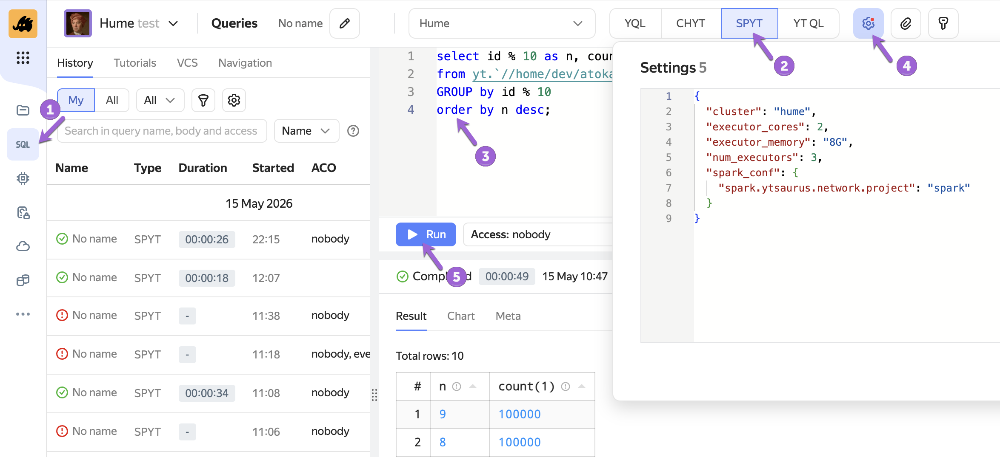
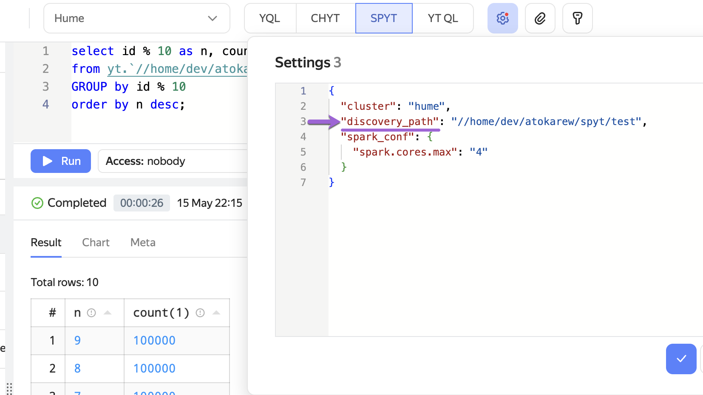

# SPYT Connect

SPYT Connect — это механизм удалённого подключения к Spark-драйверу, построенный на базе протокола [Spark Connect](https://spark.apache.org/docs/latest/spark-connect-overview.html). С его помощью можно выполнять запросы Spark SQL через [Query Tracker](../../../../user-guide/query-tracker/about.md) в {{product-name}}. Также можно работать с данными напрямую из Python-кода через Spark Connect API, не устанавливая JVM на клиентской стороне.



Механизм пришёл на смену [Livy](../../../../user-guide/data-processing/spyt/cluster/livy.md) начиная со SPYT 2.10.0 и Query Tracker 0.4.



## Когда возможны задержки запросов {#request-latency}

SPYT Connect запускает Spark-драйвер по требованию. Если драйвер в данный момент не активен, его нужно сначала запустить — это занимает время. Драйвер может быть не активен в трёх случаях:

- Первое обращение к SPYT Connect.
   Вы только начали работу, и драйвер запускается с нуля.
- После простоя.
   Чтобы не тратить ресурсы впустую, драйвер автоматически останавливается после 10 минут бездействия. Следующий запрос снова инициирует его запуск. Таймаут простоя настраивается через параметр `spark.ytsaurus.connect.idle.timeout` в [конфигурационных параметрах SPYT](../../../../user-guide/data-processing/spyt/thesaurus/configuration.md).
- После изменения настроек.
   Если вы поменяли конфигурацию ресурсов для запроса (например, количество ядер), старый драйвер останавливается, а под новые настройки запускается новый.

То, в какой момент вы заметите задержку инициализации, зависит от того, как вы работаете со SPYT Connect:

- **В Query Tracker (UI или API)** запуск сессии и отправка запроса в SPYT Connect происходят в рамках одного QT-запроса. Поэтому при запуске в интерфейсе или отправке запроса через API кажется, что сам запрос выполняется долго. Все последующие запросы будут отрабатывать быстро.
- **В Python (Spark Connect API)** вы управляете запуском явно. Задержка произойдёт ровно в тот момент, когда вы вызываете функцию `start_connect_server` (ожидание готовности). Сами вычисления и операции с DataFrame будут стартовать без задержек.

## Режимы запуска {#launch-modes}

SPYT Connect работает в двух режимах — они определяют, как запускается Spark-приложение. Выбор режима влияет на конфигурацию и код во всех способах подключения.

#|
|| **Режим** | **Когда подходит** ||
|| [Прямой сабмит](../../../../user-guide/data-processing/spyt/direct-submit/desc.md) | Нет выделенного кластера; Spark-приложение запускается по требованию под каждый запрос ||
|| [Внутренний кластер](../../../../user-guide/data-processing/spyt/cluster/cluster-desc.md) | Кластер уже запущен; SPYT Connect подключается к нему ||
|#

## Способы подключения {#choose}

#|
|| **Способ** | **Когда подходит** ||
|| [Через&nbsp;UI&nbsp;Query&nbsp;Tracker](#ui) | Подходит аналитикам и всем, кто работает с данными через интерфейс {{product-name}} ||
|| [Через&nbsp;Query&nbsp;Tracker&nbsp;API](#qt-api) | Для автоматизации SQL-запросов из Python ||
|| [Через&nbsp;Spark&nbsp;Connect&nbsp;API](#spark-connect-api) | Для тех, кто хочет использовать DataFrame API или управлять жизненным циклом драйвера вручную ||
|#

### Через UI Query Tracker {#ui}

Чтобы выполнить SQL-запрос с использованием SPYT Connect:

1. Откройте вкладку **Queries** в интерфейсе {{product-name}}.
1. В списке движков выберите **SPYT**.
1. Введите SQL-запрос.
1. В поле **Settings** укажите [конфигурацию](#config) в формате JSON.
1. Нажмите **Run** и дождитесь результата.



Пример минимальной конфигурации для прямого сабмита:

```json
{
  "spark_conf": {
    "spark.ytsaurus.network.project": "<имя_сетевого_проекта>"
  }
}
```


Для работы с внутренним Spark-кластером добавьте `discovery_path` — путь к запущенному кластеру. Кластер должен работать на SPYT 2.9.0 или выше:

```json
{
  "discovery_path": "//home/spark/my-cluster"
}
```



### Через Query Tracker API {#qt-api}

В примере ниже показано, как отправить SQL-запрос через API и прочитать результат:
```python
from yt.wrapper import YtClient, start_query, get_query_result, read_query_result

client = YtClient(proxy="<cluster-proxy>", token="<your-token>")

settings = {
    "cluster": "<cluster-name>",
    "spark_conf": {
        "spark.cores.max": "4"  # Spark-native параметр: максимальное число ядер для всего приложения
    }
}

# Для внутреннего кластера добавьте discovery_path:
# settings["discovery_path"] = "//home/spark/my-cluster"

query_id = start_query(
    "spyt",
    "SELECT * FROM yt.`//home/my-table`",
    settings=settings,
    client=client
)

# Получаем метаинформацию (например, схему данных)
result_meta = get_query_result(query_id=query_id, result_index=0, client=client)

# Итерируемся по результату
result = read_query_result(query_id=query_id, result_index=0, client=client)
for row in result:
    print(row)
```

Описание параметров конфигурации — в разделе [Параметры конфигурации](#config).

### Через Spark Connect API {#spark-connect-api}

Основное отличие от классического Spark — только в способе создания сессии; остальной код остаётся прежним.

В примерах ниже показано, как создать Spark-сессию в каждом из режимов запуска:



- Прямой сабмит (без выделенного кластера)

  ```python
  import spyt
  from yt.wrapper import YtClient
  from spyt.connect import start_connect_server, wait_for_spark_connect_endpoint
  from pyspark.sql import SparkSession

  client = YtClient(proxy="<cluster-proxy>", token="<your-token>")

  operation = start_connect_server(client)
  endpoint = wait_for_spark_connect_endpoint(client, operation.id)

  try:
      spark = SparkSession.builder.remote(f"sc://{endpoint}").getOrCreate()
      df = spark.read.format("yt").load("yt:///home/my-table")
      df.show()
  finally:
      if spark:
          spark.stop()
  ```

- С внутренним SPYT-кластером (SPYT 2.9.0+)

  ```python
  import spyt
  from yt.wrapper import YtClient
  from spyt.connect import start_connect_server_inner_cluster
  from pyspark.sql import SparkSession

  client = YtClient(proxy="<cluster-proxy>", token="<your-token>")

  endpoint = start_connect_server_inner_cluster(client, discovery_path)

  try:
      spark = SparkSession.builder.remote(f"sc://{endpoint}").getOrCreate()
      df = spark.read.format("yt").load("yt:///home/my-table")
      df.show()
  finally:
      if spark:
          spark.stop()
  ```



## Параметры конфигурации QT {#config}

Параметры применяются **только при работе через Query Tracker** и передаются в формате JSON — в поле **Settings** (UI) или в словаре `settings` (API). <!--При работе через Spark Connect API те же параметры передаются как аргументы функций `start_connect_server` и `start_connect_server_inner_cluster`.-->

| **Параметр** | **Описание** | **По умолчанию** |
|:---|:---|:---|
| `driver_cores` | CPU для драйвера | 1 |
| `driver_memory` | Память для драйвера | 1.5G |
| `num_executors` | Число экзекьюторов | 2 |
| `executor_cores` | CPU на один экзекьютор | 1 |
| `executor_memory` | Память на один экзекьютор | 4G |
| `spark_conf` | Конфигурационные параметры для запуска Spark-приложения. Можно указывать как [стандартные параметры Spark](https://spark.apache.org/docs/latest/configuration.html), так и [параметры SPYT](../../../../user-guide/data-processing/spyt/thesaurus/configuration.md) | — |

## Миграция с Livy {#migration}

Начиная с SPYT 2.10.0 и Query Tracker 0.4 интеграция через Livy больше не поддерживается. SPYT Connect является её заменой.

Основное отличие от Livy: в Livy все драйверы запускались на одной машине с сервером, что ограничивало число одновременных сессий и не позволяло гибко настраивать ресурсы. В SPYT Connect каждый пользователь запускает Spark-драйвер как отдельную {{product-name}}-операцию с индивидуальной конфигурацией.

| **Характеристика** | **Livy** | **SPYT Connect** |
|:---|:---|:---|
| Одновременные сессии | Ограничены: все драйверы запускались на одном сервере, при нагрузке пользователи ждали в очереди | Не ограничены: каждый пользователь получает отдельную операцию {{product-name}} |
| Изоляция сессий | Общий драйвер — нагрузка одного пользователя могла влиять на других | Каждый пользователь работает в изолированной среде выполнения |
| Квотирование | Отсутствует | Запросы выполняются в пользовательском пуле {{product-name}} со стандартным квотированием |
| Конфигурация ресурсов | Фиксированная, задаётся на уровне сервера | Гибкая: CPU и память настраиваются отдельно для драйвера и каждого экзекьютора |
| Выбор пула ресурсов | Недоступен | Можно явно указать пул, в котором будут выполняться задачи |

## Версии и совместимость {#versions}

| **Возможность** | **Минимальная версия** |
|:---|:---|
| SPYT Connect с прямым сабмитом | SPYT 2.8.0 |
| SPYT Connect с внутренним кластером | SPYT 2.9.0 |
| Поддержка Spark 4.x | SPYT 2.10.0 |
| Замена Livy в Query Tracker | SPYT 2.10.0 + Query Tracker 0.4 |

Протокол Spark Connect появился в Spark 3.4, поэтому более ранние версии Spark не поддерживаются. Текущий SPYT Connect работает начиная с версии Spark 3.5.x.



Для работы через Spark Connect API потребуются пакеты `ytsaurus-spyt` и `pyspark-client`.



## Что дальше {#see-also}

- [Прямой сабмит](../../../../user-guide/data-processing/spyt/direct-submit/desc.md)
- [Внутренний SPYT кластер](../../../../user-guide/data-processing/spyt/cluster/cluster-desc.md)
- [Конфигурационные параметры SPYT](../../../../user-guide/data-processing/spyt/thesaurus/configuration.md)
