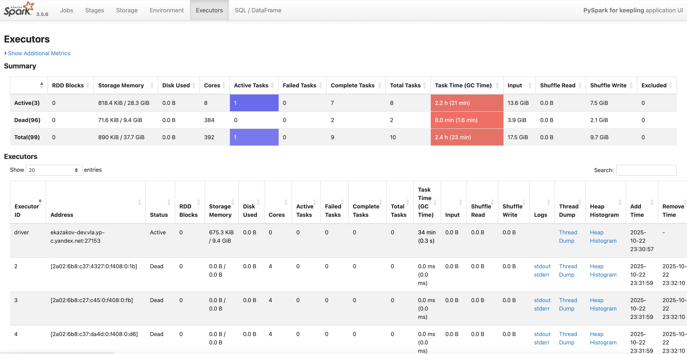
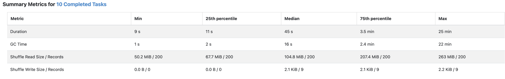
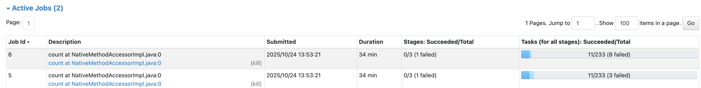
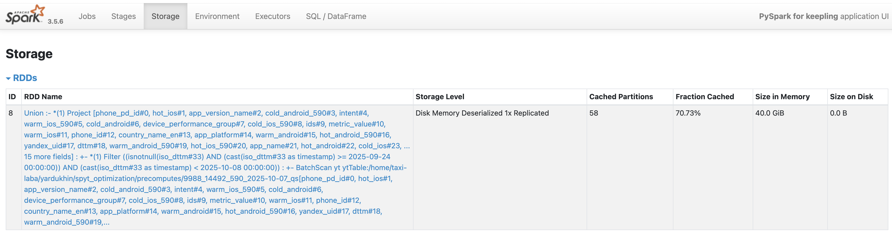
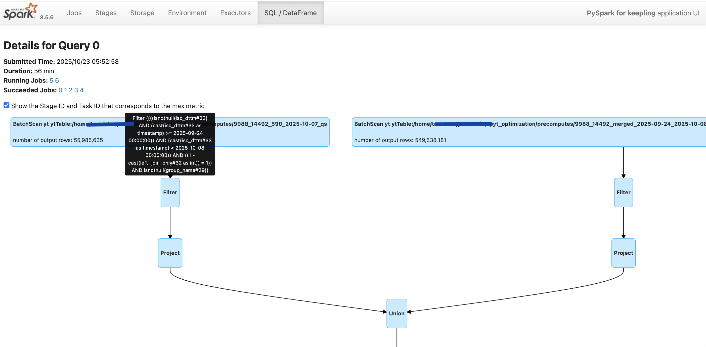

# Диагностика проблем Spark приложений

При работе со Spark-приложениями проблемы можно разделить на две большие категории:

1.  **Приложение не работает (критические сбои):** падает с ошибками (`OutOfMemoryError`, `Container killed ...` и т.д.), не запускается вообще или "зависает" на неопределённое время, не завершаясь.
2.  **Приложение работает медленно (проблемы производительности):** задача чаще всего отрабатывает до конца, но занимает слишком много времени, ощущается нерациональное использование ресурсов (CPU, память).

Диагностика этих двух сценариев начинается с разных шагов, хотя на более поздних этапах методы могут пересекаться (например, нехватка памяти может как приводить к падению, так и к замедлению из-за долгого GC).

-   В случае **критических сбоев** приложение может не доходить до стадии, где доступны инструменты вроде Spark UI. Поэтому первичными средствами диагностики являются **логи**: логи драйвера, экзекьюторов и менеджера кластера.
-   В случае **проблем с производительностью** приложение работает, а значит, генерирует массу полезных данных. Первичными средствами диагностики являются **Spark UI**, **Spark History Server (SHS)** и **метрики** выполнения.

Информация по разрешению **критических сбоев** в случае standalone кластера SPYT доступна в разделе [Кластер SPYT/Решение проблем](../../../../user-guide/data-processing/spyt/problems.md)

## Порядок действий для диагностики проблем с производительностью

### Шаг 1: Быстрый анализ (Первичная диагностика)

На этом этапе необходимо выявить очевидные "симптомы" неэффективной работы приложения, проанализировав **Spark UI** или **Spark History Server**.

*   **Громоздкий план выполнения.** Слишком сложный или длинный физический план в разделе **SQL/DataFrame** сложно анализировать для идентификации "узких" (неоптимальных) мест. Кроме того, в случае потери части партиций план будет исполнятся полностью повторно.
*   **Частые паузы сборщика мусора (GC).** В разделе **Executors** обратите внимание на колонку `GC Time`. Если это значение составляет значительную часть `Task Time` (в таком случае используется красный фон), это сигнализирует о нехватке памяти, неэффективном использовании объектов JVM или слишком больших партициях.

{ .center }

*   **Перекос данных в партициях (Data Skew).** В разделе **Stages** проверьте статистику по задачам (tasks). Если максимальное время выполнения (`Max`) значительно превышает медианное (`Median`), это говорит о неравномерном распределении данных по ключам. Несколько задач "тормозят" весь стейдж.

{ .center }

*   **Подозрительные параллельные джобы.** В разделе **Jobs** вы видите одновременный запуск нескольких джобов, хотя ожидали только один. Это может указывать на многократное считывание одних и тех же данных из-за нескольких `actions` (например, `.show()`, `.count()`, `display()`) на некэшированном DataFrame.

{ .center }

### Шаг 2: Принцип "Разделяй и властвуй"

Это ключевой шаг для анализа больших и сложных приложений. Вместо того чтобы оптимизировать монолитный код, разбейте его на логические части.

1.  **Дробление кода.** Разбейте цепочку трансформаций на отдельные шаги. Результат каждого шага сохраняйте в именованный DataFrame.
    ```python
    # Вместо:
    # final_df = source_df.filter(...).join(...).groupBy(...).agg(...)

    # Используйте:
    filtered_df = source_df.filter(...)
    joined_df = filtered_df.join(...)
    aggregated_df = joined_df.groupBy(...).agg(...)
    ```

2.  **Кэширование (`.persist()`) и материализация (`.count()`).** Кэшируйте промежуточные DataFrame'ы, особенно перед "тяжелыми" операциями (join, groupBy).
    *   Становится видно, вычисление какого именно DataFrame занимает больше всего времени.
    *   Позволяет перезапускать только проблемный участок кода, не пересчитывая всю предыдущую цепочку.
    *   После кэширования можно оценить реальный размер данных на каждом этапе на вкладке

{ .center }

3.  **Сохранение на диск.** Некоторые промежуточные DataFrame'ы можно сохранить в постоянное хранилище (кипарис) и читать на следующем шаге. Таким образом вы "разрезаете" план выполнения и не используете память для кеширования.

### Шаг 3: Уменьшение объема данных на ранних этапах

Чем раньше вы отфильтруете ненужную информацию, тем меньше ресурсов потребуется на последующих этапах.

*   **Pushdown-фильтры и Column Pruning.** Убедитесь, что Spark "проталкивает" фильтры (`.filter()`, `.where()`) и выбор колонок (`.select()`) на уровень источника данных. Это позволяет считывать с диска только те данные, которые действительно нужны.

   

   В Spark UI на вкладке **SQL/DataFrame** найдите стадию `Scan` для вашего источника. Сравните количество строк в исходной таблице и значение `number of output rows`. Если они совпадают при наличии фильтров, значит, pushdown не сработал.

   

{ .center }

*   **Правильное приведение типов.** Если в условии фильтрации сравниваются колонка и значение разных типов, приводите значение к типу колонки, а не наоборот.

    ```python
    # Хорошо: предикат может быть "протолкнут" до уровня хранения данных
    df.filter(col("date_str") == "2023-01-01")

    # Плохо: функция на колонке мешает pushdown
    df.filter(to_date(col("date_str")) == lit(some_date_object))
    ```

### Шаг 4: Анализ плана выполнения

После изоляции проблемного участка детально изучите его план выполнения в Spark UI.

*   **Агрегации (`HashAggregate` vs `ObjectHashAggregate`):**
    *   `HashAggregate` работает быстро и эффективно по памяти, используя whole-stage codegen.
    *   `ObjectHashAggregate` в плане — это тревожный знак. Он оперирует объектами JVM, что ведёт к высокому потреблению памяти и частым GC. Обычно появляется при агрегации по ключам со сложными типами данных.

*   **Тяжелые агрегации и Data Skew:** Одна из частых причин OOM — агрегация по ключу с сильным перекосом, когда все данные для одного ключа пытаются обработаться на одном экзекьюторе. Adaptive Query Execution (AQE) не всегда справляется с таким случаем.

    *   **Приближенные вычисления.** Используйте, если для бизнес-задачи не требуется абсолютная точность. Они работают на порядки быстрее и требуют значительно меньше ресурсов. Например, вместо `countDistinct()` используйте `approx_count_distinct()
    *   **Двухэтапная агрегация.** Для борьбы с перекосом можно сначала выполнить агрегацию с добавлением "соли" (случайного значения) к ключу, а затем провести финальную агрегацию по исходному ключу.
    *   **Разделите агрегации на "легкие" и "тяжелые".** Вычислите их по отдельности, а затем объедините результаты с помощью `.join()`.

*   **Использование подсказок (Hints).** Вручную подскажите Spark, как лучше выполнить операцию. Использовние `.hint()` не ломает AQE.

    ```python
    # Пример: принудительно задать количество партиций
    df.hint("REPARTITION", 100)
    ```

*   **Настройка Spark.** Оптимизируйте параметры, когда уже понимаете узкие места:
    *   **Распределение памяти:** `spark.executor.memory`, `spark.memory.fraction`.
    *   **Настройки AQE:** `spark.sql.adaptive.enabled`, `spark.sql.adaptive.skewJoin.enabled`.
    *   **Порог для Auto-Broadcast Join:** `spark.sql.autoBroadcastJoinThreshold`.



      С осторожностью меняйте настройки распределения памяти. Это может привести к значительной деградации.


