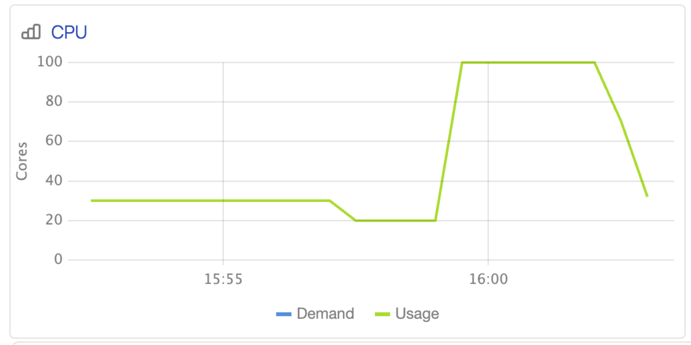

# Динамическая аллокация ресурсов (доступно с версии SPYT 2.8.0)

Динамическая аллокация позволяет масштабировать ресурсы под нужды Spark приложения в заданных пределах.
Для работы динамической аллокации требуется подключенный внешний shuffle-сервис, который обеспечивает сохранность данных при удалении экзекьюторов.

Для включения опции необходимо выставить следующие параметры:

```
--conf spark.dynamicAllocation.enabled=true
--conf spark.ytsaurus.shuffle.enabled=true
```

Помимо этого необходимо указать минимальное и максимальное число экзекьюторов и дополнительные параметры при необходимости, используя стандартную [конфигурацию Spark](https://spark.apache.org/docs/latest/configuration.html#dynamic-allocation):

```
--conf spark.dynamicAllocation.minExecutors=1            # минимум при простое
--conf spark.dynamicAllocation.maxExecutors=10           # максимум при нагрузке
--conf spark.dynamicAllocation.executorIdleTimeout=120s  # таймаут остановки при неактивности
--conf spark.dynamicAllocation.initialExecutors=5        # стартовое количество экзекьюторов
```
Из-за особенностей операций в {{product-name}} параметр minExecutors не должен быть равен нулю.



На данный момент динамическая аллокация не поддерживает множественные профили ресурсов экзекьюторов.



Если все настроено верно и характер приложения подразумевает неравномерное использование вычислительных ресурсов, то на странице мониторинга операции вы будете наблюдать изменение количества CPU с течением времени.

{ .center width="40%" }
