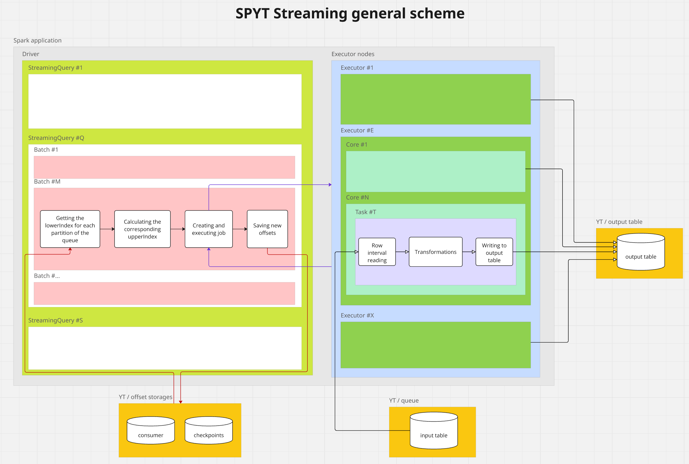
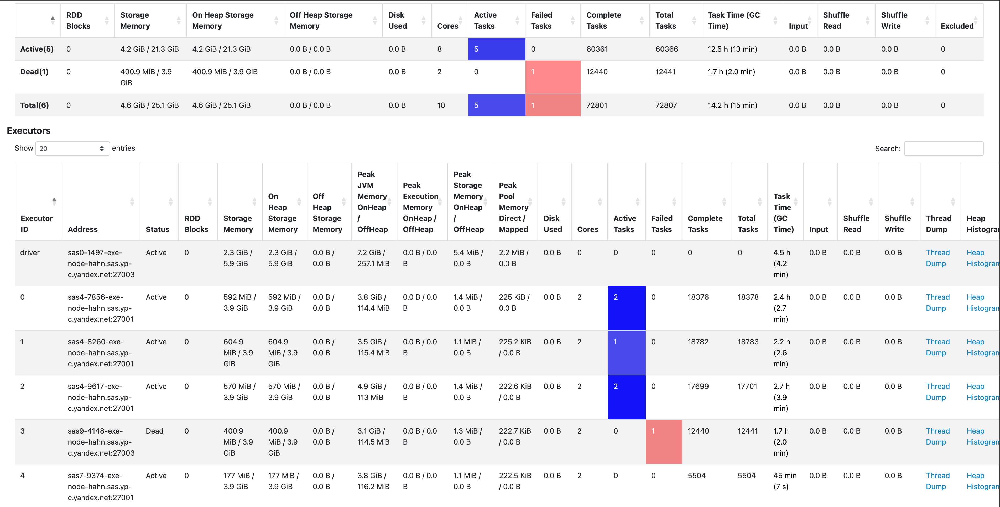
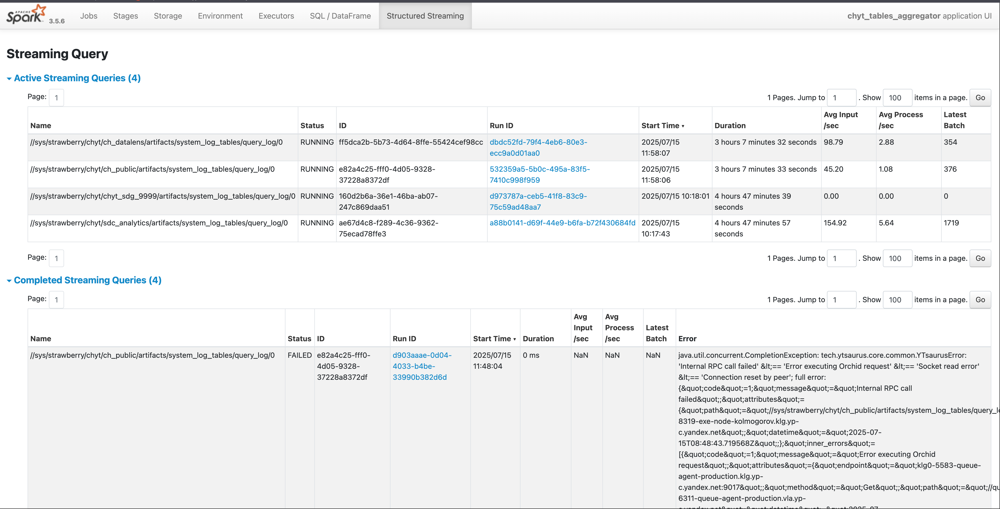
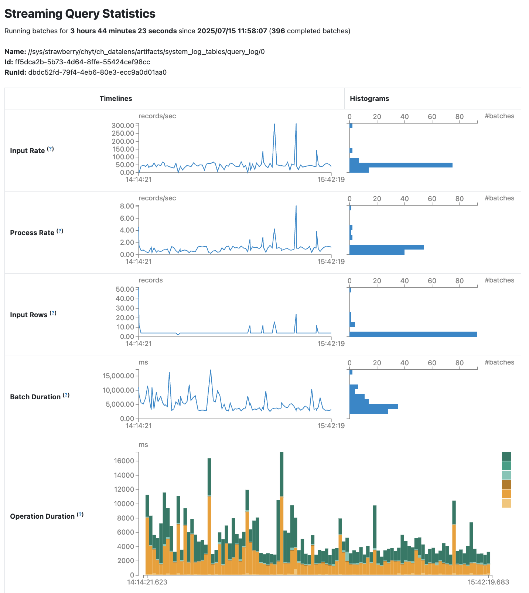

# Structured Streaming

В версии SPYT 1.77.0 появилась поддержка [стриминговых процессов](https://spark.apache.org/docs/latest/streaming/index.html) поверх {{product-name}}.

## Общая схема Spark Structured Streaming в SPYT

{ .center }

### Основные понятия

`Очередь` — любая упорядоченная динамическая таблица.

`Сonsumer` — сортированная таблица с некоторой фиксированной схемой. Консьюмер находится в соотношении many-to-many с очередями и представляет из себя потребителя одной или нескольких очередей. Задача консьюмера — хранить оффсеты по партициям читаемых очередей.

`Source` — источник данных. В стриминге поверх Queue API это очередь (упорядоченная динамическая таблица).

`Sink` — приёмник данных. Например, выходная динамическая таблица.

`Microbatch` — порция данных, которая обрабатывается за одну итерацию стриминга.

`Streaming Query` — непрерывно выполняемый процесс, который обрабатывает поток данных микробатчами. Читает данные из `Source`, применяет заданные преобразования и записывает результаты в `Sink`. Создается методом `start()` класса `DataStreamWriter`.

## Хранилище чекпоинтов { #checkpoint-location }

{{product-name}} может выступать в роли надежного хранилища оффсетов и других метаданных. Для этого необходимо указать опцию `checkpointLocation` со значением `yt:///...`. После чего вся метаинформация об этой задаче будет сохраняться по указанному пути.

<small>Листинг 1 — Пример использования хранилища чекпоинтов</small>

```scala
val numbers = spark
  .readStream
  .format("rate")
  .option("rowsPerSecond", 1)
  .load()
  .select($"timestamp", floor(rand() * 10).as("num"))

val groupedNumbers = numbers
  .withWatermark("timestamp", "5 seconds")
  .groupBy(window($"timestamp", "5 seconds", "3 seconds"), $"num")
  .count()

val job = groupedNumbers
  .writeStream
  .option("checkpointLocation", "yt:///tmp/spark-streaming/sample01/checkpoints")
  .trigger(ProcessingTime(1000))
  .foreachBatch { (frame: DataFrame, batchNum: Long) =>
    frame.write.mode(SaveMode.Append).yt("//tmp/spark-streaming/sample01/result")
  }

val query = job.start()
query.awaitTermination()
```

## Стриминг очередей {{product-name}} { #queues }

{{product-name}} имеет собственную реализацию [очередей](../../../../user-guide/dynamic-tables/queues.md), основанных на упорядоченных динамических таблицах.

На текущий момент SPYT кластер способен оперировать только с данными, расположенными на том же кластере {{product-name}}. Это ограничение накладывается и на консьюмеры/очереди.

Перед запуском стриминговой задачи необходимо создать и настроить очереди в соответствии с [документацией](../../../../user-guide/dynamic-tables/queues.md#api). В случае чтения — создать таблицы очередей и консьюмеров, произвести регистрацию. Запись результатов стриминга производится в упорядоченную динамическую таблицу, созданную и примонтированную заранее.

После обработки очередной порции данных совершается коммит нового смещения, что позволяет уведомлять входную таблицу о возможности удалить неактуальные строки.

При использовании очередей на чтение и на запись действуют гарантии at-least-once.

<small>Листинг 2 — Пример использования очередей на языке Scala</small>

```scala
val numbers = spark
  .readStream
  .format("yt")
  .option("consumer_path", "//tmp/spark-streaming/sample02/consumer")
  .load("//tmp/spark-streaming/sample02/queue")

val job = numbers
  .writeStream
  .option("checkpointLocation", "yt:///tmp/spark-streaming/sample02/checkpoints")
  .trigger(ProcessingTime(2000))
  .format("yt")
  .option("path", "//tmp/spark-streaming/sample02/result")

val query = job.start()
query.awaitTermination()
```

<small>Листинг 3 — Пример использования очередей на языке Python</small>

```python
from pyspark.sql.functions import length
from spyt import spark_session

with spark_session() as spark:
    df = spark \
        .readStream \
        .format("yt") \
        .option("consumer_path", "//tmp/spark-streaming/sample02/consumer") \
        .load("//tmp/spark-streaming/sample02/queue")
    df\
        .select("data") \
        .withColumn('data_length', length("data")) \
        .writeStream \
        .format("yt") \
        .option("checkpointLocation", "yt:///tmp/spark-streaming/sample02/checkpoints") \
        .option("path", "//tmp/spark-streaming/sample02/result") \
        .start().awaitTermination()
```

## Механизм обработки микробатча в Streaming Query { #streaming-query-processing-mechanism }

1. **Инициализация батча**

   Драйвер запускает обработку нового микробатча **#N**:
   - Получает текущие оффсеты (lowerIndex) для всех партиций очереди.
   - Вычисляет upperIndex для каждой партиции по формуле:
     ```
     upperIndex = min(
         lowerIndex + max_rows_per_partition,
         текущий_конец_очереди
     )
     ```
     
2. **Сравнение lowerIndex и upperIndex** 

   Для каждой партиции:
   - Если lowerIndex < upperIndex:
     - Выполняется метод [advanceConsumer](../../../../user-guide/dynamic-tables/queues.md#rabota-s-konsyumerom) для фиксации оффсетов батча `#N-1` в консьюмере.
     - Формирует таски для экзекьюторов.
   - Иначе: пропускает обработку (пустой батч).
   
3. **Исполнение на экзекьюторах**

   Каждый экзекьютор для своей партиции:
   - Читает данные, используя метод [pullConsumer](../../../../user-guide/dynamic-tables/queues.md#chtenie-dannyh).
   - Применяет трансформации (если есть).
   - Пишет данные в выходную таблицу.
   
4. **Создание чекпоинт файлов на Кипарисе для батча #N**
   - Файл в директории `offsets`.
   - Файл в директории `commits`.

5. **Новая итерация**
   - Система переходит к батчу `#N+1`.
   - Повторяет шаги 1-3 с новыми оффсетами.
   - Только на 2 этапе итерации `#N+1` вызывается commit батча **#N**, если есть доступные строки.

## Работа с оффсетами { #streaming-offsets }

На текущий момент оффсеты хранятся в 2 местах:

1. В [чекпоинт файлах](../../../../user-guide/data-processing/spyt/structured-streaming#checkpoint-location), создаваемых Sparkом автоматически в директории.
2. В таблице consumer.


### Определение lowerIndex и upperIndex для каждой партиции

1. Spark пытается найти последний чекпоинт файл на Кипарисе.
   - Если файл есть, то получает из него структуру с оффсетами, содержащую `lowerIndex` для каждой партиции.
   - Если нет, то берутся оффсеты из консьюмера.
2. Для каждой партиции входной очереди происходит получение максимального $row_index — `upper_row_index`.
3. Анализируется опция `max_rows_per_partition`:
   - Если она установлена, то для каждой партиции вычисляется `upperIndex` для каждой партиции по формуле:
     ```
     upperIndex = min(
         lowerIndex + max_rows_per_partition,
         upper_row_index
     )
     ```

### Возможный рассинхрон оффсетов

Из-за особенности позднего вызова метода `commit`, реализованной в самом Spark, оффсеты в консьюмере могут "отставать" от оффсетов в чекпоинт файлах на 1 батч, если:
- Батч **#N** полностью обработан, но батч `#N+1` еще не инициализирован.
- Батч `#N+1` пустой и не будет обработан, потому что во входной очереди нет (или не осталось) непрочитанных строк.

Тогда оффсеты в последнем чекпоинт файле будут соответствовать `upperIndex` батча **#N**, а поле `offset` в консьюмере будут соответствовать `upperIndex`.


## Достижение семантики exactly-once { #exactly-once }

Spark Structured Streaming, работающий поверх {{product-name}} очередей, предоставляет гарантию `at-least-once`.

В некоторых сценариях возможно достичь гарантии `exactly-once` при одновременном выполнении двух условий:

1. **Преобразования без сохранения состояния (stateless processing)**
   
   К таким операциям относятся:
   - Простые трансформации (`select`, `filter`, `withColumn`).
   - Проекции и переименование колонок.
   - Любые операции, где каждая выходная строка зависит **строго от одной входной строки**.

2. **Инъективное отображение данных**

   Должны соблюдаться требования:
   - Каждая входная строка преобразуется **не более чем в одну выходную**.
   - Отсутствуют операции, порождающие дубликаты (например, `join`, `groupBy`, `union` без дедупликации).


**Необходимые действия:**

1. Установить опцию `include_service_columns` в значение `true`. Тогда стриминговый датафрейм будет содержать столбцы `__spyt_streaming_src_tablet_index` и `__spyt_streaming_src_row_index`, соответствующие столбцам `$tablet_index` и`$row_index` читаемой очереди.
2. Создать выходную сортированную динамическую таблицу с ключевыми колонками `__spyt_streaming_src_tablet_index` и `__spyt_streaming_src_row_index`. Можно назвать эти колонки в выходной таблице по-другому, но тогда и в датафрейме необходимо переименовать их (как в примере ниже).
3. Если чтение происходит из более чем одной очереди, можно добавить в датафрейм (с помощью `withColumn()`) и в выходную таблицу ключевую колонку, содержащую уникальный идентификатор исходной очереди. Например, id или путь к очереди (как в примере ниже).
4. Достигаем at-most-once благодаря тому, что
   - В любой очереди комбинация значений столбцов `$tablet_index` и `$row_index` уникальна.
   - В выходной сортированной динамической таблице колонки `__spyt_streaming_src_tablet_index` и `__spyt_streaming_src_row_index` ключевые.

В результате: `at-least-once` + `at-most-once` = `exactly-once`.



Важно помнить, что использование сортированной динамической таблицы вместо упорядоченной добавляет накладные расходы на сортировку. Поэтому при отсутствии необходимости в семантике at-most-once лучше писать в упорядоченные динамические таблицы.



<small>Листинг 4 — Использование опции include_service_columns</small>

```python
import spyt
from pyspark.sql import SparkSession
from pyspark.sql.functions import lit
from yt.wrapper import YtClient
import os


yt = YtClient(proxy="hume.yt.yandex.net", token=os.environ['YT_SECURE_VAULT_YT_TOKEN'])
spark = SparkSession.builder.appName('streaming example').getOrCreate()

schema = [
    {"name": "src_queue_path", "type": "string"},
    {"name": "tablet_idx", "type": "int64"},
    {"name": "row_idx", "type": "int64"},
    {"name": "some_data", "type": "string"},
]
yt.create("table", result_table_path, recursive=True, attributes={"dynamic": "true", "schema": schema})
yt.mount_table(result_table_path, sync=True)

df = spark \
  .readStream \
  .format("yt") \
  .option("consumer_path", consumer_path) \
  .option("include_service_columns", True) \
  .load(queue_path)
  .withColumnRenamed("__spyt_streaming_src_tablet_index", "tablet_idx")
  .withColumnRenamed("__spyt_streaming_src_row_index", "row_idx")
  .withColumn("src_queue_path", lit(queue_path))

query = df\
  .writeStream \
  .outputMode("append") \
  .format("yt") \
  .option("checkpointLocation", checkpoints_path) \
  .option("path", result_table_path) \
  .start()
```

## Конфигурация количества строк на 1 батч { #rows-limit }

По умолчанию Spark пытается прочитать все доступные в очереди строки за 1 стриминговый микробатч. Для очередей с большим количеством непрочитанных строк это приведет к `OutOfMemoryError` на экзекьюторах. Есть 2 опции для установки лимита строк на 1 микробатч:

1. Опция `max_rows_per_partition` задает максимальное количество строк, которые могут быть прочитаны из одной партиции очереди в рамках одного батча. Например:
   - Если очередь состоит из 3 партиций и `max_rows_per_partition` равно 1000, то будет прочитано не более 1000 строк каждой партиции, то есть не более 3000 строк за 1 батч. При этом партиции распределяются между экзекьюторами равномерно. Если экзекьюторов не меньше, чем партиций, то каждый будет обрабатывать не более 1 партиции.
   - В простейшем случае, когда очередь состоит из 1 партиции, `max_rows_per_partition` фактически устанавливает лимит строк на 1 батч.
2. Конфигурационный параметр `spark.yt.write.dynBatchSize` устанавливает максимально количество строк, которые могут быть записаны в динамическую таблицу за 1 вызов команды `modifyRows`. Например:
   - Если экзекьютор прочитал 1000 строк, а `spark.yt.write.dynBatchSize` равно 100, то будет 10 раз последовательно будет сформирован `ModifyRowsRequest`, содержащий по 100 строк.

<small>Листинг 5 — Использование опции max_rows_per_partition</small>

```python
spark = SparkSession.builder.appName('streaming example') \
   .config("spark.yt.write.dynBatchSize", 100) \
   .getOrCreate()

df = spark \
  .readStream \
  .format("yt") \
  .option("consumer_path", consumer_path) \
  .option("max_rows_per_partition", 1000) \
  .load(queue_path)

query = df\
  .writeStream \
  .outputMode("append") \
  .format("yt") \
  .option("checkpointLocation", checkpoints_path) \
  .option("path", result_table_path) \
  .start()
```

## Композитные типы { #type-v3 }
Для того чтобы обрабатывать стримингом [композитные типы данных](../../../../user-guide/storage/data-types.md), необходимо, как и для батчовых джоб, включать опции `parsing_type_v3` и `write_type_v3`.

<small>Листинг 6 — Обработка композитных типов в Structured Streaming</small>

```python
df = spark \
  .readStream \
  .format("yt") \
  .option("consumer_path", consumer_path) \
  .option("parsing_type_v3", "true") \
  .load(queue_path)
  
query = df\
  .writeStream \
  .outputMode("append") \
  .format("yt") \
  .option("write_type_v3", True) \
  .option("checkpointLocation", checkpoints_path) \
  .option("path", result_table_path) \
  .start()
```

## Параметры Spark Structured Streaming, задаваемые через Spark методы { #streaming-required-params }

| Параметр   | Описание                                                      | Обязательный                                                                | Значение по умолчанию |
|------------|---------------------------------------------------------------|-----------------------------------------------------------------------------|-----------------------|
| format     | Формат. Указывается отдельно для readStream и для writeStream | да (для Structured Streaming поверх дин таблиц необходимо указать значение `yt`) | —                     |
| load       | Входная очередь                                               | да                                                                          | —                     |
| outputMode | Режим записи                                                  | нет                                                                         | "append"              |


## Параметры Spark сессии для конфигурации стриминга { #streaming-configs }

| Опция                       | Описание                                                                     | Обязательный | Значение по умолчанию |
|-----------------------------|------------------------------------------------------------------------------|--------------|-----------------------|
| spark.yt.write.dynBatchSize | Максимальное количество строк в одной операции записи в динамическую таблицу | нет          | 50000                 |


## Опции { #streaming-options }

| Опция                   | Описание                                                                                | Обязательный | Значение по умолчанию |
|-------------------------|-----------------------------------------------------------------------------------------|--------------|-----------------------|
| consumer_path           | Путь к таблице-консьюмеру                                                               | да           | —                     |
| checkpointLocation      | Путь к директории с чекпоинт-файлами                                                    | да           | —                     |
| path                    | Путь к выходной таблице                                                                 | да           | —                     |
| include_service_columns | Добавить колонки `$tablet_index` и `$row_index` читаемой очереди в датафрейм            | нет          | false                 |
| max_rows_per_partition  | Максимальное количество строк, читаемых из одной партиции очереди в рамках одного батча | нет          | ∞                     |
| parsing_type_v3         | Читать композитные типы с сохранением типа                                              | нет          | false                 |
| write_type_v3           | Писать композитные типы с сохранением типа                                              | нет          | false                 |


## Матрица совместимости { #compatibility-matrix }

| Функциональность                                       | Минимальная версия SPYT                                                         |
|--------------------------------------------------------|---------------------------------------------------------------------------------|
| Хранение чекпоинтов на {{product-name}}                | 1.77.0                                                                          |
| Structured Streaming поверх {{product-name}} Queue API | 1.77.0                                                                          |
| Поддержка композитных типов данных                     | 2.6.0                                                                           |
| Опция max_rows_per_partition                           | 2.6.0                                                                           |
| Опция include_service_columns                          | 2.6.0                                                                           |
| Параметр spark.yt.write.dynBatchSize                   | с 2.6.5 стал конфигурируем для стриминга (ранее был жестко задан и равен 50000) |


## Мониторинг в Spark webUI { #monitoring }

Страницы Jobs, Stages, SQL/Dataframes как и в обычном Spark приложении нужны для мониторинга джобов, этапов выполнения и планов запросов.

Environment нужен для просмотра всех конфигурационных параметров Spark сессии и некоторых метрик.

На странице Executors можно посмотреть количество активных, упавших, выполненных тасок и понять, насколько оптимально загружены ядра экзекьюторов. А также можно узнать статистику использования памяти. Иногда при утечке памяти полезно переходить во Thread Dump или Heap Histogram, чтобы найти причину. 

{ .center }

Для стриминговых процессов в webUI по умолчанию появляется страница Structured Streaming. Здесь можно смотреть статистику по активным и по завершенным стримам. В частности, полезно смотреть, с какой ошибкой завершился Streaming Query.

{ .center }

Нажав на Run ID, можно посмотреть более детальную статистику конкретного Streaming Query.

{ .center }

## Best practices { #best-practices }

- Правильная настройка опций `max_rows_per_partition` и конфига `spark.yt.write.dynBatchSize` для ограничения размера строк, обрабатываемых за 1 батч. Важно устанавливать их не слишком большими, так как иначе есть риск получить `OutOfMemoryError`. Но и не слишком мелкими, так как иначе батчи будут создаваться слишком часто, что значительно увеличивает нагрузку на мастер-сервера и прокси-сервера {{product-name}}.
- Установка небольшого значения конфига `spark.sql.streaming.minBatchesToRetain`. Этот параметр устанавливает минимальное количество последних батчей, метаданные которых необходимо хранить. Это файлы в директории с чекпоинтами на Кипарисе и объекты во внутренних структурах драйвера. По дефолту значение этого конфига равно 100. Для стриминга без трансформаций с сохранением состояния, достаточно выставить `--conf spark.sql.streaming.minBatchesToRetain=2`. Это позволяет экономить чанки на Кипарисе и память драйвера.
- Устанавливать при создании спарк сессии конфигурационные параметры:
   -  `.config("spark.streaming.stopGracefullyOnShutdown", True)` - Корректно завершить обработку всех созданных батчей и очистить ресурсы перед остановкой стриминга.
   - `.config("spark.streaming.stopGracefullyOnShutdown.timeout", ...)` — Время на корректное завершение в миллисекундах.
   - `.config("spark.sql.adaptive.enabled", False)` — Обычное адаптивное выполнение не работает для стриминга. Выключаем его.
   - `.config("spark.sql.streaming.adaptiveExecution.enabled", True)` — Включаем специальное адаптивное выполнение для стриминговых джобов.

- Настраивать распределение памяти параметрами `spark.memory.fraction` и `spark.memory.storageFraction`, например:
  - `.config("spark.memory.fraction", 0.5)` — 50% памяти на execution, 50% на storage.
  - `.config("spark.memory.storageFraction", 0.2)` — 20% памяти выделяется на кеш и 80% на обработку данных (подходит, если нет кеширования).
