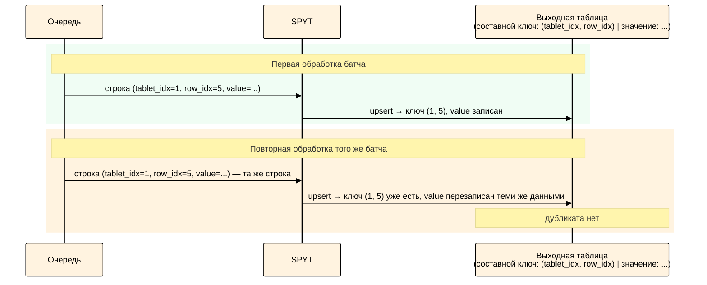

# Идемпотентный приёмник

В этой статье — инструкции по настройке идемпотентного приёмника.



Идемпотентный приёмник работает медленнее, чем нетранзакционный стриминг и [транзакционный режим](../../../../../../user-guide/data-processing/spyt/structured-streaming/exactly-once/transactional-mode.md): это связано с тем, что данные записываются в сортированную динамическую таблицу, которая требует обновления индекса при каждой записи. Если скорость записи критична, рассмотрите транзакционный режим: он быстрее и поддерживает любые трансформации.



## Как работает { #how-it-works }

Идемпотентный приёмник достигает `exactly-once` иначе, чем [транзакционный режим](../../../../../../user-guide/data-processing/spyt/structured-streaming/exactly-once/transactional-mode.md): не через атомарность, а через идемпотентность записи. Если при повторном выполнении батча в таблицу попадают те же самые строки, дубликатов не возникает.

Механизм основан на уникальной идентификации каждой строки очереди:

1. Каждая строка упорядоченной динамической таблицы (очереди) адресуется неизменяемой парой (`$tablet_index`, `$row_index`) — индексом таблета и позицией строки внутри него.
2. SPYT передаёт эти значения в стриминговый датафрейм как служебные колонки `__spyt_streaming_src_tablet_index` и `__spyt_streaming_src_row_index`.
3. Выходная таблица создаётся как сортированная динамическая таблица с составным первичным ключом по этим двум колонкам.
4. Запись происходит через upsert: если строка с таким составным ключом уже существует, она перезаписывается теми же данными. При повторной обработке батча результат не отличается от первой записи.

<div class="mermaid-diagram-compact">



</div>

## Когда можно использовать { #applicability }

Идемпотентный приёмник работает только со stateless 1:1 трансформациями — то есть с такими, где:

- обработка строк не зависит от предыдущих микробатчей;
- каждая входная строка преобразуется строго в одну выходную.

Ниже — примеры Spark-операций, которые работают и не работают с идемпотентным приёмником:

| **Работают с идемпотентным приёмником** | **Не работают с идемпотентным приёмником** |
|---|---|
| `select`, `filter`, `withColumn`, проекции, переименования | `join`, `groupBy`, `explode`, `flatMap`, `union`[*](*union), агрегации |

При операциях с несколькими выходными строками (например, `explode` или `join` в режиме один-ко-многим) или при агрегациях (`groupBy`) связь между позицией строки в очереди и выходными данными разрывается — служебные колонки либо теряются, либо перестают однозначно идентифицировать результат.

## Как включить { #steps }

1. При чтении очереди установите опцию [include_service_columns](../../../../../../user-guide/data-processing/spyt/thesaurus/streaming-options.md#service-columns) в `true`. Тогда стриминговый датафрейм будет содержать столбцы `__spyt_streaming_src_tablet_index` и `__spyt_streaming_src_row_index`, соответствующие `$tablet_index` и `$row_index` строки в читаемой очереди.
2. Создайте выходную [сортированную динамическую таблицу](../../../../../../user-guide/dynamic-tables/sorted-dynamic-tables.md) и примонтируйте её до запуска стриминга.
   - Если чтение идёт из одной очереди, используйте в качестве ключевых колонок `__spyt_streaming_src_tablet_index` и `__spyt_streaming_src_row_index`. Ключевые колонки должны быть указаны в схеме и образовывать её префикс, см. [схему таблицы](../../../../../../user-guide/storage/static-schema.md). Можно переименовать эти колонки — тогда переименуйте их и в датафрейме, как в листинге ниже.
   - Если чтение происходит из более чем одной очереди, добавьте в ключ выходной таблицы и в датафрейм ещё одну колонку с уникальным идентификатором исходной очереди — например, её путь. Как это сделать, показано в [примере](#multi-queues).

После такой настройки ключ выходной таблицы однозначно определяется исходной строкой очереди, поэтому повторная запись той же строки не создаёт дубликат.

## Как проверить { #verify }

Чтобы убедиться, что настройка выполнена правильно, откройте выходную таблицу после нескольких обработанных микробатчей — в ней должны появиться строки с ключевыми колонками (или их переименованными аналогами). Если данных нет, проверьте, что таблица примонтирована и что опция `include_service_columns` установлена в `true`.

## Пример { #example }

### Одна очередь

<small>Листинг — Использование идемпотентного приёмника для одной очереди</small>

```python
# В примере выходная таблица содержит только ключевые колонки — это минимальная
# конфигурация, необходимая для идемпотентной записи.
# В реальной задаче добавьте в схему таблицы и в датафрейм остальные колонки результата.

import os
import spyt
import yt.yson as yson
from pyspark.sql import SparkSession
from yt.wrapper import YtClient

queue_path = "//path/to/queue"
consumer_path = "//path/to/consumer"
result_table_path = "//path/to/result"
checkpoints_path = "//path/to/checkpoints"

yt = YtClient(
    proxy="<cluster-name>",
    token=os.environ["YT_SECURE_VAULT_YT_TOKEN"],
)

spark = SparkSession.builder.appName("streaming example").getOrCreate()

# Ключ таблицы должен однозначно идентифицировать строку исходной очереди.
schema = yson.YsonList([
    {"name": "tablet_idx", "type": "int64", "sort_order": "ascending"},
    {"name": "row_idx", "type": "int64", "sort_order": "ascending"},
])
schema.attributes["unique_keys"] = True

# Выходную динамическую таблицу нужно создать и примонтировать заранее.
yt.create(
    "table",
    result_table_path,
    recursive=True,
    attributes={
        "dynamic": True,
        "schema": schema,
    },
)
yt.mount_table(result_table_path, sync=True)

# Переименуйте служебные колонки так, чтобы они совпали со схемой выходной таблицы.
df = (
    spark.readStream.format("yt")
    .option("consumer_path", consumer_path)
    .option("include_service_columns", True)
    .load(queue_path)
    .withColumnRenamed("__spyt_streaming_src_tablet_index", "tablet_idx")
    .withColumnRenamed("__spyt_streaming_src_row_index", "row_idx")
    .select("tablet_idx", "row_idx")
)

query = (
    df.writeStream.outputMode("append")
    .format("yt")
    .option("checkpointLocation", checkpoints_path)
    .option("path", result_table_path)
    .start()
)
```

### Несколько очередей { #multi-queues }

Если чтение идёт из нескольких очередей, добавьте в схему выходной таблицы и в датафрейм ещё одну ключевую колонку с идентификатором очереди, например её путь. Служебной колонки с путём очереди в SPYT нет: доступны только `__spyt_streaming_src_tablet_index` и `__spyt_streaming_src_row_index`, аналога `input_file_name()` нет. Поэтому идентификатор очереди нужно добавлять вручную при чтении каждой очереди:

<small>Листинг — Чтение из нескольких очередей с идентификатором источника</small>

```python
from pyspark.sql.functions import lit

df1 = (
    spark.readStream.format("yt")
    .option("consumer_path", consumer_path)
    .option("include_service_columns", True)
    .load(queue_path_1)
    .withColumn("queue_id", lit(queue_path_1))
)

df2 = (
    spark.readStream.format("yt")
    .option("consumer_path", consumer_path)
    .option("include_service_columns", True)
    .load(queue_path_2)
    .withColumn("queue_id", lit(queue_path_2))
)

df = df1.union(df2)
```

В этом случае ключ выходной таблицы должен включать `queue_id` вместе с колонками, построенными из `__spyt_streaming_src_tablet_index` и `__spyt_streaming_src_row_index`.


## Типичные ошибки настройки { #violations }

| **Ошибка** | **Последствие** |
|---|---|
| Из одной входной строки получается несколько выходных | Идемпотентный ключ перестаёт быть взаимно-однозначным: несколько выходных строк начинают конкурировать за один и тот же ключ. В результате часть данных может быть перезаписана без падения джоба, что приведёт к тихой потере данных без падения джоба |
| Трансформация теряет служебные колонки `__spyt_streaming_src_tablet_index` и `__spyt_streaming_src_row_index` (или их переименованные аналоги) | Запись батча завершится ошибкой: в датафрейме не будет ключевых колонок, обязательных для выходной таблицы |
| Чтение идёт из нескольких очередей (например, объединённых через `union`), но идентификатор очереди не включён в ключ | Каждая очередь нумерует строки независимо, поэтому строки из разных очередей могут получить одинаковый ключ `(tablet_index, row_index)`. Операция `upsert` перезапишет одну строку другой — данные исчезнут без ошибок или предупреждений |
| Выходная таблица не настроена как сортированная динамическая таблица с нужными ключевыми колонками | Механизм идемпотентной записи не сработает: повторная запись той же исходной строки не будет надёжно дедуплицироваться, и гарантия `exactly-once` не достигается |

## См. также

- [Гарантия exactly-once](../../../../../../user-guide/data-processing/spyt/structured-streaming/exactly-once/index.md) — выбор подхода к гарантиям записи
- [Транзакционный режим](../../../../../../user-guide/data-processing/spyt/structured-streaming/exactly-once/transactional-mode.md) — рекомендуемый подход для новых задач
- [Опции стриминга](../../../../../../user-guide/data-processing/spyt/thesaurus/streaming-options.md) — справочник опций

[*union]: Каждая очередь нумерует строки независимо: в очереди A и очереди B может оказаться строка с одинаковым ключом `(tablet_index=0, row_index=42)`, хотя это разные данные. Если объединить их через `union` напрямую, обе строки попадут в выходную таблицу с одним и тем же ключом — upsert перезапишет одну другой, и данные исчезнут без каких-либо ошибок или предупреждений. Чтобы ключи оставались уникальными, добавьте каждой строке колонку с идентификатором источника до объединения: `.withColumn("queue_id", lit(queue_path))` — и включите `queue_id` в ключ выходной таблицы.