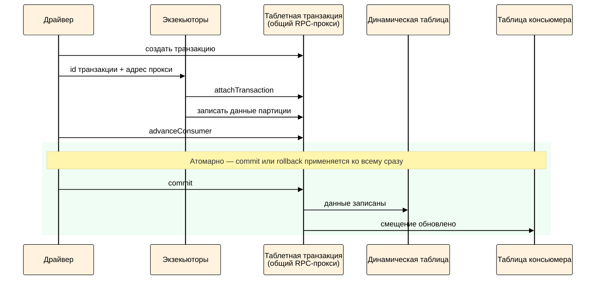

# Транзакционный режим стриминга



На данный момент транзакционный режим носит экспериментальный характер, так как из-за архитектурных особенностей этот режим может создавать повышенную нагрузку на коммунальные пулы RPC-прокси. Рекомендуется включать эту опцию только там, где гарантия `exactly-once` действительно необходима.



## Как работает { #how-it-works }

В транзакционном режиме запись данных и фиксация смещения консьюмера объединены в одну таблетную транзакцию. Благодаря этому дубликаты при повторном выполнении микробатча исключены — и в отличие от [идемпотентного приёмника](../../../../../../user-guide/data-processing/spyt/structured-streaming/exactly-once/idempotent-receiver.md) подход работает с любыми трансформациями, включая shuffle (`join`, агрегации).

Последовательность действий при обработке каждого микробатча:

1. Драйвер создаёт таблетную транзакцию на общем RPC-прокси.
2. Драйвер передаёт экзекьюторам id транзакции и адрес прокси.
3. Каждый экзекьютор присоединяется к транзакции через `attachTransaction` и записывает данные своей партиции.
4. Драйвер в той же транзакции вызывает `advanceConsumer`.
5. Драйвер коммитит транзакцию.
6. Транзакция атомарно фиксирует результат: данные записаны в выходную таблицу, смещение обновлено в таблице консьюмера.

<div class="mermaid-diagram-compact">



</div>

## Пререквизиты { #prerequisites }

Прежде чем включить транзакционный режим:

1. Проверьте версию SPYT — транзакционный режим доступен начиная с версии 2.10. Как проверить: Spark UI → вкладка **Environment** → раздел **Spark Properties** → `spark.yt.version`

2. Создайте выходную таблицу с достаточным числом таблетов и примонтируйте её. Это нужно сделать до запуска стриминга — транзакция записывает весь микробатч атомарно, и если таблетов мало, транзакция завершится с ошибкой по лимиту строк на таблет. Подробнее в разделе [Шардирование выходной таблицы](#sharding).

## Как включить { #enable }

Установите два параметра Spark-сессии:

- `spark.yt.streaming.transactional = true` — включает транзакционную запись микробатчей.
- `spark.ytsaurus.rpc.job.proxy.enabled = false` — отключает локальные Job Proxy и переводит драйвер и экзекьюторы на работу через общие пулы внешних RPC-прокси.

Флаг `spark.ytsaurus.rpc.job.proxy.enabled = false` — архитектурное требование. По умолчанию у драйвера и у каждого экзекьютора поднят собственный RPC-прокси. Транзакция, открытая в RPC-прокси драйвера, не видна в RPC-прокси экзекьюторов — поэтому все участники должны работать через один общий прокси.



Из-за использования общих пулов стабильность и скорость коммитов зависят от соседей по кластеру. Если пулы перегружены другими задачами, время записи микробатча может увеличиться, а в редких случаях возможны ошибки `transaction expired`. Учитывайте это при оценке пропускной способности (throughput) и будьте готовы корректировать размер микробатча при частых таймаутах — см. параметр `max_rows_per_partition` в [Опциях стриминга](../../../../../../user-guide/data-processing/spyt/thesaurus/streaming-options.md).



Примеры:



- Python

  ```python
  spark = SparkSession.builder \
    .config("spark.yt.streaming.transactional", "true") \
    .config("spark.ytsaurus.rpc.job.proxy.enabled", "false") \
    .getOrCreate()

  # Остальной код — обычный Spark Structured Streaming, без изменений
  ```

- CLI

  ```bash
  spark-submit \
    --conf spark.yt.streaming.transactional=true \
    --conf spark.ytsaurus.rpc.job.proxy.enabled=false \
    ...
  ```



## Как проверить { #verify }

Откройте Spark UI → вкладку **Environment** → раздел **Spark Properties** и найдите:

```
spark.yt.streaming.transactional      true
spark.ytsaurus.rpc.job.proxy.enabled  false
```

Если одного из параметров нет или его значение отличается — транзакционный режим не включён.


## Шардирование выходной таблицы { #sharding }

В {{product-name}} есть внутреннее [ограничение](../../../../../../user-guide/dynamic-tables/transactions.md#restrictions): в рамках одной транзакции в один таблет нельзя записать больше определённого числа строк (по умолчанию 100 000). Поскольку транзакционный режим атомарно записывает весь микробатч одной транзакцией, все его строки распределяются по таблетам выходной таблицы. Если таблетов мало, а микробатч большой, на каждый таблет придётся слишком много данных — лимит будет превышен, и транзакция завершится с ошибкой `Transaction affects too many rows in tablet`.

Чтобы транзакция успешно проходила лимиты, выходную таблицу следует шардировать — разбить на большее число таблетов до запуска стриминга. Точной формулы расчёта нужного количества таблетов нет — подбирайте опытным путём, отталкиваясь от характера нагрузки:
- Для нагрузок без shuffle, когда данные записываются без изменений или с простыми трансформациями (`filter`, `select`) — ориентируйтесь на число таблетов очереди-источника.
- Для операций с shuffle (`join`, `groupBy`, агрегации) универсального правила нет — ориентируйтесь на ожидаемый объём результата микробатча и корректируйте при необходимости.

Как задать число таблетов при создании таблицы или изменить его позже — в разделе [Шардирование](../../../../../../user-guide/dynamic-tables/resharding.md).

## Поведение при сбоях { #failures }

Ошибка во время обработки или записи батча

:    Транзакция прерывается (`abort`). Данные не записаны, consumer offset не продвинут. Spark автоматически повторяет микробатч — благодаря свойству транзакционности дубликаты не запишутся.

Перезапуск драйвера после успешного коммита

:    Транзакция уже зафиксирована: данные записаны, consumer offset продвинут. При перезапуске Spark прочитает актуальный offset из {{product-name}} и продолжит с нового места — дубликатов не будет.

## Решение проблем { #troubleshooting }

#|
|| **Проблема** | **Описание и решение** ||
|| Ошибка `Transaction affects too many rows in tablet` | Превышается лимит строк на таблет в рамках одной транзакции.

Как решить: Увеличьте число таблетов выходной таблицы. См. [Шардирование выходной таблицы](#sharding) ||
|| Ошибка `transaction expired` | Микробатч превышает таймаут транзакции.

Как решить: Уменьшите `max_rows_per_partition` или оптимизируйте трансформацию ||
|| Экзекьютор не может записать данные (транзакция не найдена) | Sticky-транзакция привязана к одному RPC-прокси; если драйвер и экзекьютор идут через разные прокси, экзекьютор не найдёт транзакцию.

Как решить: Убедитесь, что флаг `spark.ytsaurus.rpc.job.proxy.enabled` установлен в `false` ||
|#

## См. также

- [Гарантия exactly-once](../../../../../../user-guide/data-processing/spyt/structured-streaming/exactly-once/index.md) — выбор подхода к гарантиям записи
- [Идемпотентный приёмник](../../../../../../user-guide/data-processing/spyt/structured-streaming/exactly-once/idempotent-receiver.md) — альтернатива для stateless 1:1 трансформаций
- [Опции стриминга](../../../../../../user-guide/data-processing/spyt/thesaurus/streaming-options.md) — справочник опций
- [Конфигурационные параметры](../../../../../../user-guide/data-processing/spyt/thesaurus/configuration.md) — параметры Spark-сессии
