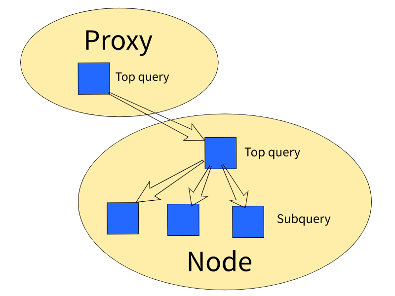

# Язык запросов

В данном разделе описан собственный диалект языка SQL, позволяющий читать и преобразовывать данные на стороне системы.

## Обзор

Данная функциональность поддерживается только для динамических таблиц.



Собственный диалект языка SQL не является полноценной реализацией языка SQL. Описываемый язык запросов стоит рассматривать как расширенную операцию чтения данных, позволяющую сделать часть работы по обработке данных на стороне сервера.





Описываемая функциональность не является заменой MapReduce операциям. Движок исполнения запросов не имеет планировщика и, задав тяжёлый запрос с full scan, можно вызвать деградацию кластера. Команда сервиса {{product-name}} работает над тем, чтобы добавить больше надёжности при обработке крупных запросов, однако описываемый диалект языка SQL не планируется развивать с целью замены MapReduce.



## Примеры

Чтение из таблицы:
```sql
yt select-rows "* FROM [//mytable] LIMIT 10" --format json
```
Подсчет количества строк:
```sql
yt select-rows "SUM(1) FROM [//mytable] GROUP BY 1" --format json
```
Запросы с группировкой:
```sql
yt select-rows "day, MIN(price), MAX(price) FROM [//mytable] WHERE is_ok = 1 GROUP BY timestamp / 86400 AS day" --format json
yt select-rows "item_id FROM [//mytable] WHERE (user_id, order_id) IN ((1, 1), (1, 2), (10, 10), (10, 11))" --format json
```

## Синтаксис запроса

```sql
* | <select-expr-1> [AS <select-alias-1>], <select-expr-2> [AS <select-alias-2>], ...
FROM [//path/to/table] [JOIN [//path/to/rhs1] USING <column-1>, <column-2>, ...]
[WHERE <predicate-expr>]
[GROUP BY <group-by-expr-1> [AS <group-by-alias-1>], <group-by-expr-2> [AS <group-by-alias-2], ...]
[ORDER BY <column-1>, <column-2>, ...]
[OFFSET <n>]
[LIMIT <m>]
```

В общем случае порядок строк на выходе запроса не определён, но в случаях [ORDER BY](#order_by) и [LIMIT](#limit) подобные гарантии даются.

### Секция SELECT { #select }
Синтаксис SELECT:
```sql
* | <select-expr-1> [AS <select-alias-1>], <select-expr-2> [AS <select-alias-2>], ...
```
Определяет выходные колонки запроса. При указании звездочки (`*`) в качестве выходных колонок будут использованы все входные колонки основной таблицы. Альтернативно можно задать произвольные выражения для вычисления. При запросах без группировки в выражении могут встречаться все колонки исходных таблиц. При запросах с группировкой в выражении могут встречаться только ключевые колонки, используемые для группировки, или агрегаты.

### Секция FROM ... JOIN { #from_join }
Синтаксис FROM ... JOIN:
```sql
FROM [//path/to/table] [[AS] <table-alias>] [[LEFT] JOIN [//path/to/dict-1] [[AS] <table-alias>] (ON <expression> = <foreign-expression> | USING <column-1>, <column-2>, ...) [AND <predicate>]] ...
```

Определяет источники данных для запроса. Таблица, указываемая сразу после FROM, считается основной, и именно она используется при координации исполнения запроса. Также допустимо указание вспомогательных таблиц-справочников в секции JOIN. Таблицы-справочники подключаются к основной таблице при точном совпадении указанного ключа. Без указания ключевого слова LEFT будет выполнен INNER JOIN. Дополнительно можно указывать выражение для фильтрации таблицы справочника, которое будет выполняться при чтении данных до выполнения join с основной таблицей.

Для объединения таблиц по нескольким колонкам в условии ON необходимо записать кортеж.

```sql
FROM [//x] AS x JOIN [//y] AS y ON (x.a, x.b) = (y.a, y.b)
```
Допускается написание выражений в условии JOIN:
```sql
ON (if(is_null(x.a), 0, x.a), x.b) = (y.a, y.b)
```

Подробнее про JOIN, их возможности и ограничения можно прочитать в разделе [JOINS](#joins).

### Секция WHERE { #where }
Синтаксис WHERE:
```sql
WHERE <predicate-expr>
```
Определяет первичный фильтр данных.

### Секция GROUP BY { #group_by }
Синтаксис GROUP BY:
```sql
GROUP BY <group-by-expr-1> [AS <group-by-alias-1>], <group-by-expr-2> [AS <group-by-alias-2], ...
```
Определяет группировку данных по ключу.

### Секция HAVING { #having }
Синтаксис HAVING:
```sql
HAVING <predicate-expr>
```
Определяет условие фильтрации после группировки.

### Модификатор WITH TOTALS { #with_totals }

Используется вместе с группировкой и добавляет к результату дополнительную строку, с которой в ключах группировки будут `NULL` значения, а в значениях суммарные агрегаты по сгруппированным данным. Добавляемая строка итоговым агрегатом не обрабатывается в ORDER BY ... LIMIT. В случае когда используется секция HAVING, итоговые агрегаты можно считать как до, так и после фильтрации. Порядковое расположение строки с итоговыми агрегатами в результирующем наборе строк неспецифицировано. Добавляемая строка может быть как первой, так и последней. Отличать её нужно по `NULL` ключу.

Синтаксис WITH TOTALS:
```sql
GROUP BY ... WITH TOTALS
GROUP BY ... WITH TOTALS HAVING ...
GROUP BY ... HAVING ... WITH TOTALS
```

### Секция ORDER BY { #order_by }
Синтаксис ORDER BY:
```sql
ORDER BY <order-by-expr-1> [ASC|DESC], <order-by-expr-2> [ASC|DESC], ...
```
Определяет упорядоченность выходного набора строк по указанным выражениям. По умолчанию используется порядок сортировки по возрастанию (ASC). Для сортировки по убыванию указывается ключевое слово DESC. Сортировка применяется после группировки, поэтому в выражениях могут присутствовать только ключевые колонки группировки или посчитанные агрегаты. Сортировка является частичной, то есть в качестве результата возвращается лишь N наименьших строк (параметр N задается в секции LIMIT).

### Секция OFFSET { #offset }
Синтаксис OFFSET:
```sql
OFFSET <n>
```
Определяет количество пропускаемых строк из выходного набора строк.

Эффективной реализации OFFSET в языке запросов при текущей схеме хранения данных быть не может. Для запроса OFFSET N LIMIT M будет прочитано N + M строк. Чтобы это реализовать эффективно, должен быть индекс из номера строки в ключ.
Правильный способ делать постраничный вывод — делать запросы с LIMIT, но вместо использования OFFSET запоминать последние значения ключа last_key = (key_column1, key_column2, ...) у результата текущего запроса и посылать следующий запрос с условием where (key_column1, key_column2, ...) > last_key.

### Секция LIMIT { #limit }
Синтаксис LIMIT
```sql
LIMIT <m>
```
Определяет размер выходного набора строк. При наличии секции ORDER BY задаёт ограничение на размер кучи, иначе — задаёт ограничение на порядок и объём сканируемых данных. При запросе с LIMIT данные сканируются последовательно по первичному ключу до достижения целевого размера, в этом случае порядок строк на выходе однозначно определён.



При использовании группировки с лимитом (без ORDER BY) данные будут читаться упорядоченно в порядке первичного ключа таблицы.

Если агрегатных колонок нет, после накопления необходимого набора сгруппированных строк запрос завершится. При наличии агрегатных колонок будет произведена догруппировка для накопленных в количестве, указанном в LIMIT, ключей.

При использовании LIMIT без ORDER BY следует обращать внимание на то, что LIMIT будет применяться к предыдущему оператору. Например, если используется GROUP BY ... WITH TOTALS и LIMIT, то итоговые агрегаты будут посчитаны по данным, уместившимся в лимит. Данные сверх лимита даже не будут прочитаны. Если добавить ORDER BY, то LIMIT будет влиять на него, а GROUP BY будут обработаны все прочитанные данные, соответственно TOTALS будут посчитаны по большему массиву данных.



## Синтаксис выражений { #expression_syntax }

```sql
<literal>
<identifier>
```
Арифметические операторы:
```sql
<expr> + <expr>
<expr> - <expr>
<expr> * <expr>
<expr> / <expr>
<expr> % <expr>
```
Битовые операторы:
```sql
<expr> ~ <expr>
<expr> | <expr>
<expr> & <expr>
<expr> >> <expr>
<expr> << <expr>
```
Логические операторы:
```sql
<expr> AND <expr>
<expr> OR <expr>
NOT <expr>
```
Операторы сравнения:
```sql
<expr> = <expr>
<expr> != <expr>
<expr> < <expr>
<expr> <= <expr>
<expr> > <expr>
<expr> >= <expr>
<expr> BETWEEN <literal> AND <literal>
<expr> BETWEEN (<literal> AND <literal>, ...)
```
Оператор IN:
```sql
<expr> IN (<literal>, ...)
```
Функции:
```sql
FN(<expr>, ...)
```

Приоритеты:

1.  `unary + - ~`
2.  `binary * / %`
3.  `binary + -`
4.  `binary >> <<`
5.  `binary &`
6.  `binary |`
7.  `binary < <= > >= IN BETWEEN`
8.  `binary =`
9.  `unary NOT`
10.  `binary AND`
11.  `binary OR`

Каждое выражение имеет тип: `int64`, `uint64`, `boolean`, `double`, `string`, `any`. Типизация выражений строгая. При возникновении ошибки типизации исполнение запроса останавливается и пользователю возвращается ошибка.

Арифметические операторы принимают на вход численные типы (`int64`, `uint64`, `double`) и возвращают значение такого же типа.

Логические операторы принимают на вход и возвращают значения типа `boolean`.

Операторы сравнения, операторы IN и BETWEEN принимают на вход значения одинакового типа и возвращают значения типа `boolean`. Также они допускают использование кортежей.

Пример использования кортежей:
```sql
(a, b) >= (valA, valB)
(a, b) IN ((valA0, valB0), (valA1, valB1), ...)
(a, b) BETWEEN ((16202224, 1) AND (16202224, 3), (2011740432, 6) AND (2011740432), (591141536) AND (591141536, 2), ...)
```
Функции в выражениях бывают двух типов: скалярные, применяемые к кортежу значений, и агрегирующие, применяемые к группе входных данных, соответствующих одному ключу. Скалярные функции можно использовать в любом выражении. Агрегирующие функции можно использовать только в секции SELECT при наличии секции GROUP BY.

### Идентификаторы { #identifiers }
Имена колонок, содержащие специальные символы, необходимо оборачивать в квадратные скобки.

**Примеры**: `t.[a.b], t.[c-1], t.[[d]] from [//path] as t`, где `a.b`, `c-1` и `[d]` — имена колонок.
В результирующей схеме в именах колонок квадратные скобки по возможности будут опускаться.
Для запроса `[my.column-1], [my+column-2] from ...` будет схема `"my.column-1", "my+column-2"`.
В случае если в запросе указаны выражения без псевдонима (`AS name`), a колонки содержат специальные символы, квадратные скобки будут добавлены.
Для запроса `[my.column-1] + x, [my+column-2] from ...` будет схема `"[my.column-1] + x", "my+column-2"`.

### Синонимы { #synonims }
Для выражений можно задавать имя с помощью ключевого слова AS. Поддержка синонимов сделана аналогично [ClickHouse](https://clickhouse.yandex). В отличие от стандартного SQL, синонимы могут объявляться не только на верхнем уровне выражений: `((1 as x) + x) as y`. Кроме этого, синонимы можно использовать во всех секциях запроса. **Пример**: `a from [...] group by x % 2 as a`.

Такое поведение совместимо со стандартным SQL до тех пор, пока не используются синонимы, которые перекрывают имена колонок исходных таблиц.

В таблице приведен пример использования синонимов для таблицы с колонкой `UpdateTime`.

Пример использования синонимов:

| Выражение | {{product-name}}   | В стандартном SQL |
| --------- | ---- | ----------------- |
| `UpdateTime / 1000 as UpdateTime, UpdateTime as b` | В результате UpdateTime = b | В результате UpdateTime != b |
| `UpdateTime / 3600 % 24 as Hour from ... group by Hour` | Группировка будет по `UpdateTime / 3600 % 24` | Группировка будет по `UpdateTime / 3600 % 24` |
| `UpdateTime / 3600 % 24 as Hour where Hour = ...` | Будет фильтрация по `UpdateTime / 3600 % 24` | Будет фильтрация по `UpdateTime / 3600 % 24` |
| `UpdateTime / 1000 as UpdateTime where in (...)` | Будет фильтрация по `UpdateTime / 1000` | Будет фильтрация по исходному полю `UpdateTime` |
| `UpdateTime / 1000 as UpdateTime from ... group by UpdateTime` | Группировка будет по `UpdateTime / 1000` | Группировка будет по исходному полю `UpdateTime` |
| `UpdateTime from ... group by UpdateTime / 1000 as UpdateTime` | Группировка будет по `UpdateTime / 1000` | AS не поддерживается внутри group by |
| `max(UpdateTime) as UpdateTime where UpdateTime between ...` | Будет ошибка, поскольку в where нельзя использовать агрегат | Будет фильтрация по исходному полю `UpdateTime` |

### Литералы { #literals }
В выражениях могут встречаться литералы, кодирующие типизированные значения.

Для задания чисел со знаком используется десятичная запись числа (к примеру, `100500` или `42`); для задания чисел без знака используется десятичная запись числа с суффиксом `u` (к примеру, `100500u`, `42u`).

Для задания чисел с плавающей точкой используется C-подобная десятичная запись числа (к примеру, `3.1415926`) с обязательным наличием точки-разделителя целой и дробной части.

Для задания строк используются C-подобные строковые литералы (а-ля `"hello"`, `"world"`).

### Скалярные функции



Некоторые функции являются полиморфными: то есть могут принимать значения нескольких типов. Сигнатура таких функций описана или с использованием переменных для типов (type variables; обозначаются большими буквами: `A`, `B`, ...), или с использованием явного перечисления принимаемых типов (обозначается: `int64 | uint64`).



#### Общеприменимые функции
`if(cond, then, else) :: boolean -> A -> A -> A`
Условный оператор; если выражение `cond` является истинным, то результатом функции является значение `then`, иначе `else`.

`is_null(x) :: A -> boolean`
Проверяет, является ли указанное значение `NULL`.

`transform(a, (a1, a2, ...), (b1, b2, ...)) :: A -> List[A] -> List[B] -> B`
`transform[a2), ((a11, a12), ...), (v1, ...](a1,) :: Tuple -> List[Tuple] -> List[B] -> B`
Преобразовать значение(или tuple) согласно явно указанному отображению одних элементов на другие.
Если соответствующего значения нет - возвращается `NULL`.
Сложность - константная.

#### Работа со строками
`is_substr(s, t) :: string -> string -> boolean`
Проверяет, является ли строка `s` подстрокой `t`.

`is_prefix(p, t) :: string -> string -> boolean`
Проверяет, является ли строка `p` префиксом `t`.

`lower(s) :: string -> string`
Приводит строку `s` к нижнему регистру.

#### Обращение к контейнерам

Если столбец таблицы имеет составной тип данных `Composite`, для обращения к полям этого столбца можно использовать следующий синтаксис:
- для доступа к полям структур (`struct`) используется точка;
- для доступа к полям кортежей (`tuple`) используется точка, адресация начинается **с нуля**;
- для доступа к полям словарей (`dict`) используются квадратные скобки;
- для доступа к полям списков (`list`) используются квадратные скобки, адресация начинается **с нуля**.

Корректность обращения к полям структур и кортежей выполняется **до начала** выполнения запроса. Корректность обращения к полям словарей и списков выполняется **во время** выполнения запроса.

Чтобы воспользоваться этим синтаксисом, необходимо в параметрах запроса указать `syntax_version=2`. Начиная с этой версии синтаксиса, для экранирования строк используется символ `backtick`.

При обращении к контейнерам необходимо указывать полное имя столбца, включая алиас таблицы.

Примеры работы:
```sql
t.struct.member,
t.tuple.0,
t.dict["key"],
t.list[1+1]
from `//tmp/test` as t;
```

```sh
$ yt create table '//tmp/test' --attributes '{dynamic=true; schema=<"unique_keys"=%true;"strict"=%true;>[{name=a;sort_order=ascending;type=int64;};{name=b;type_v3={type_name=struct;members=[{name=c;type={type_name=list;item=int64}}]}}]}'
$ yt mount-table --path '//tmp/test'
$ echo '{a=0;b={c=[]}}' | yt insert-rows --table '//tmp/test' --format yson
$ echo '{a=1;b={c=[1;2;3]}}' | yt insert-rows --table '//tmp/test' --format yson
$ echo '{a=2;b={c=[4]}}' | yt insert-rows --table '//tmp/test' --format yson

$ yt select-rows 't.b.c from `//tmp/test` as t' --syntax-version 2 --format json 
{"t.b.c":[]}
{"t.b.c":[1,2,3]}
{"t.b.c":[4]}

$ yt select-rows 't.b.c[0] from `//tmp/test` as t' --syntax-version 2 --format json 
{"t.b.c[0]":null}
{"t.b.c[0]":1}
{"t.b.c[0]":4}
```

#### Работа с [YSON](../../../user-guide/storage/formats.md#yson)



Фиксированный порядок ключей в словарях не гарантируется, поэтому сравнения и группировки могут себя вести не так, как ожидается.



##### Извлечение данных

Существует набор функций для извлечения данных:

1. `try_get_int64`, `get_int64`, `try_get_uint64`, `get_uint64`, `try_get_double`, `get_double`, `try_get_boolean`, `get_boolean`, `try_get_string`, `get_string`, `try_get_any`, `get_any`
    Функции принимают два аргумента: `(yson, path)`, где:
    - `yson` — значение типа `any`, содержащее YSON;
    - `path` — строка, содержащая путь до нужного поля в формате [YPATH](../../../user-guide/storage/ypath.md).
    
    Версия с префиксом `try_` в случае отсутствия поля нужного типа по заданному пути возвращает `NULL`. Версия без `try_` возвращает ошибку при отсутствии поля.
    
    Пример: для строки таблицы `{column=<attr=4>{key3=2;k={k2=<b=7>3;k3=10};lst=<a=[1;{a=3};{b=7u}]>[0;1;<a={b=4}>2]}}` `try_get_uint64(column, "/lst/@a/2/b")` вернёт значение `7u`.
2. `list_contains(list, value) :: any -> (string | int64 | uint64| boolean) -> boolean`
    Ищет `value` в YSON-списке `list`, имеющем тип `any`. Значение `value` скалярного типа. Список не обязан быть гомогенным (т. е. может содержать значения разных типов), сравнение выполняется с учётом типа.
3. `any_to_yson_string(yson) :: any -> string`
    Преобразует значение типа `any` в строку, содержащую его binary-[YSON](../../../user-guide/storage/yson.md) представление.

##### Формирование YSON

1. `make_entity()`. Пример: `make_entity() -> #`
2. `make_map(args...)`. Пример: `make_map("a", 1, "b", 2) -> {a=1;b=2}`
3. `make_list(args...)`. Пример: `make_list("a", 1, 2, 3) -> [a;1;2;3]`

#### Работа с регулярными выражениями
Для работы с регулярными выражениями используется библиотека [Google RE2](https://github.com/google/re2). Библиотека работает в режиме UTF-8. Синтаксис регулярных выражений описан на отдельной [странице](https://github.com/google/re2/wiki/Syntax).

`regex_full_match(p, s) :: string -> string -> boolean`
Проверяет, что строка `s` целиком соответствует регулярному выражению `p`.

`regex_partial_match(p, s) :: string -> string -> boolean`
Проверяет, что в строке `s` встречается подстрока, соответствующая регулярному выражению `p`.

`regex_replace_first(p, s, r) :: string -> string -> string -> string`
Заменяет первое вхождение регулярного выражения `p` в строке `s` на строку `r`.

`regex_replace_all(p, s, r) :: string -> string -> string -> string`
Заменяет все вхождения регулярного выражения `p` в строке `s` на строку `r`.

`regex_extract(p, s, r) :: string -> string -> string -> string`
Позволяет извлекать из строки `s` подстроки, соответствующие регулярному выражению `s`, проводя замену `r`.
Например, результатом выражения `regex_extract("([a-z]*)@(.*)", "email foo@bar.com", "\\1 at \\2")` будет `foo at bar.com`.

`regex_escape(p) :: string -> string`
Экранирует в строке `p` специальные символы языка регулярных выражений.

#### Работа с датами
При округлении используется UTC-таймзона

`timestamp_floor_year(t) :: int64 -> int64 `
Получить timestamp года (на 0:00 первого января) для указанного timestamp

`timestamp_floor_month(t) :: int64 -> int64 `
Получить timestamp месяца (на 0:00 первого дня месяца) для указанного timestamp

` timestamp_floor_week(t) :: int64 -> int64 `
Получить timestamp недели (на 0:00 понедельника) для указанного timestamp

` timestamp_floor_day(t) :: int64 -> int64 `
Получить timestamp дня (на 0:00 начала дня) для указанного timestamp

` timestamp_floor_hour(t) :: int64 -> int64 `
Получить timestamp часа (0 мин. 0 секунд начала часа) для указанного timestamp

#### Хеширование

`farm_hash(a1, a2, ...) :: (int64 | uint64 | boolean | string)* -> uint64`
Вычисляет [FarmHash](https://code.google.com/p/farmhash/) от заданного набора аргументов.

#### Приведение типов

`int64(x) :: any | int64 | uint64 | double -> int64`
`uint64(x) :: any | int64 | uint64 | double -> uint64`
`double(x) :: any | int64 | uint64 | double -> double`
`boolean(x) :: any -> boolean`
`string(x) :: any -> string`
Преобразуют численный аргумент `x` к целевому типу. Правила округления и переполнения -- стандартные, С-подобные.

Для преобразования численного типа в строку есть функция:
`numeric_to_string :: int64 | uint64 | double -> string`
Для преобразования строки в число:
`parse_int64 :: string -> int64`
`parse_uint64 :: string -> uint64`
`parse_double :: string -> double`

#### Значение NULL
В большинстве операторов использование `NULL` значений в операндах приводит к результату со значением `NULL`. Операторы сравнения имеют отличное поведение. В них результат всегда имеет значение типа `boolean`. Это требуется для того, чтобы поведение операций сравнения было одинаковым как при упорядочивании данных в таблице по ключу, так и при вычислении выражений внутри запроса. Необходимость в сравнении с `NULL` вызвана стремлением сделать отношение порядка на ключах полным. `NULL` считается меньшим, чем другие значения.

### Агрегирующие функции { #aggregation_functions }
В языке запросов поддерживаются следующие агрегирующие функции:

- `sum` — подсчёт суммы;
- `min` — подсчёт минимума;
- `max` — подсчёт максимума;
- `avg` — подсчёт среднего;
- `cardinality` — подсчёт количества различных элементов с помощью алгоритма [HyperLogLog](https://en.wikipedia.org/wiki/HyperLogLog).

## Исполнение запроса { #query_execution }



Запрос исполняется на кластере распределённо. Процесс исполнения запроса условно делится на две фазы: координация и исполнение. Во время координации определяется множество узлов кластера, которые будут выполнять запрос, а во время исполнения производится непосредственно обработка данных. Типичный сценарий: запрос, заданный пользователем, распадается на множество _фрагментов исполнения_, обрабатываемых узлами кластера; финальный результат формируется на клиенте в результате слияния промежуточных результатов, полученных с узлов кластера.

Для вывода информации о плане запроса есть команда [`explain_query`](#explain_query).

### Координация
Процесс разделения запроса на множество параллельных фрагментов исполнения с целью распределения нагрузки называется _координацией_. Координация запроса происходит и на клиенте, и на узлах кластера. Непосредственно процесс координации состоит из следующих шагов:

1. Определение диапазонов исходных данных.
2. Разбиение запроса для независимой обработки частей входных данных.

Входные данные для запроса и варианты их разбиения определяются структурой основной таблицы, указанной в запросе, и предикатом фильтрации. В настоящее время поддержано исполнение запросов поверх **[динамических](../../../user-guide/dynamic-tables/overview.md)** (сортированных и упорядоченных) таблиц.

При работе с динамическими сортированными таблицами разбиение данных двухуровневое: изначально таблица разбивается на _таблеты_, и запрос отправляется на машины, обслуживающие выбранные таблеты, а затем на каждой машине таблет разбивается далее на партиции для обеспечения параллельности исполнения внутри каждой машины. Подробнее о таблетах можно узнать в разделе [Динамические таблицы](../../../user-guide/dynamic-tables/overview.md).

В процессе координации выбираются узлы кластера, содержащие необходимые для выполнения запроса данные. Исходный запрос разбивается на фрагменты выполнения и отправляется на выбранные узлы. На каждом узле выполнение запроса может быть дополнительно распараллелено, если затрагивается достаточно большое количество данных. Параллельность выполнения запроса на одном узле ограничивается параметром запроса `max_subqueries`, а также заданным в конфигурации узла кластера количеством потоков, отведенных для выполнения запроса.

При разбиении запроса на части для параллельного исполнения вычисление предикатов (`WHERE`), группировок (`GROUP BY`) и сортировок (`ORDER BY`) переносится как можно ближе к чтению данных, а на координаторе остаются лишь минимально необходимые операторы. К примеру, если в результате разбиения входных данных получилась ровно одна часть, то тогда фильтрацию и группировку целиком будет производить подчиненный узел, а координатор ничего с данными делать не будет.

### Отсечение входных данных { #input_data_cut }

Во время координации происходит анализ предиката фильтрации (`WHERE`). На основе набора ключевых колонок таблицы и условий предиката происходит вывод диапазонов чтения данных.
Вывод диапазонов умеет учитывать логические связки (`AND`, `OR`, `NOT`), операторы сравнения, оператор `IN`, оператор `BETWEEN`, функцию `is_prefix`. После вывода диапазонов часть условий из предиката может быть отброшена, если условия оказываются всегда истинными на читаемых по диапазонам данных.

Выведенные диапазоны представляют собой множество нижних и верхних границ чтения. Граница чтения является префиксом ключа основной таблицы.

В случае отсутствия вычисляемых колонок в схеме таблицы, вывод диапазонов происходит следующим способом. Рассматриваются ключевые колонки в порядке их следования в схеме до тех по пока в предикате есть условия верхнего уровня (соединенные логическими операторами `AND`, `OR`, `NOT`), ограничивающие значения этих колонок. Условия на колонку бывают точечные (оператор `=`, оператор `IN`) и диапазонные ( `!=`, `<`, `<=`, `>`, `>=`, `is_prefix`). Результирующий диапазон строится пока встречаются точечные условия и завершается на первом диапазонном условии.

**Примеры:**

Пусть таблица имеет ключевые колонки: `a, b, c`.

- Для предиката `a = 1 and b in (3, 4)` будут выведены диапазоны:
    ```
    [[1, 3] .. [1, 3]], [[1, 4] .. [1, 4]]
    ```
- Для предиката `a = 1 and b between 20 and 30 and c between 40 and 60` будет выведен диапазон:
    ```
    [[1, 20] .. [1, 30]]
    ```

- Для предиката `a = 1 and b = 2 and c between 40 and 60` будет выведен диапазон:
    ```
    [[1, 2, 40] .. [1, 2, 60]]
    ```
- Для предиката `a in (1, 2, 3) and b in (5, 6) and c between 40 and 60` будут выведены диапазоны:
    ```
    [[1, 5, 40] .. [1, 5, 60]], [[1, 6, 40] .. [1, 6, 60]], [[2, 5, 40] .. [2, 5, 60]], [[2, 6, 40] .. [2, 6, 60]], [[3, 5, 40] .. [3, 5, 60]], [[3, 6, 40] .. [3, 6, 60]]
    ```
- Для предиката `a = 1 and b = 2 and c between 40 and 60 or a between 10 and 20` будет выведен диапазон:
    ```
    [[1, 2, 40] .. [1, 2, 60]], [[10] .. [20]]
    ```


Важной особенностью выводимых диапазонов является то, что нижняя и верхняя границы имеют _общий префикс_ и отличаются только последней компонентой.

В случае наличия в схеме таблицы вычисляемых колонок диапазоны выводятся сначала без учета вычисляемых колонок, а потом либо дополняются вычисляемыми колонками, либо обрезаются до первой вычисляемой колонки, которую невозможно вычислить. Для каждого диапазона вычисляемая колонка может быть вычислена при подстановке в выражение только колонок, принадлежащих общему префиксу нижней и верхней границы.

**Примеры:**

Пусть таблица имеет ключевые колонки: `h = hash(a, b), a, b, c`.

- Для предиката `a = 1 and b in (3, 4)` будут выведены диапазоны:
    ```
    [[hash(1, 3), 1, 3] .. [hash(1, 3), 1, 3]], [[hash(1, 4), 1, 4] .. [hash(1, 4), 1, 4]]
    ```
- Для предиката `a = in (1, 2)` диапазон не может быть выведен, поскольку вычисляемая колонка зависит не только от колонки `a`, но и от колонки `b`.

- Специально рассматривается случай, когда вычисляемая колонка представляет собой выражение, взятое по модулю: `h = hash(a, b) % 3, a, b, c`. В этом случае нет необходимости вычислять значение колонки, поскольку множество значений и так ограничено модулем. При выводе диапазонов рассматриваются все возможные варианты значения вычисляемой колонки с выражением, взятым по модулю. Так для предиката `a = in (1, 2)` будут выведены диапазоны
    ```
    [[0, 1] .. [0, 1]], [[0, 2] .. [0, 2]], [[1, 1] .. [1, 1]], [[1, 2] .. [1, 2]], [[2, 1] .. [2, 1]], [[2, 2] .. [2, 2]]
    ```
- Для предиката `a between 10 and 20`:
    ```
    [[0, 10] .. [0, 20]], [[1, 10] .. [1, 20]], [[2, 10] .. [2, 20]]
    ```

Количество выводимых диапазонов ограничивается с помощью опции `range_expansion_limit`.

Для эффективного исполнения запроса важно максимально возможным образом использовать информацию из первичного ключа таблицы для отсечения максимально большого объема данных при координации запроса.

В случае если диапазоны вывести не удалось, таблица читается целиком. Такое чтение называется _full scan_. Достаточно большая таблица (больше десятков гигабайт) не может быть прочитана за ограничение по времени (`query_timeout` по умолчанию равен одной минуте), отведенный для выполнения запроса. Для запрета _full scan_ у запроса можно выставлять опцию `allow_full_scan` в значение `false`.


### JOINS { #joins }
В запросе можно также указать дополнительные таблицы-справочники, необходимые для вычисления финального ответа или для дополнительной фильтрации. В настоящий момент поддерживаются **только lookup joins** — то есть схема исполнения JOIN при которой обработчик основных данных явно обращается к дополнительной таблице по ключу.

В самом запросе это означает то, что условие для JOIN должно содержать такой набор ключевых колонок таблицы справочника, чтобы из ограничения на эти колонки можно было вывести диапазоны для чтения данных. В случае, если JOIN невозможно выполнить с использованием индекса таблицы справочника, вернётся ошибка "Foreign table key is not used in the join clause". Для отключения такого поведения есть параметр `allow_join_without_index`.

В общем случае JOIN выполняется следующим образом. На каждом узле кластера данные читаются из шарда основной таблицы, накапливаются в памяти, и вычисляется множество JOIN ключей для таблицы справочника. После этого выполняется запрос к таблице справочнику с полученными на основе JOIN ключей диапазонами чтения и опциональным предикатом. Далее в памяти происходит JOIN, и выполнение продолжается в обычном режиме.

При использовании множества JOIN в запросе последовательное их выполнение занимало бы значительно время. Поэтому отдельные JOIN группируются в множества, которые можно выполнить одновременно. Так при выполнении группы JOIN во время чтения данных из основной таблицы строится набор множеств JOIN ключей для каждого справочника из группы. Далее одновременно отправляются запросы на чтение данных из справочников, и после получения данных происходит JOIN, который формирует результирующие строки. Полный результирующий набор строк не материализуется в памяти, а по мере выполнения JOIN строки передаются в следующий оператор (например группировку).

Специальным способом выполняется JOIN, когда основная таблица и таблица справочник имеют общий префикс ключа с точностью до условия JOIN. В этом случае диапазоны для чтения таблицы справочника известны ещё до чтения основной таблицы уже на стадии координации запроса. Поэтому запрос на чтение таблицы справочника отправляется сразу после координации.

## Отладка запроса { #query_debug }

### Статистики выполнения { #execution_stat }
В CLI можно указать опцию `--print-statistics`. Статистика напечатается в следующем виде:
```yson
{
  "incomplete_output" = %false;
  "async_time" = 20458u;
  "memory_usage" = 0u;
  "inner_statistics" = [
    {
      "incomplete_output" = %false;
      "async_time" = 12098u;
      "memory_usage" = 0u;
      "inner_statistics" = [
        {
          "incomplete_output" = %false;
          "async_time" = 4547u;
          "memory_usage" = 0u;
          "sync_time" = 23u;
          "codegen_time" = 8u;
          "rows_read" = 2164;
          "execute_time" = 0u;
          "read_time" = 13u;
          "incomplete_input" = %false;
          "write_time" = 0u;
          "rows_written" = 2164;
          "data_weight_read" = 77352;
        };
        ...
      ];
      "codegen_time" = 5u;
      "sync_time" = 13u;
      "rows_read" = 26908;
      "execute_time" = 5u;
      "read_time" = 0u;
      "incomplete_input" = %false;
      "write_time" = 0u;
      "rows_written" = 26908;
      "data_weight_read" = 1176824;
    };
    ...
  ];
  "codegen_time" = 11u;
  "sync_time" = 64u;
  "rows_read" = 188520;
  "execute_time" = 16u;
  "read_time" = 27u;
  "incomplete_input" = %false;
  "write_time" = 8u;
  "rows_written" = 188520;
  "data_weight_read" = 8245048;
}
```

Статистика имеет иерархическую структуру и соответствует структуре выполнения запроса.
- первый уровень - агрегация на координаторе (http или rpc proxy).
- второй уровень - агрегация на нодах.
- третий уровень - выполнение на нодах части подзапроса в thread pool.

- `rows_read` — количество прочитанных строк.
- `data_weight_read` — объём прочитанных данных в байтах в разжатом виде.
- `codegen_time` — время кодогенерации. После первой кодогенерации шаблон запроса (запрос без литералов) попадает в кеш.
- `execute_time` — время выполнения запроса без учета времени чтения (декодирования данных из формата чанка).
- `rows_read` — количество прочитанных строк.
- `read_time` — синхронное время чтения.
- `wait_on_ready_event_time` — время ожидания данных из reader.
- `async_time` — общее время ожидания. Если оно сильно отличается от wait_on_ready_event_time, это значит, что запрос ожидает выделения CPU времени в fair share scheduler.

### Команда explain-query { #explain_query }
Для отладки запроса можно использовать команду explain rows. Команда выдает результат в структурированном виде.
Пример:
```
{
    "udf_registry_path" = "//sys/udfs";
    "query" = {
        "where_expression" = "((((oh.ff_status = ?) AND (o.fake_order_type = ?)) AND (NOT is_null(o.external_id))) AND (NOT is_null(oh.order_update_time))) AND (oh.id > ?)";
        "is_ordered_scan" = %false;
        "joins" = [
            [
                {
                    "lookup_type" = "source ranges";
                    "common_key_prefix" = 0u;
                    "foreign_key_prefix" = 1u;
                };
            ];
        ];
        "common_prefix_with_primary_key" = ...;
        "key_trie" = "(key0, { (0#0:0#<Max>] })";
        "ranges" = ...;
    };
    "subqueries" = {
        // Часть запроса, который будет выполняться на нодах.
    };
    "top_query" = {
        // Часть запроса, который будет выполняться на прокси.
    };
}

```

- `where_expression` — синтаксическое представление условия where, из которого выводятся диапазоны чтения (`ranges`).
- `is_ordered_scan` — определяет, будет ли сохранен порядок строк таблицы при чтении данных. Такой режим может понадобиться при реализации постраничного вывода (pagination). Если же нужно прочитать всё множество строк, удовлетворяющее условию WHERE (LIMIT отсутствует), быстрее будет происходить параллельное чтение без сохранения порядка строк в таблице.
- `joins` — содержит список групп join. Join в пределах группы выполняется параллельно для нескольких таблиц.
- `lookup_type` — способ указания диапазонов чтения при выполнении join. Возможные варианты: source ranges, prefix ranges и IN clause. Режим source ranges наиболее оптимальный. В режиме prefix ranges происходит копирование ключей join. Это происходит, если в условии join есть выражения или поля таблицы, которые не являются префиксом ключа вторичной таблицы. В режиме IN clause join происходит как подзапрос выражением IN. Этот режим используется, если из условия join нельзя вывести диапазоны чтения вторичной таблицы. При наличии дополнительного условия AND в join происходит попытка вывести диапазоны чтения, используя оба условия - условие join и дополнительное условие AND.
- `common_key_prefix` — размер общего префикса ключа первичной таблицы и вторичной таблицы.
- `foreign_key_prefix` — размер префикса ключа вторичной таблицы, который выводится из условия join.
- `common_prefix_with_primary_key` — размер префикса первичного ключа таблицы, который содержится в условии группировки. Это позволяет не делать общую hash таблицу для всех ключей (ключи группировки с разными префиксами не могут совпасть). При одновременном использовании group by и order by ненулевой общий префикс с первичным ключом позволяет перенести вычисление order by + limit на ноды и сократить количество передаваемых данных на прокси (координатор).
- `ranges` — список диапазонов чтения таблицы, полученных из условия where.
- `key_trie` — промежуточное представление ограничений на ключевые колонки, которое формируется из условия where. Далее из key trie выводятся диапазоны чтения (`ranges`).
- `top_query`, `subqueries` — части запроса, выполняющиеся на разных узлах кластера. Подробнее про исполнение запроса можно прочитать в разделе [Исполнение запроса](#query_execution).

## Расширения и настройки

### Ограничения на сложность запроса (Опции)
Опция в конфигурации драйвера:
`query_timeout`

Опции отдельных запросов:

- `input_row_limit` — ограничение на количество строк, которое читается на одном узле кластера в одном потоке;
- `output_row_limit` — ограничение на количество строк, которое получается на выходе на одном узле кластера в одном потоке. Также это значение ограничивает количество строк в группировке на одном узле кластера;
- `range_expansion_limit` — максимальное количество диапазонов, которое будет выведено из условия WHERE;
- `fail_on_incomplete_result` — определяет поведение в случае превышения `input_row_limit` или `output_row_limit`;
- `memory_limit_per_node` — ограничение на объём памяти, доступной запросу на одном узле кластера.

### Распределение ресурсов между запросами
Для выполнении запросов используется fair share CPU планировщик. Планирование запросов осуществляется на каждой ноде независимо. По умолчанию каждый исполняемый запрос в пределах ноды получает равные ресурсы (CPU). Благодаря этому нода, загруженная несколькими тяжелыми запросами, сможет предсказуемо быстро выполнить легкий запрос. Однако это не спасает от ситуации, когда ноду кластера загружают очень большим количеством запросов. В таком случае запросы будут замедляться пропорционально количеству выполняемых запросов в единицу времени. Например, один из пользователей системы может задать множество запросов и получить большую часть CPU. В качестве мер противодействия такой ситуации есть поддержка двухуровнего fair share: кроме разделения ресурса (CPU) между запросами, запросы можно объединять в группы и разделять ресурс между группами запросов. Для объединения запросов в группы (например, по пользователю) предусмотрена возможность указания вычислительного пула (параметр запроса `execution_pool`). Запросы с одинаковым параметрам `execution_pool` попадут в одну группу. Каждая группа будет получать свою долю ресурсов. Внутри группы ресурсы будут делиться между отдельными запросами.
По умолчанию каждый пул имеет вес, равный 1. Если какому-то пулу хочется выделить отличный от 1 вес, для этого в директории `//sys/ql_pools` нужно создать ноду c названием пула, прописать ей атрибут `@weight` и указать в ACL разрешение `use` для заданной группы (пользователя).
По умолчанию запросы выполняются в пуле `default`.

<!---

### UDF
Для языка запросов имеется возможность задания пользовательских функций. Их можно писать на C/C++ и загружать на кластер в виде файлов.
Пользовательская функция создается и загружается в систему следующим способом:

Из репозитория {{product-name}} потребуются следующие заголовочные файлы:

- `yt/ytlib/query_client/udf/yt_udf.h`;
- `yt/ytlib/query_client/udf/yt_udf_cpp.h`;
- `yt/ytlib/query_client/function_context.h`.

Для функции на C нужно будет добавить в файл с кодом функции заголовочный файл `yt_udf.h`, а для С++ `yt_udf_cpp.h`. Функции на С++ должны идти с ключевым словом extern "C".

Для пользовательских функций доступны два вида соглашений о вызове (calling convention) — `simple` и `unversioned_value`. Первым параметром в обоих случаях передается указатель на `TExpressionContext`. `TExpressionContext` является непрозрачным объектом и передается в некоторые служебные функции, например для аллокации памяти. Вторым параметром опционально может передаваться указатель на `TFunctionContext`. Контекст функции является разделяемым объектом для вызовов пользовательской функции в пределах одного экземпляра исполнения запроса в одном потоке. Он позволяет произвести инициализацию некоторых данных один раз и использовать их при последующих вызовах пользовательской функции.

- В случае `simple` сигнатура функции описывается следующим образом. В случае если тип результата скалярный, он и является типом результата функции. Соответствие по типам следующее: `Boolean` => `char`, `Int64` => `int64_t`, `Uint64` => `u_int64_t`, `Double` => `double`. В случае если тип результата — строка или Any, результат передается двумя параметрами после контекста — указателем на массив с данными и указателем на размер массива.

```c
char is_prefix(TExpressionContext* context, char* pattern_begin, int pattern_length, char* data_begin, int data_length)
    void lower(TExpressionContext* context, char** result, int* result_len, char* s, int s_len)
```

- В случае `unversioned_value` тип функции должен быть `void`, первым параметром идет указатель на `TExpressionContext`, далее результат передается указателем на `TUnversionedValue`, и далее следуют аргументы функции, которые тоже передаются указателями на `TUnversionedValue`. Для функций с переменным числом аргументов последними параметрами следуют указатель на массив `TUnversionedValue` и количество элементов в массиве. Для данного соглашения о вызове имеется возможность описывать полиморфные функции, задавая множество допустимых типов (тег `union_type`).

```c
void regex_extract(TExpressionContext* expressionContext, NYT::NQueryClient::TFunctionContext* functionContext, TUnversionedValue* result, TUnversionedValue* pattern, TUnversionedValue* input, TUnversionedValue* rewrite)
    void farm_hash(TExpressionContext* context, TUnversionedValue* result, TUnversionedValue* args, int args_len)
```

Файл с UDF нужно скомпилировать с помощью clang в llvm байткод.
```
clang++-3.7 -c -emit-llvm -std=c++1y -Wglobal-constructors udf.cpp
```

В случае если udf состоит из нескольких файлов, нужно скомпилировать каждый файл, а потом произвести компоновку файлов с байткодом.
```
llvm-link-3.7 -o result.bc udf.bc additional_file.bc
```

После этого необходимо выполнить оптимизацию получившегося байткода:
```
llvm-opt-3.7 -O2 -internalize -internalize-public-api-list=<список экспортируемых функций> -globalopt -globaldce -o optimized_udf.bc result.bc
```

Получившийся байткод необходимо загрузить на кластер в директорию, которая указана в конфигурации клиента в поле `udf_registry_path` (по умолчанию `//tmp/udfs`). У загруженного файла необходимо выставить атрибут `function_descriptor`, который представляет собой структуру со следующими полями, перечисленными в таблице 2. Обязательными являются: `name`, `result_type`, `argument_types` и `calling_convention`.

<small>Таблица 2 — Структура `function_descriptor`</small>

| **Имя** | **Описание** |
| ------- | ------------ |
| `name` |Имя функции в файле с байткодом. Полезно когда имя файла не совпадает с именем функции. |
| `argument_types` | Массив декрипторов типов, который состоит из полей `tag` и `value`. ||
| `result_type` | Дескриптор типа |
| `repeated_argument_type` | Дескриптор типа |
| `calling_convention` | Соглашение о вызове: `simple | unversioned_value` |
| `use_function_context` | Передавать ли контекст функции. По умолчанию значение %false. |


Дескриптор типа состоит из полей `tag` и `value`. `tag` принимает значения `type_argument | union_type | concrete_type`. Для UDF используются только `union_type` и `concrete_type`. В случае `union_type` `value` — массив имен возможных типов, в случае `concrete_type` — имя типа.



Префикс `_yt_` зарезервирован для имён внутренних служебных UDF, поэтому не стоит использовать его в именах своих функций.



-->
