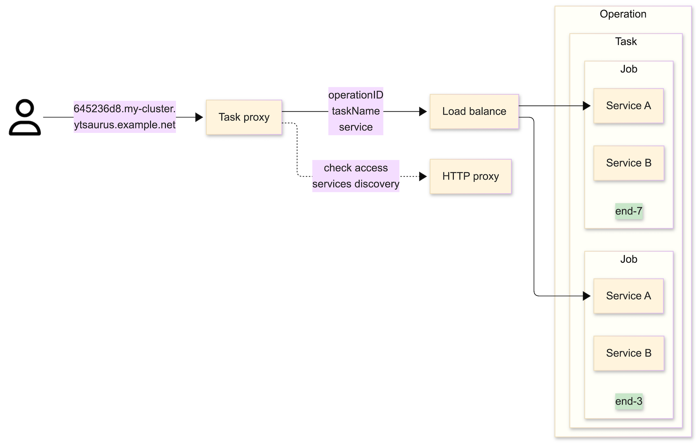

# Task-прокси

В операциях {{product-name}} часто требуется разворачивать веб-сервисы. Это могут быть UI для отладки (например, Spark UI в [SPYT](../../../user-guide/data-processing/spyt/overview.md)), серверы для инференса ML-моделей или API внутри джобов.

Джобы операций исполняются на exec-нодах кластера, поэтому сервисы привязываются к сетевым портам этих нод &mdash; для приёма входящего трафика. Но при попытке прямого обращения к сервисам внутри джоба возникают сложности:

- Сетевая изоляция: у пользователя может не быть прямого сетевого доступа к IP-адресам exec-нод (они могут находиться в закрытом контуре).
- Динамическая адресация: даже при наличии сетевого доступа джобы могут переезжать между нодами, поэтому хост и порт сервисов постоянно меняются.
- Безопасность: прямое обращение к порту на ноде происходит в обход механизмов аутентификации {{product-name}}. Контроль прав доступа к операции не осуществляется.

_Task-прокси_ решает эти проблемы, предоставляя единую точку входа. Он выделяет стабильные домены (FQDN) для каждого сервиса и проверяет права доступа у пользователя перед тем, как перенаправить запрос внутрь джоба.

## Как это работает { #how }

В основе Task-прокси лежит механизм _Services Discovery_ (обнаружение сервисов). Он автоматически находит в кластере операции с веб-сервисами и [генерирует](#access) для них доменные имена.

Каждый сервис описывается сущностями:

- _Операция_ (operation): Основная единица работы в кластере {{product-name}}.
- _Задача_ (task): Тип работы внутри операции. Операция может содержать несколько задач (например, driver и executor).
- _Джоб_ (job): Конкретный процесс. Каждая задача запускается в одном или нескольких экземплярах — джобах.
- _Сервис_ (service): Конкретный сетевой сервис задачи. Одна задача может выставлять наружу несколько веб-сервисов (например, HTTP UI и REST API).

Task-прокси балансирует входящий трафик между всеми запущенными джобами одной задачи, направляя запрос в конкретный сервис этого джоба. Если один из джобов выйдет из строя или переедет на другую ноду, прокси автоматически перенаправит трафик на доступные экземпляры.



Автоматическое обнаружение (Services Discovery) работает для:

- Vanilla-операций с настроенными аннотациями.
- SPYT-операций (Standalone-кластера и Direct Submit) — они обнаруживаются автоматически без дополнительных настроек.

## Запуск HTTP-сервиса {#quickstart}

Чтобы запустить операцию с веб-сервисом, доступным через Task-прокси:

1. Укажите параметр `port_count` в спецификации задачи. {{product-name}} выделит свободные порты на exec-ноде и передаст их номера в переменные окружения `YT_PORT_0`, `YT_PORT_1` и т. д.
2. Добавьте `task_proxy={enabled=%true}` в спецификацию операции.

Пример команды запуска двух экземпляров (`job_count=2`) HTTP-сервера на одном порту (`port_count=1`):

```sh
yt vanilla \
    --tasks '{example_http_server={job_count=2; command="python3 -m http.server ${YT_PORT_0}"; port_count=1}}' \
    --spec '{annotations={task_proxy={enabled=%true;}}}'
```

При такой конфигурации Task-прокси автоматически обнаружит сервис, присвоит ему протокол `HTTP` и имя `port_0`.

## Как узнать адрес сервиса {#access}

После запуска операции Task-прокси сгенерирует уникальный домен для каждого сервиса. Доменное имя состоит из `baseDomain` (указывается администратором кластера), к которому добавляется уникальный хеш от дескриптора сервиса.

Механизм Service Discovery сканирует операции и записывает информацию о доступных точках входа в таблицу `//sys/task_proxies/services` (путь может быть изменен администратором в параметре `dirPath`).

Ниже приведён пример содержимого таблицы. Каждая строка описывает свой сервис:

| __domain__                               | __operation_id__                  |  __task_name__      | __service__ | __protocol__ |
|------------------------------------------|-----------------------------------|---------------------|-------------|--------------|
| 645236d8.my-cluster.ytsaurus.example.net | a6e04b98-bf982394-5103e8-55754a49 | example_http_server | port_0      | http         |
| ae5cf6f5.my-cluster.ytsaurus.example.net | a8ef7695-3de07913-5103e8-e29a6707 | example_grpc_server | server      | grpc         |
| 2ef4261c.my-cluster.ytsaurus.example.net | a6e04b98-bf982394-5103e8-55754a49 | master              | ui          | http         |
| 51a6d485.my-cluster.ytsaurus.example.net | a6e04b98-bf982394-5103e8-55754a49 | history             | ui          | http         |
| 37a5f11c.my-cluster.ytsaurus.example.net | 6699a5a9-37c731e3-5103e8-b05d7dd0 | driver              | ui          | http         |

- Первая строка представляет [vanilla](../../../user-guide/data-processing/operations/vanilla.md)-операцию с примером HTTP-сервера.
- Вторая — [пример](https://github.com/ytsaurus/ytsaurus-task-proxy/tree/main/examples/grpc-service) gRPC-сервера. О том, как запустить его с использованием расширенного формата аннотации Task-прокси, читайте [далее](#exp).
- Третья и четвёртая строки соответствуют [standalone](../../../user-guide/data-processing/spyt/cluster/cluster-start.md)-кластеру SPYT, запущенному с History Server.
- Пятая строка относится к SPYT [direct submit](../../../user-guide/data-processing/spyt/direct-submit/desc.md).

## Способы подключения к сервисам {#connection-methods}

Для доступа к сервису необходимо пройти аутентификацию. Поддерживаются:

- **Токены:** OAuth-токен или IAM-токен (в заголовке `Authorization`).
- **Cookie:** Аутентификационная кука (имя куки задаётся администратором).

### Через браузер {#browser}

Для доступа к UI (например, Spark UI) просто откройте домен сервиса (`https://645236d8...`) в браузере. Если вы авторизованы в интерфейсе {{product-name}}, доступ будет предоставлен автоматически через cookie.

### Через Ingress (публичный доступ) {#ingress}

Если в кластере настроен Ingress-контроллер, вы можете обращаться к домену напрямую через интернет. В данном случае настройки DNS и TLS не выполняются в рамках Task-прокси, а осуществляются отдельно администраторами вашей инсталляции.

```sh
curl \
  -H "Authorization: Bearer ${IAM_TOKEN}" \
  "https://645236d8.my-cluster.ytsaurus.example.net"
```

### Напрямую в Task-прокси (внутри K8s) {#k8s}

Если вы находитесь внутри сетевого периметра (например, в Kubernetes, где развернут Task-прокси), можно обращаться к сервису K8s напрямую. В этом случае **обязательно** укажите домен сервиса в заголовке `Host`.

```sh
curl \
  -H "Host: 645236d8.my-cluster.ytsaurus.example.net" \
  -H "Authorization: OAuth ${YT_TOKEN}" \
  "http://task-proxy.${NAMESPACE}.svc.cluster.local:80"
```

### Альтернатива Wildcard-доменам {#wildcard-domains}

Если инфраструктура не поддерживает wildcard-домены (вида `*.ytsaurus.example.net`), используйте заголовок `x-yt-taskproxy-id`. В качестве значения передайте левую часть домена (хеш).

```sh
curl \
  -H "Authorization: Bearer ${IAM_TOKEN}" \
  -H "x-yt-taskproxy-id: 645236d8" \
  "https://task-proxy.my-cluster.ytsaurus.example.net"
```

## Расширенный формат аннотации {#exp}

Аннотация `task_proxy={enabled=%true}` применяет настройки по умолчанию. Это означает, что при её использовании каждый сервис получает:

- имя `port_${PORT_INDEX}`;
- порт с индексом, соответствующим порядку появления задач в спецификации операции;
- протокол HTTP.

Если вы хотите выставить другие настройки — например, использовать протокол gRPC, задать собственное имя сервиса или выбрать конкретный порт из списка — используйте расширенный формат аннотации. Для этого в ней потребуется указать поле `tasks_info`. С примерами можно ознакомиться ниже.

### Запуск gRPC-сервиса {#grpc}

Запустим [пример gRPC-сервера](https://github.com/ytsaurus/ytsaurus-task-proxy/tree/main/examples/grpc-service) с использованием расширенной аннотации:

```sh
yt vanilla \
    --tasks '{example_grpc_server={job_count=2; command="./yt-sample-grpc-service"; file_paths = ["//home/yt-sample-grpc-service"]; port_count=1}}' \
    --spec '{annotations={task_proxy={enabled=%true; tasks_info={example_grpc_server={server={protocol="grpc"; port_index=0}}}}}}'
```

Разбор параметра `tasks_info`:

- `example_grpc_server` — имя задачи (task).
    - `server` — имя сервиса (в данном примере он один, но одна задача может содержать несколько сервисов).
        - `protocol="grpc"` — указание протокола.
        - `port_index=0` — использование первого порта из `port_count` (соответствует `YT_PORT_0`).


### Обращение к gRPC-сервису {#grpcurl}

Для gRPC-запросов также потребуется авторизация.

#### Через Ingress (публичный доступ) {#grpc-ingress}

Обратите внимание, что порт для gRPC на Ingress-контроллере может отличаться (в примере ниже — `9090`).

```sh
grpcurl \
  -H "Cookie: YTCypressCookie ${AUTH_COOKIE_VALUE}" \
  "ae5cf6f5.my-cluster.ytsaurus.example.net:9090" \
  "helloworld.Greeter/SayHello"
```

#### Напрямую в Task-прокси (внутри K8s) {#grpc-task-proxy}

```sh
grpcurl \
  -plaintext \
  -authority "ae5cf6f5.my-cluster.ytsaurus.example.net" \
  -H "Authorization: Bearer ${IAM_TOKEN}" \
  "task-proxy.${NAMESPACE}.svc.cluster.local:80" \
  "helloworld.Greeter/SayHello"
```
