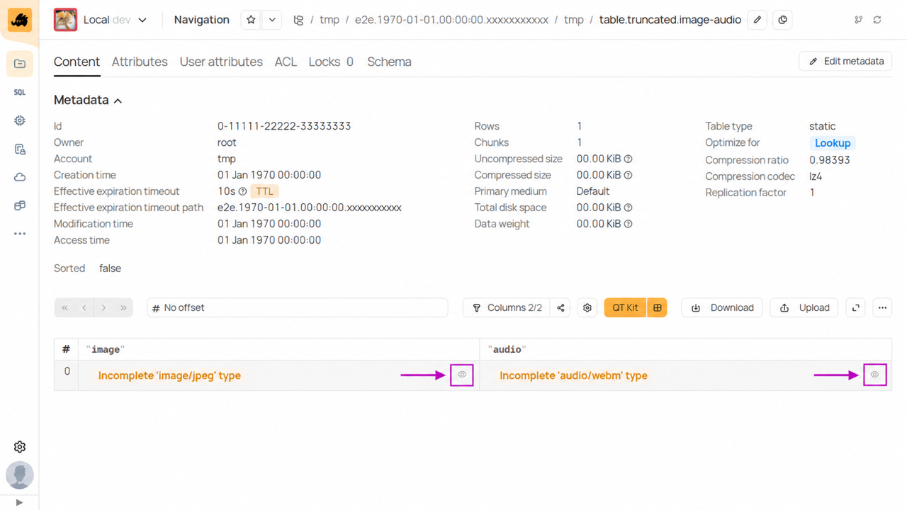

# Типы данных

В данном разделе описано, какие типы данных поддерживает {{product-name}}, как они описываются в схеме и как они представляются в форматах.

## Общая информация {#overview}

{{product-name}} поддерживает набор примитивных типов:

- `string`;
- `integer`;
- `boolean`;
- `float`;
- `double`;
- `date`;
- `datetime`;
- `timestamp`;
- `interval`.

А также следующие композитные (сложные) типы:

- `optional`;
- `list`;
- `struct`;
- `tuple`;
- `variant`;
- `tagged`.

Задать тип в схеме таблицы можно одним из двух способов:

- с помощью ключей `type` и (необязательно) `required` — исторически первый способ, но так можно задать лишь примитивные или опциональные примитивные типы;
- с помощью ключа `type_v3`.

В ключе `type` всегда ожидается строка.
В ключе `type_v3` ожидается либо строка для примитивных типов, либо YSON-словарь.
YSON-словарь всегда имеет ключ `type_name`, в котором хранится имя типа.
Остальные ключи зависят от конкретного типа и описаны ниже.

## Описание типов в схеме {#schema}

### Примитивные типы {#schema_primitive}

Примитивные типы можно задать в схеме как с помощью ключа `type`, так и с помощью ключа `type_v3`.

Если примитивный тип `T` задаётся с помощью `type`, {{product-name}} дополнительно проверит ключ `required` в схеме:

- `required=%true` — колонка будет иметь строго заданный тип. Значение `Null` или отсутствие значения не допускаются;
- `required=%false` — колонка будет иметь тип `optional<T>` — будут допустимы все значения примитивного типа и значение `Null`.

В таблице перечислены поддерживаемые типы и их представление в ключах `type`/`type_v3`.

| **Описание** | **Представление в `type`** | **Представление в `type_v3`** |
|--------------|----------------------------|-------------------------------|
| целое число в диапазоне `[-2^63, 2^63-1]` | `int64`   | `int64`  |
| целое число в диапазоне `[-2^31, 2^31-1]` | `int32`   | `int32`  |
| целое число в диапазоне `[-2^15, 2^15-1]` | `int16`   | `int16`  |
| целое число в диапазоне `[-2^7, 2^7-1]`   | `int8`    | `int8`   |
| целое число в диапазоне `[0, 2^64-1]`     | `uint64`  | `uint64` |
| целое число в диапазоне `[0, 2^32-1]`     | `uint32`  | `uint32` |
| целое число в диапазоне `[0, 2^16-1]`     | `uint16`  | `uint16` |
| целое число в диапазоне `[0, 2^8-1]`      | `uint8`   | `uint8`  |
| [8-байтное число с плавающей точкой](https://en.wikipedia.org/wiki/Double-precision_floating-point_format) соответствующее стандарту [IEEE 754](https://en.wikipedia.org/wiki/IEEE_754) | `double`  | `double` |
| [4-байтное число с плавающей точкой](https://en.wikipedia.org/wiki/Single-precision_floating-point_format) соответствующее стандарту [IEEE 754](https://en.wikipedia.org/wiki/IEEE_754) | `float`   | `float`  |
| стандартный булев тип `true/false`        | `boolean` | `bool` (отличие от `type`) |
| произвольная последовательность байт      | `string`  | `string` |
| корректная UTF8 последовательность        | `utf8`    | `utf8`   |
| строка, содержащая валидный [JSON](https://en.wikipedia.org/wiki/JSON) | `json` | `json` |
| [UUID](https://en.wikipedia.org/wiki/Universally_unique_identifier), произвольная последовательность 16 байт (хранится бинарное представление) | `uuid` | `uuid` |
| целое число в диапазоне `[-53375809, 53375808 - 1]`, <br> выражает число дней, прошедших с unix-эпохи; <br> выражаемый диапазон времени около 145'000 лет в прошлое и в будущее <br> см. раздел про [временные типы](#temporal_types) | `date32` | `date32` |
| целое число в диапазоне `[-53375809 * 86400, 53375808 * 86400 - 1]`, <br> выражает число секунд, прошедших с unix-эпохи; <br> выражаемый диапазон времени около 145'000 лет в прошлое и в будущее <br> см. раздел про [временные типы](#temporal_types) | `datetime64` | `datetime64` |
| целое число в диапазоне `[-53375809 * 86400 * 10^6, 53375808 * 86400 * 10^6 - 1]`, <br> выражает число микросекунд, прошедших с unix-эпохи; <br> выражаемый диапазон времени около 145'000 лет в прошлое и в будущее <br> см. раздел про [временные типы](#temporal_types)| `timestamp64` | `timestamp64` |
| целое число в диапазоне `[-9223339708800000000, 9223339708800000000]`, <br> выражает число микросекунд между двумя таймстемпами типа `timestamp64` <br> см. раздел про [временные типы](#temporal_types) | `interval64` | `interval64` |
| целое число в диапазоне `[0, 49673 - 1]`, <br> выражает число дней, прошедших с unix-эпохи; <br> выражаемый диапазон дат: `[1970-01-01, 2105-12-31]`  <br> см. раздел про [временные типы](#temporal_types) |  `date` | `date` |
| целое число в диапазоне `[0, 49673 * 86400 - 1]`, <br> выражает число секунд, прошедших с unix-эпохи; <br> выражаемый диапазон времён: `[1970-01-01T00:00:00Z, 2105-12-31T23:59:59Z]`  <br> см. раздел про [временные типы](#temporal_types) | `datetime` | `datetime` |
| целое число в диапазоне `[0, 49673 * 86400 * 10^6 - 1]`, <br> выражает число микросекунд, прошедших с unix-эпохи; <br> выражаемый диапазон времён: `[1970-01-01T00:00:00Z, 2105-12-31T23:59:59.999999Z]`  <br> см. раздел про [временные типы](#temporal_types) | `timestamp` | `timestamp` |
| целое число в диапазоне `[- 49673 * 86400 * 10^6 + 1, 49673 * 86400 * 10^6 - 1]`, <br> выражает число микросекунд между двумя таймстемпами типа `timestamp`  <br> см. раздел про [временные типы](#temporal_types)  | `interval` | `interval` |
| *экспериментальный тип, не использовать в production* тип `date` с информацией о часовом поясе <br> см. раздел [часовые пояса](#time_zones) | tz_date |  tz_date |
| *экспериментальный тип, не использовать в production* тип `datetime` с информацией о часовом поясе <br> см. раздел [часовые пояса](#time_zones) | tz_datetime |  tz_datetime |
| *экспериментальный тип, не использовать в production* тип `timestamp` с информацией о часовом поясе <br> см. раздел [часовые пояса](#time_zones) | tz_timestamp |  tz_timestamp |
| *экспериментальный тип, не использовать в production* тип `date32` с информацией о часовом поясе <br> см. раздел [часовые пояса](#time_zones) | tz_date32 |  tz_date32 |
| *экспериментальный тип, не использовать в production* тип `datetime64` с информацией о часовом поясе <br> см. раздел [часовые пояса](#time_zones) | tz_datetime64 |  tz_datetime |
| *экспериментальный тип, не использовать в production* тип `timestamp64` с информацией о часовом поясе <br> см. раздел [часовые пояса](#time_zones) | tz_timestamp64 |  tz_timestamp64 |
| произвольная YSON-структура, <br> физически представляется последовательностью байт, <br> не может иметь атрибут `required=%true` | `any` | `yson` (отличие от `type`) |
| системный сингулярный тип, возможно единственное значение `null` <br> (заведение отдельной колонки с таким типом не имеет смысла, <br>, этот тип не ожидается в пользовательских таблицах, <br> но тип полезен для интеграции с YQL) | `null` | `null` |
| сингулярный тип, возможно единственное значение `null`, это тип, отличный от `null` <br> (заведение отдельной колонки с таким типом не имеет особого смысла, <br> мы не ожидаем встретить этот тип в пользовательских таблицах, <br> но тип полезен для интеграции с YQL)| `void` | `void` |

Примеры в схеме:

```yson
type_v3=utf8
```

```yson
type_v3=bool
```

```yson
type_v3=yson
```

### Временные типы {#temporal_types}

Есть два набора типов для работы со временем. Исторически, первые появившиеся в системе это `date`, `datetime`, `timestamp`, `interval`. Эти типы позволяют выражать времена от начала 1970 года до конца 2105 года. Позже появились типы `date32`, `datetime64`, `timestamp64` и `interval64`. Эти типы позволяют выражать времена в более широком диапазоне, около 145'000 лет в прошлое и столько же в будущее. Предпочтительнее использовать последние типы, у них более широкий диапазон значений.

Все времена подразумевают использование григорианского календаря. При работе с моментами времени в далёком прошлом, стоит иметь в виду, что {{product-name}} никак не учитывает [переход на григорианский календарь](https://ru.wikipedia.org/wiki/%D0%9F%D1%80%D0%B8%D0%BD%D1%8F%D1%82%D0%B8%D0%B5_%D0%B3%D1%80%D0%B8%D0%B3%D0%BE%D1%80%D0%B8%D0%B0%D0%BD%D1%81%D0%BA%D0%BE%D0%B3%D0%BE_%D0%BA%D0%B0%D0%BB%D0%B5%D0%BD%D0%B4%D0%B0%D1%80%D1%8F), который происходил в разных государствах в разное время. {{product-name}} считает, что григорианский календарь использовался всегда.

### Часовые пояса {#time_zones}

**Внимание:** поддержка типов данных, описанных в данном разделе, не закончена и вероятно поменяется в будущем обратно несовместимым образом, типы **нельзя** использовать для продакшн процессов.

Tипы `tz_timestamp64`, `tz_datetime64`, `tz_date32`, `tz_timestamp`, `tz_datetime`, `tz_date` хранят информацию о времени с учётом часового пояса. Логически эти типы хранят пару:

- таймстемп, целое число из соответствующего типа «без часовых поясов», число выражает момент времени в часовом поясе [UTC](https://en.wikipedia.org/wiki/Coordinated_Universal_Time)
- id часового пояса, беззнаковое 16-битное число (см. [список часовых поясов](https://github.com/ytsaurus/ytsaurus/blob/main/library/cpp/type_info/tz/tz_gen.h); нумерация с нуля: `"GMT"` = 0, `"Europe/Moscow"` = 1)

Ниже описано внутреннее представление значений этих типов. Некоторые высокоуровневые инструменты предоставляют удобный способ работать с этими типами.

#|
|| **tz-тип**    | **соответствующий тип без часового пояса** | **нижележащий целочисленный тип** | **диапазон значений целочисленного типа** | **физическая величина**  ||
|| tz_date        | date        | Uint16 | `[0, 49673 - 1]`                                          | дни          ||
|| tz_datetime    | datetime    | Uint32 | `[0, 49673 * 86400 - 1]`                                  | секунды      ||
|| tz_timestamp   | timestmap   | Uint64 | `[0, 49673 * 86400 * 10^6 - 1]`                           | микросекунды ||
|| tz_date32      | date32      | Int32  | `[-53375809, 53375808 - 1]`                               | дни          ||
|| tz_datetime64  | datetime64  | Int64  | `[-53375809 * 86400, 53375808 * 86400 - 1]`               | секунды      ||
|| tz_timestamp64 | timestamp64 | Int64  | `[-53375809 * 86400 * 10^6, 53375808 * 86400 * 10^6 - 1]` | микросекунды ||
|#

Сериализация этой пары в строку устроена следующим образом:

- таймстемп записывается в предсортированном представлении (см. ниже);
- id часового пояса записывается в предсортированном представлении (см. ниже).

Предсортированное представление целого числа получается следующим образом:

- число записывается в big-endian представлении;
- если число имеет знаковый тип, то старший (знаковый) бит инвертируется. Иначе этот шаг пропускается.

*Пример:* нужно сохранить момент времени 2025-01-01T00:00:00 в часовом поясе Москвы в типе tz_datetime64. Для этого сделайте следующее:

1. Переведите этот момент времени в UTC, получится `2024-12-31T21:00:00Z`.
1. Переведите UTC время в unix timestamp, получится `1735678800`.
1. Запишите этот timestamp в big-endian представлении, получится `"\x00\x00\x00\x00\x67\x74\x5b\x50"`.
1. Т.к. тип tz_datetime64 основан на знаковом типе Int64, инвертируйте старший бит. Получится `"\x80\x00\x00\x00\x67\x74\x5b\x50"`.
1. Переведите название часового пояса "Europe/Moscow" в его id, получится `1`.
1. Запишите id в big-endian представлении, получится `"\x00\x01"`.
1. Допишите информацию о временной зоне, получится `"\x80\x00\x00\x00\x67\x74\x5b\x50\x00\x01"`.

### Десятичное число / decimal {#schema_decimal}

Значения типа `decimal(p, s)` — вещественные числа с указанной точностью.

Чтобы задать этот тип в схеме, укажите следующие ключи:

  - `type_name` — значение `decimal`;
  - `precision` — общее число десятичных цифр в представлении числа, `precision` должен находиться в диапазоне `[1, 35]`;
  - `scale` — число десятичных цифр в представлении числа, которые идут после десятичной точки, `scale` должно находиться в диапазоне `[0, precision]`.

Пример в схеме:

```yson
type_v3={
    type_name=decimal;
    precision=10;
    scale=2;
}
```

Значения `3.14`, `-2.71`, `9.99` могут иметь тип `decimal(3, 2)` (`precision=3`, `scale=2`).

Тип поддерживает несколько специальных значений: `nan`, `+inf`, `-inf`.

#### Описание бинарного представления decimal {#schema_decimal_binary}

Для `decimal`-чисел есть специальное бинарное представление,
которое по умолчанию используется во многих форматах, например, `yson`.

В этом представлении значения типов `decimal(p, s)` представляются бинарными строками. Длина бинарной строки
зависит от `precision`.


| **Precision** | **Число бит в представлении** | **Число байт в представлении** |
|---------------|-------------------------------|--------------------------------|
| 1-9   | 32  | 4  |
| 10-18 | 64  | 8  |
| 19-38 | 128 | 16 |
| 39-76 | 256 | 32 |

Чтобы получить бинарное представление `decimal`-числа, нужно сделать следующие шаги. Шаги будут проиллюстрированы значениями `3.1415`, `-2.7182` типа `decimal(5, 4)`.
  1. Возьмите целое число, образованное десятичными цифрами значения. Число бит выбирается из `precision` по таблице выше. В данном примере — 32-битные числа `31415`, `-27182`.
  1. Запишите число в big-endian представлении. В данном примере — строки `\x00\x00\x7A\xB7`, `\xFF\xFF\x95\xD2`.
  1. Инвертируйте старший бит. В данном примере — строки `\x80\x00\7A\xB7`, `\x7F\xFF\x95\xD2`.

Целочисленные представления специальных значений `nan`, `+inf`, `-inf` для первого шага представлены в таблице ниже:

| **Специальное значение** | **Целочисленное представление** |
|--------------------------|---------------------------------|
| `nan`  | `INT_MAX` |
| `+inf` | `INT_MAX - 1` |
| `-inf` | `- INT_MAX + 1` |



На текущий момент при работе с YQL поддерживаются только `decimal` со значением `precision` не более 35.



### Опциональный тип / optional {#schema_optional}

Тип `optional<T>` означает, что значение может иметь тип `T` или отсутствовать.



Каждое применение `optional` для типа добавляет новые значения.
Например, тип `optional<optional<bool>>` может иметь следующие значения:

- внешний `optional` не заполнен;
- внешний `optional` заполнен, внутренний не заполнен;
- все `optional` заполнены, значение `true` или `false`.



Старые колонки, в которых заданы атрибуты `type=T;required=false`, соответствуют типу `optional<T>`, заданному через `type_v3`.

Чтобы задать тип `optional`, укажите ключи:

- `type_name` — значение `optional`;
- `item` — описание типа элемента.

Примеры в схеме:

```yson
type_v3={
  type_name=optional;
  item=string;
}
```

```yson
type_v3={
  type_name=optional;
  item={
    type_name=optional;
    item=bool;
  }
}
```

### Список / list {#schema_list}

Значения типа `list<T>` — списки элементов типа `T`.

Чтобы задать тип в схеме, укажите ключи:

- `type_name` — значение `list`;
- `item` — описание типа элемента.

Примеры в схеме:

```yson
type_v3={
  type_name=list;
  item=string;
}
```

```yson
type_v3={
  type_name=list;
  item={
    type_name=list;
    item=double;
  }
}
```

### Структура / struct {#schema_struct}

Набор именованных полей с указанными типами значений.

Чтобы задать этот тип в схеме, укажите ключи:

- `type_name` — значение `struct`;
- `members` — список словарей с ключами:
  - `name` — имя поля, должно быть непустой utf8-строкой;
  - `type` — тип поля.

Примеры в схеме:

```yson
type_v3={
  type_name=struct;
  members=[
    {
      name=foo;
      type=int32;
    };
    {
      name=bar;
      type={
        type_name=optional;
        item=string;
      }
    };
  ]
}
```

### Кортеж / tuple {#schema_tuple}

Набор безымянных полей с фиксированными типами.

Чтобы задать этот тип, в схеме нужно указать следующие ключи:

- `type_name` — значение `tuple`;
- `elements` — список словарей с ключами:
- `type` — тип элемента.

Пример в схеме:

```yson
type_v3={
  type_name=tuple;
  elements=[
     {
       type=double;
     };
     {
       type=double;
     };
  ]
}
```

### Вариант / variant {#schema_variant}

Вариант — строго одно значение из фиксированного набора типов.
Вариант бывает двух типов:

- Вариант над структурой. Каждый тип имеет имя (как в структуре) и каждое значение варианта маркировано именем соответствующего элемента варианта;
- Вариант над кортежем. Тогда все элементы безымянные и каждое значение маркируется индексом.

Чтобы задать этот тип, в схеме укажите ключи:

- `type_name` — значение `variant`;
-  `elements` или `members` (но не оба), ключи имеют структуру аналогичную этим ключам в `tuple` / `struct`:
  * `elements` — для варианта с безымянными элементами, сам ключ содержит список словарей с ключами:
    - `type` — тип элемента;
  * `members` — для варианта с именованными элементами, сам ключ содержит список словарей с ключами:
    - `name` — имя элемента, должно быть непустой utf8-строкой;
    - `type` — описание типа элемента.

Пример в схеме:

```yson
type_v3={
  type_name=variant;
  members=[
     {
       name=int_field;
       type=int64;
     };
     {
       name=string_field;
       type=string;
     };
  ]
}
```

```yson
type_v3={
  type_name=variant;
  elements=[
     {
       type=int32;
     };
     {
       type=string;
     };
     {
       type=double;
     };
  ]
}
```

### Словарь / dict {#schema_dict}

Словарь — это последовательность пар ключ-значение.
{{product-name}} не проверяет уникальность ключей или их порядок.
Однако большая часть клиентов при обработке будет загружать данные в реальный словарь, и значения для повторяющихся ключей будут утеряны.

Чтобы задать этот тип, в схеме укажите ключи:

- `type_name` — значение `dict`;
- `key` — описание типа ключа;
- `value` — описание типа значения.

Пример в схеме:

```yson
type_v3={
  type_name=dict;
  key=int64;
  value={
    type_name=optional;
    item=string;
  };
}
```

### Тегированное значение / tagged {#schema_tagged}

Тип `tagged` позволяет аннотировать другие типы строкой. Значением типа `tagged<TAG_NAME,T>` может быть любое значение типа `T`,
однако сами типы будут считаться различными в тех местах, где {{product-name}} сравнивает схемы. Например, когда проверяется возможность объединить две таблицы в одну.

Чтобы задать этот тип, в схеме укажите ключи:

- `type_name` — значение `tagged`;
- `tag` — имя тега, должно быть непустой utf8-строкой;
- `item` — описание типа элемента.

#### Медиаданные в веб-интерфейсе {#schema_tagged_media}

Веб-интерфейс может показывать изображения и воспроизводить аудио при просмотре таблицы или результата YQL-запроса в Query Tracker. Для этого задайте колонке тип `tagged<string>` через `type_v3`, а в поле `tag` укажите медиатег:

```yson
type_v3={
  type_name=tagged;
  tag="image/svg";
  item="string";
}
```

[Посмотреть полный пример](#schema_tagged_media_example)

Значение `image/svg` означает, что колонка содержит SVG-изображение в Base64. Для других поддерживаемых медиаданных выберите значение `tag` из таблицы:

| **Значение поля `tag`** | **Содержимое ячейки** | **Особенности** |
| --- | --- | --- |
| `image/svg` `image/svg+xml` `image/jpeg` `image/png` `image/gif` `image/webp` | Изображение в Base64 | Значение должно содержать Base64-строку без префикса Data URL |
| `imageurl` | URL изображения | Веб-интерфейс загружает данные только с адресов, которые администратор разрешил в параметре `uiSettings.reUnipikaAllowTaggedSources` конфигурации UI. Если адрес не разрешён, URL отображается как текст |
| `audio/mpeg` `audio/webm` `audio/wav` | Аудио в Base64 | Значение должно содержать Base64-строку без префикса Data URL |
| `audiourl` | URL аудио | Веб-интерфейс загружает данные только с адресов, которые администратор разрешил в параметре `uiSettings.reUnipikaAllowTaggedSources` конфигурации UI. Если адрес не разрешён, URL отображается как текст |



- Веб-интерфейс не показывает изображения и не воспроизводит аудио из узлов Кипариса типа `file`. Эти возможности доступны только для колонок таблиц.
- Веб-интерфейс в настоящий момент не умеет воспроизводить видео ни из колонок таблиц, ни из узлов Кипариса типа `file`.



#### Лимиты {#schema_tagged_media_limits}

При просмотре таблицы в веб-интерфейсе действуют два лимита:

#|
|| **Лимит** | **Когда действует** | **Значение** ||
|| Лимит на загрузку данных ячейки | При открытии таблицы, когда интерфейс загружает значения всех ячеек страницы | По умолчанию 1 КиБ, максимум 64 КиБ.  
Можно [изменить](*cell-size-limit-settings) ||
|| Лимит на предпросмотр медиаданных | При нажатии кнопки предпросмотра , когда интерфейс загружает одно значение целиком | 16 МиБ.  
Изменить нельзя ||
|#

**Лимит на загрузку данных ячейки.** Веб-интерфейс ограничивает объём скачиваемых данных из каждой ячейки таблицы — чтобы не загружать большие значения в оперативную память вместе со всей страницей. По умолчанию этот лимит составляет 1 КиБ и действует для всех значений, включая Base64-строки.

Если размер Base64-строки превышает текущий лимит на загрузку данных ячейки, интерфейс получает только часть значения, помечает его как неполное и показывает в ячейке кнопку предпросмотра . Для просмотра изображения достаточно нажать эту кнопку:






{.center}



**Лимит на предпросмотр медиаданных.** Для предпросмотра установлен отдельный лимит на размер Base64-строки — 16 МиБ. Он относится к закодированному значению в ячейке, а не к размеру исходного файла.

Если строка превышает этот лимит, посмотреть изображение или прослушать аудио не получится. Изменить этот лимит в настройках нельзя.



Если кнопки предпросмотра нет, отсутствие изображения или аудио не связано с неполной загрузкой. Проверьте корректность Base64-значения и соответствие данных указанному тегу.



Таким образом, в пределах лимита ячейки (по умолчанию 1 КиБ, максимум 64 КиБ) медиаданные появляются сразу, от лимита до 16 МиБ — после нажатия кнопки предпросмотра , а больше 16 МиБ не отображаются.

#### Пример {#schema_tagged_media_example}

В этом примере вы создадите таблицу с колонкой для PNG-изображения. Затем запишете в неё логотип {{product-name}} в Base64 и проверите результат в веб-интерфейсе.

1. Сохраните [логотип {{product-name}}](https://raw.githubusercontent.com/ytsaurus/ytsaurus/main/yt/docs/images/logo.png) в текущий каталог под именем `logo.png`.

1. Создайте таблицу `//tmp/tagged-media` с колонкой для PNG-изображения:

   ```bash
   $ yt create table  --attributes '{
       schema=[
           {name=image; type_v3={item=string; type_name=tagged; tag="image/png"}};
       ]
   }' //tmp/tagged-media
   ```

1. Закодируйте содержимое изображения в Base64 без префикса Data URL и запишите строку в таблицу:

   ```bash
   $ IMAGE_BASE64=$(base64 < logo.png | tr -d '\r\n')
   $ printf '{"image":"%s"}\n' "$IMAGE_BASE64" \
       | yt write-table --format json //tmp/tagged-media
   ```

1. Откройте таблицу `//tmp/tagged-media` в веб-интерфейсе. В колонке `image` должен отобразиться логотип {{product-name}}.

## Представление сложных типов в форматах {#formats}

Для чтения и записи таблиц используются форматы.
Не все форматы поддерживают сложные данные, некоторые из них, например, dsv / schemaful_dsv, будут возвращать ошибку при попытке прочитать сложное значение. Например, `Values of type "any" are not supported by the chosen format`.

### YSON {#yson}

Существует два YSON представления сложных типов. Различаются представления типов `struct` и `variant`:
представление по умолчанию более удобно в использовании,
альтернативное представление несколько эффективнее в хранении и обработке.

Представления переключаются флагом `complex_type_mode`. Возможные значения: `named` / `positional`.
Ниже описаны представления типов. Если не указано иное, представление типа не зависит от настройки `complex_type_mode`.

Есть два представления для типа `dict` со строковыми ключами: по умолчанию используется `positional` представление в виде списка (так как данные хранятся в {{product-name}}). Для удобства восприятия можно включить режим `named` с помощью флага `string_keyed_dict_mode`.

#### Примитивные типы {#yson_primitive}

Примитивные типы представляются прямолинейно одним YSON-значением.
В таблице приведено соответствие примитивных типов и YSON-типов.


| **`type` / `type_v3`** | **Представление в yson**            |
| ---------------------- | ----------------------------------- |
| `int64`                | знаковое число                      |
| `int32`                | знаковое число                      |
| `int16`                | знаковое число                      |
| `int8`                 | знаковое число                      |
| `uint64`               | беззнаковое число                   |
| `uint32`               | беззнаковое число                   |
| `uint16`               | беззнаковое число                   |
| `uint8`                | беззнаковое число                   |
| `double`               | число с плавающей точкой            |
| `boolean` / `bool`     | булево значение                     |
| `string`               | строка                              |
| `utf8`                 | строка                              |
| `date`                 | беззнаковое число, см. ниже          |
| `datetime`             | беззнаковое число, см. ниже          |
| `timestamp`            | беззнаковое число, см. ниже          |
| `interval`             | знаковое число                      |
| `uuid`                 | строка с бинарными данными, см ниже |
| `any` / `yson`         | зависит от значения                 |
| `null`                 | `#`                                 |
| `void`                 | `#`                                 |

##### Временные типы {#yson_time_mode}

В yson-формате есть опция `time_mode`, которая управляет представлением типов `date`, `datetime`, `timestamp`. Ее возможные значения такие:

- `binary` (по умолчанию) — используется представление в виде беззнакового числа, обозначающего число дней / секунд / миллисекунд с начала unix эпохи.
- `text` — используется строковое представление, примеры представления `date`, `datetime`, `timestamp` соответственно такие:
  `2022-01-02`, `2022-01-02T03:04:05Z`, `2022-01-02T03:04:05.123456Z`.

##### UUID {#yson_uuid_mode}

В yson-формате есть опция `uuid_mode`, которая управляет представлением типа `uuid`. Её возможные значения:

- `binary` (по умолчанию) — используется бинарное представление из 16 байт.
- `text_yt` — используется строковое представление, в формате {{product-name}} из 4 групп, например `61626364-65666768-696a6b6c-6d6e6f70`;
- `text_yql` — используется строковое представление, в формате YQL из 5 групп более похожим на представление RFC, например `64636261-6665-6867-696a-6b6c6d6e6f70`.

#### Decimal {#yson_decimal}

В YSON формате есть опция `decimal_mode`, которая управляет представлением типа `decimal`. Её возможные значения:

- `binary` (по-умолчанию) — кодируется бинарной строкой с [бинарным представлением](#schema_decimal_binary) `decimal`-числа.
- `text` — используется текстовое представление `decimal`-числа.

#### Optional {#yson_optional}

Представление типа `optional` зависит от его внутреннего типа.
Это необходимо для обратной совместимости с колонками, для которых проставлено `required=%false`.
Если `T` — произвольный тип, который не является `optional`, то `optional<T>` представляется следующим образом:

- `Null` значение `optional` представляется `#`;
- в противном случае используется обычное представление значения типа `T`.

Если `T` — тип, который является `optional`, то `optional<T>` представляется следующим образом:

- `Null` значение внешнего `optional` представляется `#`;
- в противном случае используется представление `[ v ]` (yson-список длины 1), где `v` — YSON-представление значения типа `T`.

Примеры значений, тип `optional<int64>`:

```yson
#
```

```yson
-42
```

Примеры значений, тип `optional<optional<int64>>`:

```yson
#
```

```yson
[ # ]
```

```yson
[ -42 ]
```

#### List {#yson_list}

Тип `list<T>` кодируется YSON-списком, элементы которого представляют собой кодированное представление элементов типа `T`.

Примеры значений, тип `list<int64>`:

```yson
[]
```

```yson
[42; -1;]
```

#### Struct {#yson_struct}

Представление структуры зависит от значения флага `complex_type_mode`.

##### Именованное представление (по умолчанию) {#yson_struct_named}

Описываемое представление для случая,
когда опция YSON формата `complex_type_mode` не выставлена или выставлено значение `complex_type_mode=named`.

Структура представлена YSON-словарём, где ключи — имена полей, а значения — их содержимое.

Примеры значений, тип `struct<Foo:int64;Bar:optional<utf8>>`:

```yson
{Foo=42;Bar=#;}
```

```yson
{Foo=-5;Bar="minus five";}
```

##### Позиционное представление {#yson_struct_positional}

В случае, если для YSON-формата выставлена опция `complex_type_mode=positional`, используется другое представление.

Структура кодируется YSON-списком, где на i-й позиции стоит YSON-представление i-го поля структуры.
Длина списка может быть меньше, чем число полей в структуре, тогда оставшиеся типы должны иметь тип `optional<T>`,
и считается, что поля имеют пустое `optional` значение.

Примеры значений, тип `struct<Foo:int64;Bar:optional<utf8>>`:

```yson
[42; #;]
[42]
```

```yson
[-5;"minus five";]
```

#### Tuple {#yson_tuple}

Тип `tuple` кодируется YSON-списком фиксированной длины. На i-м месте стоит кодированное значение i-го поля.

Примеры значений, тип `tuple<int64;optional<utf8>>`:

```yson
[42; #;]
```

```yson
[-5;"minus five";]
```

#### Variant {#yson_variant}

##### Неименованный variant {#yson_variant_tuple}

Неименованный вариант представлен YSON-списком длины 2 из следующих элементов:

- номер альтернативы (индексация с 0);
- кодированное значение соответствующей альтернативы.

Примеры значений, тип `variant<int64;optional<utf8>>`:

```yson
[0; 42]
```

```yson
[1; #]
```

```yson
[1; "foo bar";]
```

##### Именованный вариант variant {#yson_variant_struct}

###### Именованное представление (по умолчанию) {#yson_variant_struct_named}

Описываемое представление для случая, когда опция YSON-формата `complex_type_mode` не выставлена или выставлена в значение `complex_type_mode=named`.

Именованный вариант представляется YSON-списком длины 2 из следующих элементов:

- имя альтернативы;
- кодированное значение соответствующей альтернативы.

Примеры значений, тип `variant<Foo:int64;Bar:optional<utf8>>`:

```yson
[Foo; 42]
```

```yson
[Bar; #]
```

```yson
[Bar; "foo bar";]
```

###### Позиционное представление {#yson_variant_struct_positional}

Если для формата выставлена опция `complex_type_mode=positional`.

Именованный вариант представлен YSON-списком длины 2 из следующих элементов:

- индекс альтернативы;
- кодированное значение соответствующей альтернативы.

Примеры значений, тип `variant<Foo:int64;Bar:optional<utf8>>`:

```yson
[0; 42]
```

```yson
[1; #]
```

```yson
[1; "foo bar";]
```

#### Dict {#yson_dict}

Тип `dict` по умолчанию представлен YSON-списком, где каждый элемент — YSON-список из двух элементов: ключ и значение.

Примеры значений типа `dict<int32;string>`:

```yson
[[1;"one"];[4;"four"]]
```

```yson
[]
```

`dict` может быть представлен YSON-словарём, однако YSON-словарь поддерживает только строки в качестве ключей, а `dict` поддерживает и другие ключи.

##### Dict with string keys {#yson_string_keyed_dict}

Представление словаря со строковыми ключами зависит от значения флага `string_keyed_dict_mode`.

###### Позиционное представление (по умолчанию) {#yson_string_keyed_dict_positional}

Описываемое представление для случая, когда опция YSON формата `string_keyed_dict_mode` не выставлена или выставлена в значение `string_keyed_dict_mode=positional`.

См. [выше](#yson_dict)

Примеры значений типа `dict<string;int32>`:

```yson
[["one";1];["four";4]]
```

###### Именованное представление {#yson_string_keyed_dict_named}

Если для YSON-формата выставлена опция `string_keyed_dict_mode=named`, используется другое представление.

`dict` кодируется YSON-словарём.

Примеры значений типа `dict<string;int32>`:

```yson
{one=1; four=4}
```

#### Tagged {#yson_tagged}

Тип `tagged` не меняет YSON представление его элемента.

[*cell-size-limit-settings]: Чтобы изменить лимит по умолчанию, откройте **Settings** → **Table** → **Cell size limit**. Чтобы изменить лимит для текущей таблицы, нажмите кнопку с иконкой шестерёнки над таблицей.
