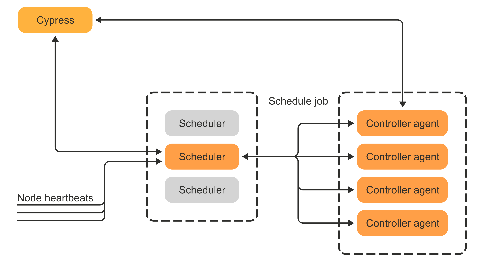

## Обработка данных

В данном разделе рассказывается, как устроен запуск вычислений и обработка данных в кластере {{product-name}}.

Вычисления в кластере производятся распределённо, логической единицей вычисления является **операция**. Большинство операций имеет набор входных и выходных таблиц и производит некоторую обработку данных из входных таблиц с сохранением результатов в выходную таблицу. Например, операция может производить сортировку таблицы `A` c cохранением результата в таблицу `B`, или операция может исполнять пользовательский код, обрабатывающий данные построчно из таблицы `A` с записью результата в таблицу `B`. Также {{product-name}} позволяет запускать операции, которые распределённо выполняют указанную bash-команду, например запуск указанного пользователем исполняемого файла. Такая возможность полезна, например, для запуска распределённых ML-обучений в кластере.

Операции бывают [разных типов](operations/overview#obzor), в частности они реализуют парадигму [MapReduce](https://en.wikipedia.org/wiki/MapReduce) распределённой обработки данных.

Операция состоит из **джобов**, которые исполняются на кластере параллельно и, как правило, независимо. Каждый джоб исполняется на одной из нод кластера и представляет из себя изолированный процесс, выполняющий часть общего вычисления. Для запуска джоба выделяется **аллокация** на ноде. Аллокация – это логическая сущность, характеризующаяся набором вычислительных ресурсов: оперативной памятью, CPU и прочими. Дальше в рамках аллокации происходит исполнение джоба данной операции.

Общая концепция и устройство системы обработки данных {{product-name}} имеет сходство с такими системами как:
  * [Hadoop MapReduce](https://hadoop.apache.org/docs/r1.2.1/mapred_tutorial.html) и [Apache YARN](https://hadoop.apache.org/docs/stable/hadoop-yarn/hadoop-yarn-site/YARN.html)
  * [Apache Mesos](https://mesos.apache.org/)



Обратите внимание на терминологические различия {{product-name}} и Hadoop: операция в {{product-name}} соответствует понятию Job в системе Hadoop, а джоб в {{product-name}} соответствует понятию Task в системе Hadoop.



## Архитектура

В выполнении вычислений на кластере участвуют следующие компоненты: планировщик, контроллер-агенты и exec-ноды.

**Планировщик** является центральной точкой: он хранит информацию обо всех операциях, решает задачу выделения новых аллокаций для операций и реализует модель иерархического распределения ресурсов.

**Контроллер-агенты** отвечают за планирование джобов конкретных операций. В них сосредоточена логика, которая формирует план исполнения операции, то есть разбиение операции на конкретные джобы. Текущая реализация позволяет корректно переживать потерю отдельных джобов и обеспечивает транзакционность выполнения операций.

**Exec-нода** – это процесс, который запущен на всех вычислительных узлах кластера. Он занимается выполнением конкретных джобов в рамках аллокаций, подготавливает окружение для исполнения джоба и обеспечивает изоляцию джобов между собой.

В любой момент времени в кластере есть:
- один активный планировщик, который выполняет всю работу по выделению новых аллокаций;
- несколько независимых контроллер-агентов, которые занимаются планированием операций;
- набор exec-нод, отвечающих за непосредственное выполнение вычислений.

Планировщик и контроллер-агенты хранят своё состояние в Кипарисе, exec-ноды фактически не имеют персистентного состояния и могут сводобно добавляться и удаляться из кластера.

Упрощенно опишем общую схему взаимодействия компонент.

Планировщик предоставляет API для запуска новых операций и управления уже выполняющимися операциями. Также он с некоторой периодичностью зачитывает свою конфигурацию и иерархию [пулов](scheduler/scheduler-and-pools.md) из Кипариса. Кроме того, планировщик использует Кипарис как persistent storage для хранения мета-состояния операции. Мета-состояние – это небольшой набор атрибутов операции, которые необходимы для обеспечения транзакционности и отказоустойчивости.

При запуске операции планировщик инициализирует состояние операции в Кипарисе и назначает операции контроллер-агента, который будет заниматься планированием джобов этой операции.

Каждая exec-нода кластера периодически посылает хартбиты (heartbeats) в планировщик, сообщает ему о статусе выделенных аллокаций и получает информацию о новых аллокациях, а также о необходимости вытеснить какие-то имеющиеся аллокации и прервать соответствующие джобы. Кроме того, exec-нода отправляет хартбиты в каждый из контроллер-агентов, сообщает им статус текущих запущенных джобов и получает спецификации для запуска новых джобов.

## Возможности и свойства

Ниже описано, какими свойствами обладает система обработки данных {{product-name}} и какие возможности она предоставляет пользователям.

###  Отказоустойчивость

Гарантируется надёжность и доступность системы. Это означает, что при выходе из строя отдельных компонент система умеет восстанавливаться и продолжать свою работу. При этом может теряться прогресс конкретных операций, но сами операции надёжно сохраняются в Кипарисе и при восстановлении учитываются планировщиком.

Также система стремится минимизировать потерю прогресса запущенных вычислений. Детальнее про это написано в отдельном [документе](reliability).

### Масштабируемость

Система позволяет прозрачно добавлять в кластер новые exec-ноды и тем самым наращивать объём вычислительных мощностей. Кроме того, имеется возможность наращивать группировку контроллер-агентов — это необходимо при масштабировании числа исполняемых операций в кластере.

Крупнейшие инсталляции {{product-name}} кластеров обслуживают более 1M CPU и позволяют исполнять одновременно десятки тысяч операций.


Отметим, что так как активный планировщик представляет из себя один процесс, то система все же ограничена в возможностях к масштабированию. Подробней узнать про масштабируемость планировщика можно в [докладе](https://smartdataconf.ru/talks/4ea723aa063743abbf850571446f9695).


### Управление ресурсами

Планировщик предоставляет богатый API для распределения ресурсов между пользователями и проектами. Единицей управления является **пул**, все пулы образуют иерархию, называемую **деревом пулов**. В рамках пула можно настраивать гарантированные ресурсы, управлять весами, указывать лимиты и различные настройки [вытеснения](scheduler/preemption.md).

Детальнее про алгоритм распределения ресурсов написано в разделе [Планировщик и пулы](scheduler/scheduler-and-pools).

### Гетерогенность ресурсов

Кластер {{product-name}} умеет работать с гетерогенными exec-нодами и гетерогенными требованиями ресурсов в запускаемых джобах. Например, в кластере могут одновременно исполняться и вычисления, требующие большого количества оперативной памяти, и CPU-intensive вычисления.

При этом система стремится быть реактивной, то есть как можно быстрее запускать джобы на свободных ресурсах, а задача эффективной упаковки решается во вторую очередь. Поэтому в случае сильных перекосов нагрузки возможна фрагментация ресурсов на кластере.

### Поддержка GPU

Exec-ноды кластера умеют исполнять вычисления, требующие GPU. Кроме того, планировщику можно сообщить топологию GPU-хостов и он будет учитывать её при планировании [gang-операций](https://en.wikipedia.org/wiki/Gang_scheduling).

Сами GPU при этом представлены в планировщике как целочисленный ресурс, описывающий количество видеокарт. Различные типы GPU рекомендуется выделять в отдельные [деревья пулов](scheduler/scheduler-and-pools#puly-i-derevya-pulov).


Подробнее про поддержку GPU можно почитать в разделе [Поддержка GPU в YT](operations/gpu).


### Разнообразные интерфейсы обработки данных

Система обработки данных {{product-name}} не только реализует парадигму MapReduce, но и позволяет поверх общих вычислительных ресурсов запускать другие приложения для обработки данных. Например, поверх {{product-name}} можно запускать [YQL](../../yql)-запросы, поднимать [ClickHouse-клики](chyt/about-chyt) и [Spark-кластеры](spyt/overview).
