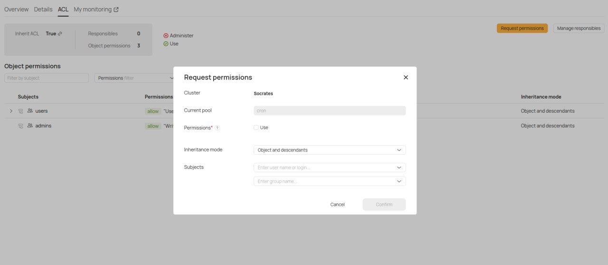
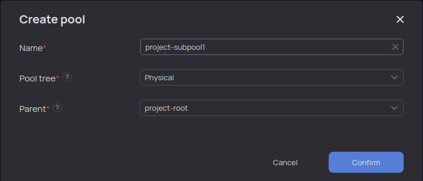



## Права доступа

Для того чтобы управлять вычислительным пулом, необходимо запросить доступ к управлению пулом. Это можно сделать через веб-интерфейс {{product-name}}.

Правами доступа к пулу управляют пользователи, у которых уже есть соответствующий доступ, — по умолчанию он выдается пользователю, создавшему пул.

Для запроса доступа к вычислительному пулу:

1. Перейдите на страницу пула из раздела `Scheduling`.
2. Выберите вкладку `ACL`.
3. Нажмите `Request permissions`, заполните открывшуюся форму и нажмите **Confirm**.

{ .center }

### Перечень допустимых действий с вычислительным пулом

- Для создания/удаления деревьев пулов необходимо право `write` на корень `//sys/pool_trees` (только для администраторов кластера {{product-name}}).
- Для создания пулов необходимо право `write` или `modify_children` на родительском пуле (выдаётся вместе с правом доступа **Use** на родительский пул).
- Для удаления пула необходимо право `remove` на него (выдаётся вместе с правом доступа **Use** на родительский пул).
- Для изменения пользовательских атрибутов пула необходимо право `write` на пул (выдаётся вместе с правом доступа **Use** на родительский пул).
- Для изменения всех остальных атрибутов пула необходимо право `administer` (только для администраторов кластера {{product-name}}).

В качестве примера рассмотрим пул `project-root` в дереве пулов `{{pool-tree}}`.
Необходимый набор прав для управления подпулами представлен в листинге:

```bash
$ yt get //sys/pool_trees/{{pool-tree}}/project-root/@acl
[
    {
        "permissions" = [
            "modify_children";
        ];
        "action" = "allow";
        "subjects" = [
            "some_user";
        ];
        "inheritance_mode" = "object_and_descendants";
    };
    {
        "permissions" = [
            "write";
            "remove";
        ];
        "action" = "allow";
        "subjects" = [
            "some_user";
        ];
        "inheritance_mode" = "descendants_only";
    };
]
```

Пользователь может управлять подпулами, но не корневым пулом проекта, то есть не может изменить гарантию корневого пула проекта и другие параметры. Разрешение распространяется только на потомков данного пула.



## Управление пулами через веб-интерфейс { #ui }

Управление пулами в веб-интерфейсе осуществляется в разделе `Scheduling`.

Для создания подпула необходимо перейти в родительский пул, нажав на его имя. Далее нужно нажать кнопку `Create pool` и заполнить все обязательные поля в форме, после этого нажать `Confirm`.

Пример формы по созданию пула представлен на рисунке.




Для редактирования настроек пула необходимо нажать на карандаш в строке с именем пула в правой части экрана, как показано на рисунке.


Настройки пула, доступные для редактирования, разделены на группы. На рисунках приведены примеры общих настроек и гарантированных ресурсов, соответственно.


В разделе `Resource Limits` можно выставить верхнее ограничение для пула, если, например, необходимо, чтобы пул не выходил за потребление в 100 ядер. По умолчанию верхнего ограничения для пулов не существует, доступные пулу ресурсы ограничены мощностью кластера.

В разделе `Other Settings` приведены дополнительные настройки, в частности запрет на запуск операций в пуле.



Обратите внимание, что операции рекомендуется запускать именно в листьях дерева пулов, то есть в тех пулах, у которых нет подпулов. В таком случае полезно явно выставлять запрет на запуск операций непосредственно в данном пуле.

В узлах дерева пулов (в пулах, имеющих подпулы) запускать операции не следует, в противном случае сложнее расследовать различные проблемы при распределении ресурсов между пулами и операциями.


