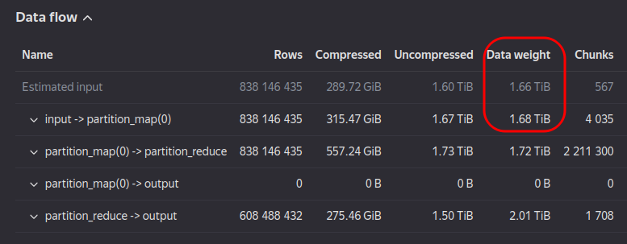
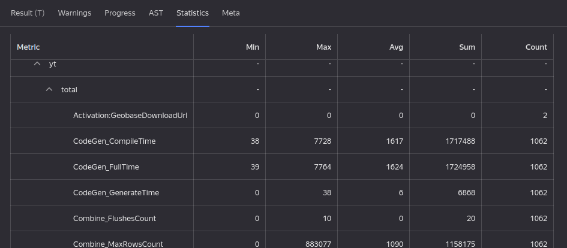
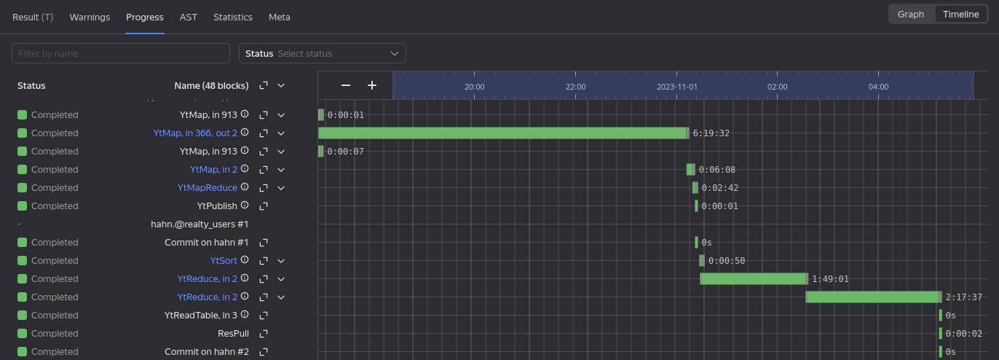
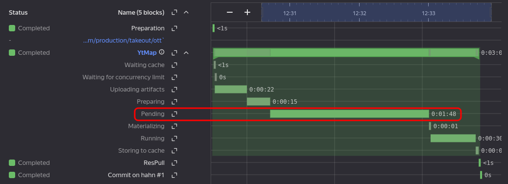
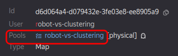

# Производительность

## Почему так долго работает запрос с JOIN? {#perf_join}

Все основные виды [JOIN](../syntax/join.md) (кроме SEMI/ONLY) строят декартово произведение строк по совпадающим значениям ключей. Если одно или несколько значений ключа являются особенными, то по нему может оказаться большое число строк с каждой из сторон и, как следствие, гигантское декартово произведение. В большинстве случаев JOIN работает медленно именно из-за этого, а такие особые значения с прикладной точки зрения оказываются не так интересны, и достаточно их исключить в `WHERE`.

Найти аномально часто встречающиеся значения можно с помощью двух запросов по каждой из таблиц с GROUP BY по тем же ключам, что и у `JOIN`, используя агрегатную функцию `COUNT` и убывающую сортировку по её результату. Ещё можно добавить `LIMIT 100`, чтобы отработало ещё быстрее.

Также бывают запросы, где на самом деле декартово произведение в `JOIN` не нужно, т. к. потом всё равно от значений тем или иным способом оставляют только уникальные значения. В этом случае стоит убрать дубли в подзапросе через [GROUP BY](../syntax/group_by.md) или [SELECT DISTINCT](../syntax/select/distinct.md) ещё до `JOIN`, а также рассказать о своём сценарии в комментариях к тикету [Свертка по payload в JOIN](https://nda.ya.ru/t/77bgy0y97FVELZ).

## Мой запрос раньше работал за N часов, а теперь стал работать за M часов. В чем причина? {#perf_slowdown}

При анализе производительности стоит обратить внимание на следующие моменты:

### Поменялся ли входной объём данных

 Например, в запрос стало попадать больше таблиц или существенно изменился их объём. Чтобы проверить, поменялся ли входной объём данных, можно кликнуть в плане запроса на первую {{product-name}} операцию и посмотреть в интерфейсе {{product-name}} на `Data flow`/`Data weight`:

### Поменяли ли план исполнения запроса

Если план изменился, то это могло произойти по нескольким причинам:
* Стала применяться другая стратегия `JOIN`. Про критерии срабатывания той или иной стратегии смотри [отдельную статью](../syntax/join.md#join_strategy).
* Изменилась схема некоторых входных таблиц в папке. YQL выравнивает схему входных таблиц, что приводит к появлению дополнительных операций.
* Поменялись оптимизаторы YQL с релизом новой версии.

### Используется ли в запросе пул с выделенными гарантиями

В запросе должна быть указана прагма [yt.StaticPool](../syntax/pragma.md#ytstaticpool) для применения пула. Если её нет, то время исполнения запроса никак не гарантируется. На него могут повлиять как соседние запросы, так и сезонные колебания нагрузки на кластера (перед ревью нагрузка на кластера, как правило, возрастает). Также стоит убедиться, что пул задаётся прагмой [yt.StaticPool](../syntax/pragma.md#ytstaticpool), а не [yt.Pool](../syntax/pragma.md#ytpool). Последняя является динамической прагмой, применяемой уже в рантайме. Из-за этого служебные операции, запущенные на этапе оптимизации, не используют её значение и запускаются в пуле по умолчанию, что может приводить к их существенному замедлению. Прагма [yt.StaticPool](../syntax/pragma.md#ytstaticpool) применяется для всех операций, в том числе и служебных.

### Проверка суммарных статистик запроса

На вкладке `Statistics` YQL-запроса можно посмотреть его суммарные статистики:

Здесь в первую очередь нужно обратить внимание и сравнить значения следующих статистик:
* `yt/total/Job_CalcTime` (Sum) &mdash; полезное время, проведенное во всех джобах с пользовательским кодом всех {{product-name}}-операций запроса. Изменение этого значения при отсутствии изменения входного объёма данных говорит об изменениях производительности в YQL-рантайме.
* `yt/total/Job_InputDecodeTime` (Sum) &mdash; время, потраченное YQL декодером на чтение входных данных во всех джобах всех {{product-name}}-операций запроса. Изменение этого значения при отсутствии изменения входного объёма данных говорит об изменениях производительности в YQL декодере.
* `yt/total/Job_OutputEncodeTime` (Sum) &mdash; время, потраченное YQL энкодером на запись данных во всех джобах всех {{product-name}}-операций запроса. Изменение этого значения при отсутствии изменения входного объёма данных говорит об изменениях производительности в YQL энкодере.
* `yt/total/CodeGen_FullTime` (Sum) &mdash; время, потраченное на кодогенерацию во всех джобах всех {{product-name}}-операций запроса. Изменение этого значения при том же числе {{product-name}}-джобов говорит об изменениях производительности кодогенерации YQL-рантайма. Если это время составляет существенную долю от `Job_CalcTime`, то стоит рассмотреть вариант отключения LLVM в запросе через `pragma config.flags("LLVM", "OFF")`.
* `yt/total/Join_Spill_Count` (Sum) &mdash; ненулевое значение этой статистики говорит о проблемах производительности `JOIN` в запросе. Если ключи по первой стороне джойна имеют очень много записей, то они не помещаются в памяти и сохраняются на диск. Это приводит к существенной деградации времени {{product-name}}-джобов, выполняющих `JOIN`. Для решения этой проблемы можно увеличить значение прагмы [yt.CommonJoinCoreLimit](../syntax/pragma.md#ytcommonjoincorelimit), либо поменять местами стороны `JOIN`.
* `yt/total/data/input/data_weight` (Sum) &mdash; суммарный объём данных, обработанный всеми джобами всех {{product-name}}-операций запроса. При отсутствии изменений в плане запроса, изменение этой статистики говорит об изменении входного объёма данных запроса.

### Поиск самой медленной {{product-name}}-операции запроса

На вкладке `Progress` YQL-запроса нужно переключиться в режим `Timeline`:

В этом режиме наглядно видно, какая {{product-name}}-операция больше всего повлияла на время исполнения YQL-запроса. Можно также раскрыть детали исполнения разных стадий операции:

Здесь видно, что операция долго стояла в статусе `Pending`, т. е. ей не хватало лимитов на число работающих операций в пуле.

Для дальнейшего анализа можно открыть медленную операцию в {{product-name}} интерфейсе, кликнув на её название в левой колонке timeline. В {{product-name}}-операции в первую очередь стоит обратить внимание на `Total job wall time` и `Total CPU time spent`. Если эти значения для двух запусков YQL-запроса существенно не изменились, но при этом изменился `Duration`, то это сигнализирует о проблемах в пуле запроса. Нужно кликнуть на название пула

и открыть его в интерфейсе {{product-name}} на вкладке `Monitoring` для анализа его нагрузки.
