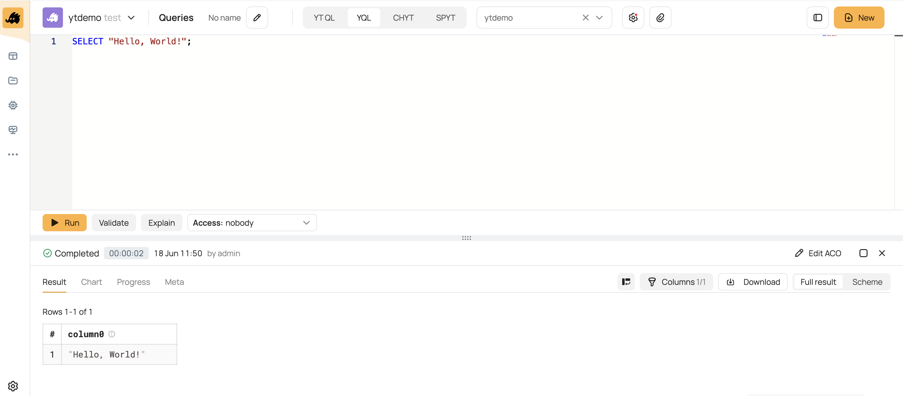

# Введение

YQL (Yandex Query Language) — универсальный декларативный язык запросов к системам хранения и обработки данных, а также инфраструктура для их выполнения. К преимуществам YQL можно отнести:

- мощный графовый движок исполнения, который строит MapReduce-pipelines из сотен узлов и может адаптивно перестраиваться по ходу вычисления;
- возможность построения сложного конвейера обработки данных на SQL с сохранением подзапросов в переменные в виде цепочек зависимых запросов и транзакций;
- предсказуемое параллельное исполнение запросов произвольной сложности;
- эффективная реализация join-ов, подзапросов и оконных функций без ограничений на их топологию и вложенность;
- богатая библиотека функций;
- поддержка пользовательских функций на [C++](udf/cpp.md), [Python](udf/python.md) и [JavaScript](udf/javascript.md);
- автоматическое исполнение небольших частей запросов на заранее подготовленных вычислительных инстансах в обход MapReduce-операций для уменьшения времени выполнения.


YQL предоставляет функциональный веб-интерфейс, в котором среди прочего можно:
- писать код запросов;
- запускать и останавливать выполнение запросов;
- просматривать результат выполнения запросов;
- просматривать историю запросов.


## Как попробовать

Чтобы запустить свой первый YQL-запрос:
1. Откройте веб-интерфейс {{product-name}} кластера (например, [{{testing-cluster-name}}]({{cluster-ui}})) и перейдите на вкладку **Queries** &mdash; на неё можно попасть из меню слева.

2. Введите запрос и нажмите кнопку запуска:

   ```yql
   SELECT "Hello, World!";
   ```

   { .center }

## Глоссарий


