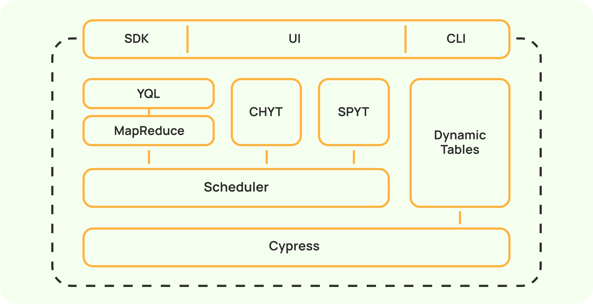

# Overview

This section contains information about the basic features and structure of the {{product-name}} system.

## Clusters { #clusters }

A {{product-name}} cluster is a group of instances located in containers on physical hosts and operating as a unit.
Based on the tasks to be solved, clusters can be divided into:
- Computing clusters for massive parallel big data processing with MapReduce operations.
- Dynamic table clusters (key-value storage).
- Geodistributed clusters for coordination.

A {{product-name}} computing cluster is able:
- To store exabytes of data.
- To use HDD, SDD, and RAM for data storage.
- To process data on hundreds of thousands of Hyper Threading cores.
- To solve machine learning problems on thousands of graphics processors (GPUs).
- To store and process data from tens of thousands of users.

## Architecture

The {{product-name}} architecture contains three layers:
- Distributed file system and metadata storage: Cypress.
- Scheduler for distributed computing with MapReduce model support.
- High-level computing engines: YQL, CHYT, and SPYT.

### Cypress { #cypress }

Cypress is a fault-tolerant tree-based storage whose capabilities can be briefly described as follows:
- A tree-like namespace with directories, tables, and files as nodes.
- Transparent sharding of large tabular data into chunks, enabling the table to be treated as a single entity without worrying too much about the details of its physical storage.
- Support for columnar and row-based storage mechanisms for tabular data.
- Support for compressed storage using various encoding codecs, such as lz4 and zstd, with varying levels of compression.
- Support for erasure coding using various erasure codecs with different control sum calculation strategies that have different redundancy parameters and allowable loss types.
- Expressive data schematization with support for hierarchical types and data sortedness signs.
- Background replication and repair of erased data without manual intervention.
- Transactional semantics with support for nested transactions and snapshot/shared/exclusive level locks.
- Transactions that can affect many Cypress objects and last indefinitely.
- A flexible disk quota accounting system.
- A flexible system for delimiting data access permissions, including access to table columns.

At the heart of Cypress is a replicated and horizontally scalable master server that stores metadata about the Cypress tree structure and the composition and location of chunk replicas for all tables on the cluster. Master servers are implemented as replicated state machines based on Hydra, a proprietary consensus algorithm similar to Raft.
Cypress implements a fault-tolerant elastic data storage layer.

In addition to handling storage, Cypress can act as a lock service similar to Apache Zookeeper.

From a user's standpoint, Cypress looks like a Linux file system tree. The easiest way of working with Cypress is to use its web interface.

### Dynamic tables { #dyn-tables }

Dynamic tables are tables in {{product-name}} that implement an interface for point reads and key-based data writes and have transaction support and a native SQL dialect.

Key features of dynamic tables:
- Storing data in the [MVCC](https://en.wikipedia.org/wiki/Multiversion_concurrency_control) model. Users can look up values by key or by timestamp.
- Scalability: dynamic tables are split into tablets (shards by key ranges) that are served by separate cluster nodes.
- Transactionality: dynamic tables are OLTP storages that can change many rows from different tablets of different tables within a single transaction.
- Fault tolerance: failure of a single cluster node serving a tablet causes that tablet to be moved to another cluster node with no data loss.
- Isolation: instances serving tablets are grouped into bundles that reside on separate servers, ensuring load isolation.
- Conflict checking at the individual key or even individual value level.
- Hot data responses from RAM.
- Deleting data by [TTL](https://en.wikipedia.org/wiki/Time_to_live).
- A built-in SQL-like language for scanning analytical queries.

In addition to dynamic tables with the k-v storage interface, the system supports dynamic tables that implement the message queue abstraction, namely topics and streams. These queues can also be considered tables because they consist of rows and have their own schema. In a transaction, you can modify rows in both the k-v dynamic table and the queue simultaneously. This enables you to build stream processing on top of {{product-name}}'s dynamic tables with exactly once semantics.

### MapReduce { #mapreduce }

The {{product-name}} computational architecture is based on the MapReduce distributed computational model. The Map operation processes input data broken down into parts between the cluster's nodes without data being exchanged between such nodes. The Reduce operation groups data from different cluster nodes.
The model helps process large amounts of data in a highly reliable manner and automatically restart a part of the computations if individual cluster nodes are unavailable.

MapReduce in {{product-name}} has the following features:
- A rich model of base operations: classic MapReduce (with different shuffle strategies and support for multi-phase partitioning), Map, Erase, Sort, and some extensions of the classic model that take into account the sortedness of input data.
- Horizontal scalability of computations: operations are divided into jobs that run on separate cluster nodes.
- Support for hundreds of thousands of jobs in a single operation.
- A flexible model of hierarchical compute pools with instant and integral guarantees, as well as fair-share distribution of underutilized resources among consumers without guarantees.
- A vector resource model that enables different compute resources (CPU, RAM, GPU) to be requested in different proportions.
- Job execution on compute nodes in containers isolated by CPU, RAM, file system, and process namespace using the Porto containerization mechanism.
- A scalable scheduler that can serve clusters with up to a million concurrent tasks.
- Virtually all compute progress is preserved in the event of updates or scheduler node failures.

You can execute not only MapReduce jobs but also arbitrary code. In {{product-name}} terminology, running arbitrary code is achieved using Vanilla operations.

### YQL { #yql }

YQL is an SQL-based language of universal declarative queries against data storage and processing systems, as well as an infrastructure to run such queries.

YQL benefits include:
- A powerful graph execution engine that can build MapReduce pipelines with hundreds of nodes and adapt during computation.
- Ability to build complex data processing pipelines using SQL by storing subqueries in variables as chains of dependent queries and transactions.
- Predictable parallel execution of queries of any complexity.
- Efficient implementation of joins, subqueries, and window functions with no restrictions on their topology or nesting.
- Extensive function library.
- Support for custom functions in C++, Python, and JavaScript.
- Automatic execution of small parts of queries on prepared compute instances, bypassing MapReduce operations to reduce latency.

### CHYT { #chyt }

ClickHouse over {{product-name}} (CHYT) is a technology that enables you to create a cluster of ClickHouse servers directly on {{product-name}} computational nodes.
ClickHouse is created within a Vanilla operation and works with the data in {{product-name}}. The {{product-name}} cluster acts as a compute cloud with respect to the running CHYT clusters within it.
This technology enables different users to run multiple CHYT clusters on a single {{product-name}} cluster, completely isolated from each other, solving the problem of resource separation in a cloud-like manner.

In the {{product-name}} ecosystem, CHYT is responsible for:
- Fast analytical queries on static tables in {{product-name}} with sub-second latency.
- Reusing existing data in the {{product-name}} cluster without having to copy it to a separate ClickHouse cluster.
- Ability to integrate via ClickHouse's native ODBC and JDBC drivers, for example, with third-party visualization systems: Tableau, Qlik, Power BI, Oracle Bi, and DataLens.

The integration is done at a fairly low level. This enables us to use the full potential of both {{product-name}} and ClickHouse. This integration implements:
- Support of reading both static and dynamic tables.
- Partial support of the {{product-name}} transactional model.
- Support of distributed inserts.
- CPU-efficient conversion of columnar data from the internal {{product-name}} format to the in-memory ClickHouse representation.
- Aggressive data caching, which in some cases enables query execution data to be read exclusively from instance memory.

### SPYT { #spyt }

SPYT is a technology that integrates Apache Spark as a compute engine for data stored in {{product-name}}. Similar to CHYT, vanilla {{product-name}} operations provide computational resources for the SPYT cluster.
Using SPYT helps minimize IO overheads and increase the performance of complex analytical pipelines manifold.
SPYT can read both static and dynamic {{product-name}} tables, perform computations with them, and capture the output in a static {{product-name}} table.

### SDK { #sdk }

All APIs in popular languages (C++, Python, Java, Go) were developed by the {{product-name}} team, so all the nuances of interacting with the system are considered and well thought out in them. The {{product-name}} client part for the mentioned languages enables you to read or write large amounts of data, despite possible network failures and other error.

### Web interface { #ui }

The {{product-name}} system implements a unified web interface for users and administrators. Use it to:
- Navigate Cypress and view data.
- Execute operations with tables, folders, and files.
- Execute and view MapReduce computations.
- Execute and view the history of SQL queries across all engines: YQL, CHYT, dynamic tables SQL.
- Administer the system:
   - Monitor cluster component health.
   - Create and delete users and groups.
   - Manage quotas.
   - View access control settings.
   - View cluster component versions and much more.

