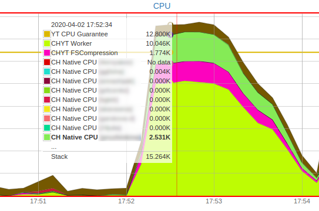
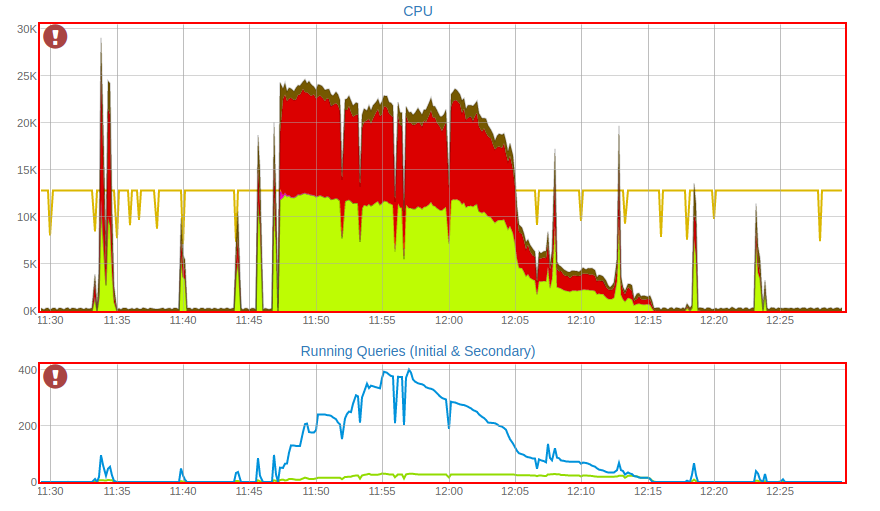

# Diagnosing queries

Before reading this article, read the [Query anatomy](../../../../../user-guide/data-processing/chyt/queries/anatomy.md).

<!-- and [CHYT dashboard](../../../../../user-guide/data-processing/chyt/cliques/administration.md#dashboard) articles-->

This article describes how to find out details about a particular query — how much data it read, whether it was CPU bound or IO bound, and other useful information.

## CPU consumption during query execution { #cpu-query }

The graph of CPU consumption at the time when the query was being executed clearly demonstrates what was the bottleneck in the query execution.

Before reading this section, see the [description of the CPU graph](../../../../../user-guide/data-processing/chyt/cliques/administration.md#cpu).

The query examples are given below.

### Native CPU bound query

{ .center }

This query loaded the clique's CPU to the brim for about a minute, with almost all of the CPU consumption going directly to data processing in the ClickHouse engine.

CHYT FSCompression is almost completely missing, which probably means that the data was read completely from block cache on the instances.
**Spoiler**: in the original graph where the screenshot above was taken from, you can actually see a chain of queries of roughly the same form from the same user before this query, which only confirms the assumption.

CHYT Worker takes a small value, which means that there is almost no "tax" on using ClickHouse over a non-native {{product-name}} data source.

The last two indicators demonstrate that such a query is almost "ideal" for CHYT — it had almost no overhead costs. You can speed up such a query by reducing the amount of processed data or by increasing the clique size — such a query should scale linearly as the number of available cores grows.

### Strongly filtering IO bound query

{ .center }

This query looks fundamentally different and you can make two conclusions.

First, you can see that this query could not load the CPU to the maximum — the total CPU consumption is averagely only about 40 cores, while the clique has a total of 128 cores available. This means that the query is mostly IO bound and you can try to speed it up by moving the data to a faster medium such as an SSD.

Second, this query had almost the entire CPU going to "CHYT Worker" (about 30 cores on average), while the native CH code was idle, loading only a total of one or two cores across all instances — this means that CHYT prepared a lot of data for CH which CH then almost never used. This situation is common for strongly filtering queries on narrow columns, for example:

`SELECT (lots of columns) FROM "//path/to/table" WHERE id == 42`

Such a query is forced to take a lot of data from the disk, including all columns from the list of requested columns, but most of the data will be simply thrown out, because the "id == 42" condition leaves very few rows. You can optimize such a query using the PREWHERE construction of the ClickHouse SQL language by changing the query as follows:

`SELECT (lots of columns) FROM "//path/to/table" PREWHERE id == 42`

Increasing the clique size can also help this query.

### CHYT Worker & IO bound query

{ .center }

This query was definitely not IO-bound, it completely loaded the clique's CPU. Moreover, you can see that the clique consumed a little more than 150 cores at the peak, while it was configured for 128 cores. This is a normal situation, because if a {{product-name}} node has not provided all the cores for the jobs running on it, the surplus cores are divided proportionally between the jobs populating it. Thereby, at this point, some of the instances were on empty nodes and the query managed to dispose of more resources than the clique is entitled to. This is a nice CHYT feature.

You can see on this graph that about 17 cores were taken to decompress the data. The tables were probably compressed by a rather strong codec.

Finally, you can see that the rest of the CPU went to "CHYT Worker" and the native CH code in the proportion of about 4:1. This could mean one of two things.

- This query, like the previous one, filters out quite many rows, looking at a small share of CHYT prepared data.
- For this query, the "tax" of using CH over {{product-name}} was very high and it really takes a long time to prepare the data for CH.

The CHYT team is working on efficiency at this point and on reducing the number of situations where queries spend most of their time on overhead computations, "unnecessarily" warming the CPU.

### DataLens Burst

{ .center }

This is quite typical for cliques under the DataLens deshboards. Short bursts at 11:34, 11:40, 11:44, 11:46, 12:18, and 12:23 show what the single opening of the dashboard living on top of this clique looks like. It's not instantaneous, but quite tolerable — the typical time to open a dashboard is about a minute, because queries digest substantial amounts of data.

Next, at 11:47, a trouble happens and the clique starts failing. Most likely, the dashboard was opened by several people at the same time or someone actively started pressing F5. In this situation, the clique starts executing multiple copies of the same queries, they get only a share of the CPU in equal proportions, and the CPU bound query that normally runs for about a minute starts running a dozen minutes. You can see that the number of concurrently executed subqueries was as high as 400 at the peak.

This provides a positive feedback — people see that the dashboard is lagging longer than they are used to and the situation only gets worse further. In the end, around 12:00, the annoyed user stops trying to get anything out of the dashboard, goes to the support chat to express frustration, and the load on the clique slowly dissipates, after which everything returns to a normal state.

What to do in this situation:

- First, you can try to make the clique more powerful by increasing the number of available CPUs. The faster an individual query runs on an unloaded clique, the less likely this situation is to occur.

- Second, you can change your approach to generating graphs. DataLens as a BI tool on top of data in {{product-name}} is good when it has to process small amounts of data in seconds to build the values it needs. If the graph requires hundreds of GB to build a scan, that's a good reason to think — maybe you should build a small-size product based on 100 GB and run BI on top of it.
