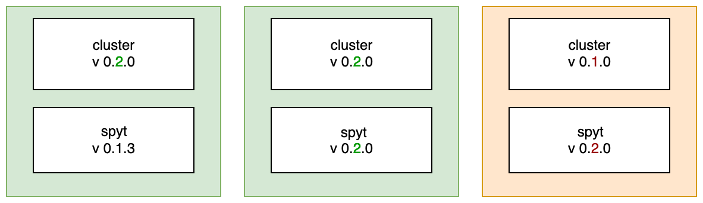

# Versioning rules

SPYT includes two components:
- A cluster with Spark pre-installed.
- A client to which the `ytsaurus-spyt` package is installed via `pip`. The client automatically installs Spark dependencies.

SPYT is built from several artifacts:
- A `.tar` archive, posted to {{product-name}} and read at cluster startup.
- A pip package containing `pyspark`. All the `.jar` files for Spark are included in the package, as in the `.tar` above.
- `yt-data-source` as a separate `.jar` file. Posted to {{product-name}} and added for each job individually. Downloaded by Spark both to the driver and the executors (the client machine and the cluster) at the same time.
- The `ytsaurus-spyt` pip package. Uploaded to a repository and installed to client hosts. Enables you to dynamically download the same version of `yt-data-source`, and installs a specific version of `pyspark` as a dependency.

A new version of `ytsaurus-spyt`, when installed, causes `pyspark` and `yt-data-source` to update automatically.

In most cases, a `ytsaurus-spyt` update is sufficient. However, sometimes, to make new functionality work, you will have to update your cluster. You can find out the update procedure and scope based on the specific version.

## Update procedure { #how }

- A cluster and client version comprises three parts. An update to the last part of a version indicates that no compatibility has been disturbed and that the update has been local and confined to a single component.

- As new functionality is added to `ytsaurus-spyt`, you will have to update your cluster. Update the second version component for all:
   * A new cluster (such as, 0.2.0) is always compatible with an old client (such as, 0.1.0). It is always better to update you cluster first followed by your client.
   * If you update the client (such as, 0.2.0) without updating the cluster (for instance, 0.1.0), the client's entire old functionality will remain operational. However, the new features added in 0.2.0 may malfunction or not function at all. The logs will display a special warning that you must update your cluster:
      { .center }

- You can select your cluster version at startup via `spark-launch-yt`. If no version is specified, the latest released version will be started.
- The `client mode` client version (in Jupyter) is the `ytsaurus-spyt` version, which you install using `pip`.
- In `cluster mode`, you can specify the client version in `spark-submit-yt`. If no version is specified, the latest release that is compatible with your cluster will launch.

