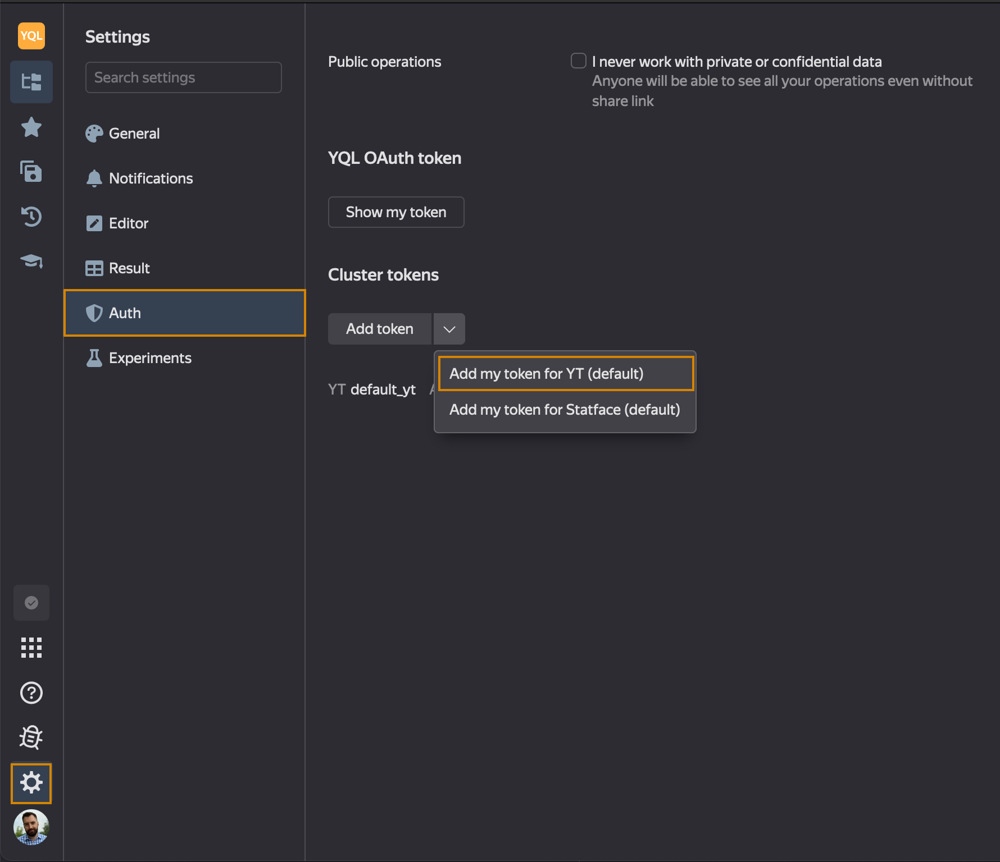

# Errors

## Exception in GetMeta(): "Access denied: ..."
Use the button "Add my token for {{product-name}}(default)":

{ width="300"}

## Expected comparable type, but got: Yson
This might happen if the table has been created in {{product-name}} without a schema and then sorted. In this case, the system ({{product-name}}) assigns to the sort column the `any` type in the table schema. In YQL, this is equivalent to `Yson` column type (arbitrary YSON data).

For example, for this query:
```yql
SELECT * FROM my_table
WHERE key = 'www.youtube.com/watch?v=Xn599R0ZBwg';
```
... you can make a workaround:
```yql
SELECT * FROM my_table
WHERE Yson::ConvertToString(Yson::Parse(key)) = 'www.youtube.com/watch?v=Xn599R0ZBwg';
```
**The drawback of this solution:**
The queries used in the examples output all the rows that match a certain key. If the table has been sorted by this key, the query execution time is usually independent of the table size. But for this workaround, such optimization won't work, and you'll have to fully scan the table.



There is no such issues for tables with valid schemas. Set up the schema if you know how to do it. If not, ask the people responsible for the tables to do it for you.



More [about Yson UDF](../udf/list/yson.md).

## Cannot add type String (String?) and String (String?)
This error arises when you try to concatenate strings using the '+' operator.
Use the '||' operator instead:
```yql
SELECT "Hello, " || "world" || "!";
```

## Expression has to be an aggregation function or key column, because aggregation is used elsewhere in this subquery
This issue most often arises when you try to use aliases used in your `SELECT` clause, further in the `HAVING` clause. Aliases are names of fields that follow `AS` in a `SELECT` statement. They define a projection and are applied after the `HAVING` clause (that's why you can't use them in HAVING).

An example of an invalid query (such a query **WON'T** work):
```yql
USE hahn;
SELECT
    region,
    COUNT(age) AS counter
FROM `home/yql/tutorial/users`
GROUP BY region
HAVING counter > 3
```

To avoid calling aggregate functions twice, add a subquery, moving the logic from the `HAVING` to the `WHERE` clause.

```yql
USE hahn;
SELECT *
FROM
    (SELECT
        region,
        COUNT(age) AS counter
    FROM `home/yql/tutorial/users`
    GROUP BY region)
WHERE counter > 3
```

## Value type "double" is not a number
The reason for this error is, most often, division by zero: it results in an NaN value (not a number) not supported by {{product-name}} in some cases.

## Row weight is too large
This error occurs when the maximum memory allocated for a row is exhausted. Use the relevant [PRAGMA](../syntax/pragma.md#yt) to increase the maximum row length in your {{product-name}} tables.
The default value is "16M", the maximum value is "128M". If you exceed the maximum value, change your computing logic, for example, split your table into parts.
<!-- or apply compression algorithms ([Compress UDF](../udf/list/compress_decompress.md)) -->
```yql
PRAGMA yt.MaxRowWeight = "32M";
```

## Key weight is too large
This error arises when the value in a key field of the table is too large. One of the methods to solve the issue is to use a [PRAGMA](../syntax/pragma.md#yt) that increases the maximum length of key table fields in {{product-name}}, where the fields are used for `ORDER BY`, `GROUP BY`, `PARTITION BY`, `DISTINCT`, `REDUCE`
The default value is "16K" and the maximum value is "256K".
```yql
PRAGMA yt.MaxKeyWeight = "32K";
```


Before using this PRAGMA, get an  approval from yt-admin@



## The same table column includes values of different types {#badtabledata}

When processing such tables, you might encounter different errors depending on query settings:
* ``` ReadYsonValue(): requirement cmd == Int64Marker failed, message: Expected char: "\2", but read: "\1"```
* ``` { 'Table input pipe failed' { 'Unexpected type of "score" column, expected: "int64" found "uint64"' } }```

To read or process such a table, you need to patch the column type to `Yson?` using [WITH COLUMNS](../syntax/select.md#with) and then parse the data manually using [Yson UDF](../udf/list/yson.md):
```yql
SELECT Yson::ConvertToDouble(bad_column, Yson::Options(false as Strict)) ?? CAST(Yson::ConvertToString(bad_column, Yson::Options(false as Strict)) as Double) as bad_column
FROM `path/to/bad_table`
WITH COLUMNS Struct<bad_column: Yson?>;
```

If the types can be converted automatically, you can do like this:
```yql
SELECT Yson::ConvertToDouble(bad_column, Yson::Options(true as AutoConvert)) as bad_column
FROM `path/to/bad_table`
WITH COLUMNS Struct<bad_column: Yson?>;
```

## Access denied for user <>: "read" permission for node <> is not allowed by any matching ACE {#symlinkaccess}

### Requesting rights in {{product-name}}

Check whether you can open the table in the {{product-name}} interface.

If you don't have the access, request it.

### Rights for table symlinks

If you can open the table in the {{product-name}} interface but YQL can't see it, the issue may be in symlinks to tables, when the user has access rights for the underlying table but doesn't have a read access to its symlink. To resolve the underlying table in {{product-name}}, you don't need read access to its symlink: that's why in {{product-name}} the contents of the table would display normally. However, besides resolving the table, YQL also reads its symlink attributes because the attributes can override the table schema, for example. To resolve this issue, request the rights to read the symlink.



## An external employee couldn't open the YQL interface or run queries {#outstaff}

see the [instructions](../quickstart.md#outstaff)



## A saved query fails with the error Client is missing credentials {#query_missing_creds}

When Reactor executes the saved query, it tries to use the `default_yt` token from the query owner profile. If no token is found, the query is executed with the Reactor's robot credentials. In the latter case, when the query tries to access the {{product-name}} cluster, it fails with the error `Client is missing credentials`. To fix this error, the query owner must add the `default_yt` token  to their [profile](https://cluster-name.yql/docs/yt/interfaces/web#auth). As a {{product-name}} token, it's OK to use your YQL token.

## Maximum allowed data weight per sorted job exceeds the limit {#key_monster}

In most cases, the error arises when executing a `JOIN` if its inputs include a monster key (a huge number of records with the same key value). To check for a monster key, click on a red circle in the query execution plan and drill down to the failed {{product-name}} operation. After that, in the {{product-name}} interface, open the `Partition sizes` tab of the failed operation.


If you see large partitions (more than 200 GB), this indicates that you have monster keys. To find the value of the problem key, expand the error message in the operation's `Details` field. Most probably, you'll find it there.


In this example, the problem key is an empty string. For other ways to find the problem key, see the [Performance](performance) section.

The main way to solve this issue is to filter the problem key values at JOIN inputs. Monster keys typically include irrelevant values (NULL, empty string) that you can safely filter out. If the values of monster keys are critical for you, process them separately.

Besides JSON, such an error may also arise in the following cases:
1. Huge amounts of data in `GROUP BY`, `JOIN`. Solution: try to decrease the data amount.
2. The [window](../syntax/window) includes the entire table. Solution: review the partitioning conditions for the window function
3. Huge amounts of data for certain values of the `GROUP BY` key. The method used to find a problem key in this case is the same as for `JOIN`. Solution: filter out the problem key, add more columns to the group key.

## Reading multiple times from the same source is not supported
DQ can't execute the query because the resulting query execution plan splits the input into multiple streams. The system hasn't learned to execute such queries properly so far; for more information, see YQL-13817

<!-- ## Too large table(s) for evaluation pass: NNN > 1048576 {#eval_error}

see the description of the [query execution steps](../misc/exec_steps.md) -->
