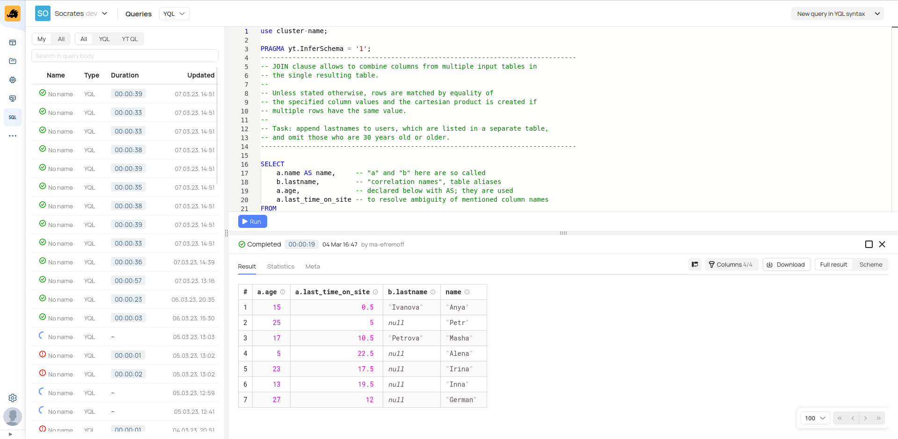

# Introduction

YQL is an SQL-based language of universal declarative queries against data storage and processing systems, as well as an infrastructure to run such queries.

YQL benefits include:
- a powerful graph execution engine that can build MapReduce pipelines with hundreds of nodes and adapt during computation;
- ability to build complex data processing pipelines using SQL by storing subqueries in variables as chains of dependent queries and transactions;
- predictable parallel execution of queries of any complexity;
- efficient implementation of joins, subqueries, and window functions with no restrictions on their topology or nesting;
- extensive function library;
- support for custom functions in C++, Python, and JavaScript;
- automatic execution of small parts of queries on prepared compute instances, bypassing MapReduce operations to reduce latency.

# How to try

YQL provides a functional web interface in which, among other things, you can:
- write query code;
- start and stop execution of requests;
- view the result of query execution;
- view the query history.

{ .center }
