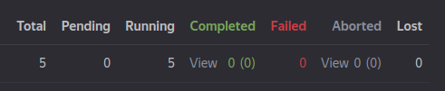
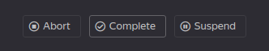

# Клика в веб-интерфейсе {{product-name}}

Попасть в клику в веб-интерфейсе {{product-name}} можно несколькими способами. При запуске клики посредством команды `start-clique` ее URL отображается в терминале:

```bash
2020-06-03 21:30:29,242 INFO    Operation started: <clique_url_in_ui>
```

Также в интерфейс клики можно попасть в любой момент со страницы **Operations**. Для этого нужно ввести алиас клики (с `*`) в поле **Filter operations...**, после чего нажать **Go to operation**.

{ .center }





Клика в веб-интерфейсе {{product-name}} представлена страницей Vanilla-операции. Эта страница не содержит никакой специфичной для CHYT логики.

Не стоит путать понятия из терминологии {{product-name}} (операция, джоб) с понятиями из терминологии CHYT (клика, инстанс, запрос). Можно считать, что операция {{product-name}} — это контейнер для клики, а джобы {{product-name}} — это контейнеры для инстансов клики. А про ClickHouse-запросы в интерфейсе операции никакой информации нет.



На странице операции есть много полезной информации, помогающей в эксплуатации CHYT.

## Description { #description }

В секции **Description** содержится разная системная информации про клику и ряд ссылок.

- `ytserver-log-tailer`, `ytserver-clickhouse`, `clickhouse-trampoline` &mdash; в этих секциях описан версии различных компонентов серверного кода CHYT;

## Specification { #specification }

В секции **Specification** содержится информация о том, как именно клика была запущена.

{ .center }

- **Wrapper version** — содержит версию лончера, запустившего клику;
- **User** — содержит информацию о том, какой пользователь запустил клику;
- **Command** — содержит строку запуска клики.

Последние два значения очень полезны, если нужно, например, перезапустить более свежую версию клики. Можно либо обратиться к пользователю, ее запустившему, либо самостоятельно воспроизвести команду запуска.

## Jobs { #jobs }

В секции **Jobs** есть информация о джобах операции, в которой запущена клика. Напомним, что один джоб соответствует одному инстансу в клике, то есть одному серверу ClickHouse.

{ .center }

В этой секции в терминах инстансов CHYT:

- `total` — общее количество инстансов в клике;
- `pending` — число инстансов из общего количества, которые еще не запущены. Ненулевое число в этой секции означает, что у клики не хватает ресурсов, чтобы единомоментно держать все инстансы запущенными, это плохая ситуация для клики;
- `running` — число запущенных инстансов из общего количества, т.е. `running + pending = total`;
- `completed` — число *gracefully preempted* инстансов. Сюда относятся те инстансы, которые попали под вытеснение и успели завершить все бегущие на них запросы до того момента, как их принудительно поабортило;
- `failed` — число упавших инстансов. Инстансы могут падать по разным причинам, наиболее частые: OOM (out of memory) либо баги в коде CHYT или ClickHouse;
- `aborted` — число поаборченных инстансов. Часть абортов приходится на непреодолимые обстоятельства (например, нода вышла из строя) и с ними ничего не поделать, наличие среди джобов поаборченных по причине `preemption` – это плохой знак, демонстрирующий нехватку ресурсов;
- `lost` — джобы в клике возникать не должны.

## Кнопки управления { #control }

С помощью кнопок в верхнем правом углу можно приостанавливать клику или останавливать совсем.

{ .center }

- **Abort** останавливает клику и абортит операцию {{product-name}}, в которой она запущена, в результате чего она больше не занимает ресурсы и алиас. Чтобы перезапустить клику, нужно будет заново ее [запускать](../../../../../user-guide/data-processing/chyt/cliques/start.md).
- **Complete** в контексте CHYT ничем не отличается от кнопки **Abort**.
- **Suspend/Resume** (c `abort running jobs`) &mdash; с помощью этой кнопки можно разом абортнуть все инстансы в клике, не завершая при этом саму клику. Операция по-прежнему будет учитываться в running operation count пула, но инстансы не будут тратить вычислительные ресурсы.

С помощью кнопки **Suspend/Resume** можно пытаться "приводить в чувство" клику, которая пришла в какое-то неудачное состояние (зависла по причине бага, оказалась завалена тяжёлыми запросами и т. д.).
