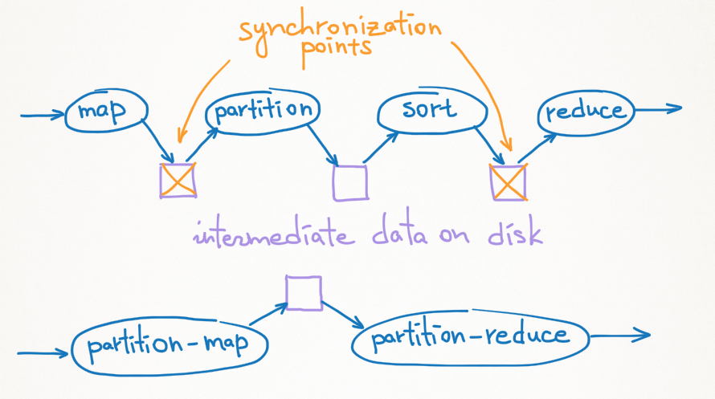

# MapReduce

Операция MapReduce устроена следующим образом:

1. На узлах кластера наступает map стадия. Каждый пользовательский скрипт map стадии (mapper) получает на вход отдельную часть входной таблицы. Выходные данные map стадии делятся по хешу от ключа на партиции. Полученные партицированные данные сохраняются локально на диск на тех узлах, где выполнялись map джобы, с единичной репликацией;
2. Далее наступает reduce стадия. Каждый пользовательский скрипт reduce стадии (reducer) обслуживает одну партицию: ему на вход попадают все записи, полученные из mapper-ов, чей хеш от ключа имеет заданное значение. Reducer забирает по сети данные, отвечающие его партиции, с узлов кластера, где выполнялись map джобы, — данный процесс называется **shuffle**, именно в это время порождается максимальная нагрузка на сеть. Каждая партиция сортируется в памяти по ключу, а при совпадении ключей по подключу. Затем сортированные данные подаются на вход reduce джобу. Выход из reduce джоба записывается на диск с требуемой репликацией — обычно это две синхронные реплики и одна асинхронная, при этом одна из синхронных реплик пишется локально.

{ .center }

Операция MapReduce аналогична операции [Sort](../../../../user-guide/data-processing/operations/sort.md), но позволяет выполнять пользовательский скрипт mapper до выполнения partitioning джобов и пользовательский скрипт reducer, после выполнения sorting-джобов.



MapReduce — это функционально не то же самое, что Map+Sort+Reduce. Даже если пользовательский скрипт reduce стадии не изменяет значения ключевых колонок, получить на выходе операции сортированную таблицу все равно не удастся. Поэтому использование MapReduce в комбинации с атрибутом `sorted_by` на выходной таблице почти всегда некорректно. Ошибка будет проявляться только на достаточно большой таблице, которая не помещается целиком в один reduce джоб.



Особенности работы слитной операции MapReduce:

1. Пользователь может не указать mapper, в таком случае он предполагается тождественным: данные входных таблиц будут переданы на выход map стадии без обработки. В терминах {{product-name}}, при наличии пользовательского mapper-а будут работать partition map джобы, а в случае отсутствия — partition джобы;
2. Если партиция оказалась слишком большой и не помещается в память, то отсортировать её на одном узле кластера невозможно. Поэтому партиция делится на части, каждая часть сортируется отдельно, результат записывается локально на диск. После этого запускается [multiway merge](https://en.wikipedia.org/wiki/K-way_merge_algorithm), сливающий данные и подающий их на вход reduce джоба. В терминах {{product-name}} сортировка маленькой партиции в памяти выполняется с помощью partition reduce джобов. Если же партиция большая, то сортировка частей выполняется partition sort джобами, а финальное слияние и запуск reducer-а — sorted_reduce джобами;
3. Нельзя начать запускать reduce джобы до тех пор, пока map джобы не завершились. Это следует из того, что система {{product-name}} должна подавать reduce джобам данные, упорядоченные по подключу, а такую последовательность нельзя сформировать, пока данные (выходы map джобов) не построены до конца. Поэтому между стадиями map и reduce есть так называемый барьер, map и reduce не должны пересекаться по времени. 
Если в процессе работы операции планировщик замечает, что возникает большая партиция, которая не может быть отсортирована в одном джобе, то у него появляется возможность сэкономить время и начать обрабатывать партицированные данные до до завершения всех map джобов. Планировщик дробит партицию на несколько частей произвольным образом. Отдельные части сортируются на разных узлах кластера intermediate sort джобами, которые забирают по сети эти данные и сортируют их. Такое наблюдение позволяет частично пересекать фазы и сокращать время операции.

## Сравнение MapReduce и Map+Sort+Reduce
У слитной операции MapReduce по сравнению с комбинацией операций [Map](../../../../user-guide/data-processing/operations/map.md) + [Sort](../../../../user-guide/data-processing/operations/sort.md) + [Reduce](../../../../user-guide/data-processing/operations/reduce.md) есть несколько плюсов:

1. **Экономия IO-операций на промежуточных данных.** В типичном случае, без фазы слияния, map-sort-reduce будет писать промежуточные данные на диск три раза: после map стадии, после partition sort стадии и по окончании сортировки. Часть из этих записей, возможно, будет происходить с неединичным коэффициентом репликации. Операция MapReduce обойдется единственной записью на диск, причем будет использовать единичную репликацию;
2. **Отсутствие лишних барьеров (точек синхронизации).** В комбинации map-sort-reduce система {{product-name}} вынуждена ждать окончания **всех** map джобов (включая самых долгих), прежде чем начинать партиционирование. Аналогично, необходимо дождаться полного окончания сортировки до запуска первых reduce джобов. В случае слитной операции MapReduce точка синхронизации одна, и она неизбежна (нельзя запускать reduce джобы до окончания map джобов);
3. **Лучшая устойчивость к сбоям.** Mapreduce — единая операция, и планировщик полностью отвечает за то, чтобы завершить её выполнение даже в случае, когда некоторые промежуточные данные становятся недоступны. В случае цепочки независимых операций ответственность планировщика ограничивается отдельными стадиями. Единственный возможный способ борьбы с этим — увеличение степени репликации промежуточных данных, ведущее к серьезной деградации скорости.

{ .center }

### Замечания по использованию

Чтобы перейти к использованию слитной операции MapReduce от комбинации Map+Sort+Reduce, достаточно передать обе опции mapper и reducer в спецификации операции.


В ряде случаев пользователи могут сталкиваться с недостаточно быстрой работой слитной операции MapReduce при запуске с настройками по умолчанию. Причины могут быть следующие:

1. **Значительная разница между объемом данных на входе и на выходе mapper-а, ведущая к неправильной оценке планировщиком числа партиций.** 

   Планировщик оценивает число партиций, исходя из объема входных данных, стремясь к тому, чтобы партиция полностью поместилась в память джоба сортировки (по умолчанию 2 Гб). При этом планировщик исходит из предположения, что объем входа mapper-а приблизительно равен объему выхода.

   На практике mapper может выполнять фильтрацию исходных данных с отношением выхода к входу порядка 1:1000 и меньше. В результате, в буфер каждой партиции попадает буквально несколько записей, что приводит к большому количеству случайных чтений с диска мелкими порциями в процессе shuffle в начале фазы сортировки.

   Пример: пусть на вход partition map джоба пришло 2 Гб данных, на выходе получилось 4 Мб, `partition_count` равен 1000. Тогда средний размер блока записанного partition map джобом будет составлять около 2 Кб до сжатия. Такие блоки порождают огромное количество случайных обращений к диску.
   
   Для борьбы с данной проблемой в спецификацию операции была добавлена опция `map_selectivity_factor`, позволяющая пользователю при старте операции задать приблизительное отношение выхода ко входу и помочь планировщику в оценке. В качестве альтернативы можно явно указать желаемое количество reduce-джобов с помощью опции `partition_count`.

1. **"Тяжелые" mapper-ы и малое количество параллельных джобов из-за дефицита памяти.**

   При выделении ресурсов для джоба планировщик учитывает память, необходимую пользовательскому коду (`memory_limit`, задается пользователем в спецификации операции) и память для системной обвязки (JobProxy). Для map-джоба (в операции Map) память складывается из `memory_limit`, буфера на чтение и буфера на запись. 
   
   Пример: пусть `memory_limit` равен 250 Мб, размеры буферов — 100 + 100 Мб, итого 450 Мб на джоб. Пусть fair-share операции равен 0.1, суммарный объем ресурсов на кластере 11 Тб памяти и 7000 CPU, тогда ресурсы, доступные операции, составляют 0.1 * 11Тб = 1.1 Тб и 0.1 * 7000 = 700 CPU. В результате можно параллельно запустить min(1100 Гб / 450 Мб, 700) = min(2500, 700) = 700 джобов.
   
   Для partition map джоба, память складывается из `memory_limit`, буфера на чтение и буфера под партиции. Для операций с большим числом партиций планировщик выдает partition map джобу большой объем памяти под буфер партиций, чтобы избежать формирования мелких блоков. Например, при 1000 партициях и буфере в 2 Гб размер блока в худшем случае будет равен 2 Гб / 1000 = 2 Мб при равномерном распределении данных. Возращаясь к предыдущему примеру: объем памяти для partition map джоба будет равен 250 Мб + 100 Мб + 2 Гб ~ 2400 Мб и при доступной памяти 1.1 Тб планировщик сможет параллельно запустить только min(1100 Гб / 2400 Мб, 700) = min(470, 700) = 470 джобов.
   
   Если mapper "тяжелый" (большое потребление CPU на единицу выходных данных), то снижение параллельности приведет к значительному увеличению времени работы, и нивелирует возможный выигрыш от склевания фаз map и partition. Так как типичный размер выхода из фильтрующего mapper-а очень мал, такой mapper тоже следует считать "тяжелым".
   
   Наилучшим решением в такой ситуации будет использовать комбинацию Map + MapReduce (с тривиальным mapper-ом). Даже в таком случае есть выигрыш по числу сохранений промежуточных данных по сравнению с комбинацией Map+Sort+Reduce.

### Результаты измерений

Для примера, показывающего прирост производительности, можно взять стандартную задачу [WordCount](https://en.wikipedia.org/wiki/Word_count). Она сводится к выполнению одной операции Map-Reduce, при этом в mapper-е  производится агрегация данных по ключу. 

В таблице приведены результаты измерений времени работы операций при решении задачи WordCount с применением слитной MapRedue операции, последовательности Map+Sort+Reduce, а также Map+MapReduce (последний — с тривиальным mapper-ом).

| Операции       | Время работы |
| --------------- | ----- |
| MapReduce       | 03:25 |
| Map+MapReduce   | 05:30 |
| Map+Sort+Reduce | 08:10 |

Данные результаты получены на кластере, состоящем из 200 узлов, каждый из которых имел 48Gb оперативной памяти и 24 ядра под джобы. Размер входных данных составил 1 Tb.

## Настройки операции MapReduce

Общие параметры для всех типов операций описаны в разделе [Настройки операций](../../../../user-guide/data-processing/operations/operations-options.md).

У операции MapReduce поддерживаются следующие дополнительные параметры (в скобках указаны значения по умолчанию, если заданы):

* `mapper` — описание пользовательского скрипта для map стадии. Если не указан, данные из входных таблиц сразу попадут на выход операции без обработки;
* `reducer` — описание пользовательского скрипта для reduce стадии;
* `reduce_combiner` — описание скрипта reduce_combiner (подробнее рассмотрен [ниже](#reduce_combiner));
* `sort_by` (по умолчанию совпадает с `reduce_by`) — список колонок, по которым будет производиться сортировка данных, поступающих на вход в reduce стадии. Последовательность `reduce_by`-полей должна быть префиксом последовательности `sort_by`-полей;
* `reduce_by` — список колонок, по которым будет производиться группировка;
* `input_table_paths` — список входных таблиц с указанием полных путей (не должен быть пустым);
* `output_table_paths` — список выходных таблиц;
* `mapper_output_table_count` — количество таблиц из `output_table_paths`, которые будут выходными из map стадии. Для таких таблиц `table_index` в джобе отсчитывается с единицы, а нулевая выходная таблица — это intermediate output;
* `partition_count`, `partition_data_size` — опции, которые указывают, сколько партиций должно быть сделано в сортировке;
* `map_job_count`, `data_size_per_map_job` — опции, которые указывают, сколько джобов должно быть запущено в map стадии (имеют рекомендательный характер);
* `data_size_per_sort_job` — опция, регулирующая количество данных на входе `reduce_combiner` (подробнее рассмотрена [ниже](#reduce_combiner));
* `force_reduce_combiners` (false) — форсировать запуск `reduce_combiner` (подробнее рассмотрен [ниже](#reduce_combiner));
* `map_selectivity_factor` (1.0) — доля от исходного объёма данных, который остаётся после map стадии (значение по умолчанию 1.0 означает, в частности, что map-стадия не меняет ожидаемый размер данных; 2.0 - что она увеличивает размер в два раза и т.п.);
* `intermediate_data_replication_factor` (1) — коэффициент репликации промежуточных данных;
* `intermediate_data_account` (intermediate) — аккаунт, в квоте которого будут учитываться промежуточные данные операции;
* `intermediate_compression_codec` (lz4) — кодек, используемый для сжатия промежуточных данных;
* `intermediate_data_acl` `({action=allow;subjects=[everyone];permissions=[read]})` — права доступа к промежуточным данным, которые появляются после map стадии;
* `map_job_io, sort_job_io, reduce_job_io` — IO-настройки соответствующих типов джобов; секция `table_writer` в опции `reduce_job_io` добавляется ко всем джобам, которые пишут в выходные таблицы;
* `sort_locality_timeout` (1 min) — время, в течение которого планировщик будет ждать появления свободных ресурсов на конкретных узлах кластера, чтобы запускать сортировку всех частей каждой партиции на одном узле. Данное действие необходимо для обеспечения большей локальности чтения при последующем слиянии сортированных данных;
* `ordered` (false) — включить логику, аналогичную ordered map, на partition-map стадии (входные данные разделяются на джобы последовательными отрезками, каждый джоб map стадии получает строки на вход в порядке следования в исходных таблицах);
* `pivot_keys` — список ключей, по которым будет производиться партицирование данных для reduce стадии. Опция полностью аналогична соответствующей [опции](../../../../user-guide/data-processing/operations/reduce.md) для операции reduce.

В операции MapReduce `table_index` поддерживаются только в mapper-е. При необходимости иметь `table_index` в reducer-е, необходимо добавить `table_index` в записи в mapper-е в отдельную колонку и после этого пользоваться `table_index` в reducer-е. 

## Работа с большими ключами — reduce_combiner { #reduce_combiner }
Для работы с большими ключами в reduce стадии существует специальная стадия обработки данных. Джобы этой стадии называются **reduce_combiner** джобами. Такие джобы запускаются на частях «больших» партиций и позволяют выполнять частичный reduce, не дожидаясь сортировки всех частей партиции и запуска reduce с финальным merge. Reduce джоб для такой партиции получит на вход результат слияния выходов нескольких `reduce_combiner`.

`Reduce_combiner` запускается, если размер партиции превышает `data_size_per_sort_job`. Объем данных в `reduce_combiner` равен `data_size_per_sort_job`. Значение по умолчанию для `data_size_per_sort_job` задается в конфигурации планировщика, но может быть переопределено в спецификации операции (в байтах).

`Reduce_combiner` также можно принудительно запустить, установив параметр `force_reduce_combiners` в `true`. `Reduce_combiner` получает на вход сортированный поток записей (как обычный reducer). На выход `reduce_combiner` накладывается несколько ограничений:

* выход должен быть сортированный;
* `reduce_combiner` не должен изменять ключи — колонки указанные в `sort_by` поле спецификации, если оно не указано, то `reduce_by`;
* должна быть только одна выходная таблица, как для map стадии в операции `MapReduce`; 
Отсюда, в частности, следует, что любой коммутативный и ассоциативный reducer можно использовать в качестве `reduce_combiner` в исходном виде.

Пример запуска операции с `reduce_combiner`:

```
yt map-reduce --reduce-combiner cat --reducer cat --reduce-by cookies --src //statbox/access-log/2013-05-15 --dst //tmp/asd --format dsv
```

## Пример спецификации

Пример спецификации MapReduce операции:

```yaml
{
  partition_count = 100;
  reduce_by = ["key"];
  sort_by = ["key"; "subkey" ];
  input_table_paths = [ "//tmp/input_table" ];
  output_table_paths = [ "//tmp/first_output_table"; //tmp/second_output_table" ];
  mapper = {
    command = "python my_mapper.py";
    file_paths = [ "//tmp/my_mapper.py" ];
    tmpfs_path = ".";
    tmpfs_size = 1000000;
    copy_files = %true;
  };
  reducer = {
    command = "python my_reducer.py";
    file_paths = [ "//tmp/my_reducer.py" ];
  };
}
```
