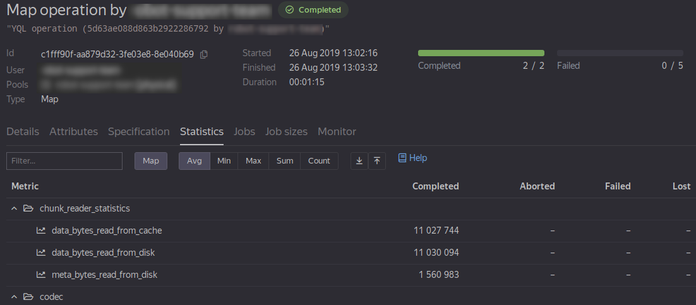

# Статистики джобов 

В данном разделе содержится перечень и описание статистик, собираемых системой {{product-name}} с операций и отдельных джобов. Приводятся примеры диагностики проблем на основе собираемых статистик.

## Обзор

В процессе выполнения операций {{product-name}} собирает из джобов различные системные и пользовательские статистики.

Статистики отдельных джобов попадают в лог планировщика, агрегированные статистики по операции доступны в веб-интерфейсе во вкладке **Statistics** на странице операции. На рисунке приведён пример страницы со статистиками джобов операции:





Для более полного понимания статистик джобов необходимо знать понятия `job proxy`, `sandbox`, иметь представление о том, как система {{product-name}} доставляет пользовательские файлы в джобы. Об этом можно узнать в разделе Джобы.



## Описание статистик

### Системные статистики { #system_stats }

| Статистика | Описание |
| --- | --- |
| `time/total` | Время выполнения джоба с момента его создания планировщиком до получения планировщиком информации о завершении джоба (успешном или неуспешном). В миллисекундах. |
| `time/prepare` | Время подготовки джоба до запуска `job proxy` (загрузка файлов в чанк-кеш при необходимости, создание `sandbox`-директории, создание и копирование файлов в `tmpfs`, подготовка необходимых `cgroups`). В миллисекундах. |
| `time/artifact_download` | Время загрузки файлов в чанк-кеш (при необходимости). Является частью `time/prepare`. В миллисекундах.|
| `time/prepare_root_fs` | Время подготовки файловой системы в porto контейнере (при необходимости). Является частью `time/prepare`. В миллисекундах. |
| `time/gpu_check` | Время выполнения утилиты предварительной проверки работоспособности GPU на ноде (релевантно для части GPU-операций). Является частью `time/prepare`. В миллисекундах. |
| `time/exec` | Время выполнения джоба, от старта до завершения процесса `job proxy`. В миллисекундах. |
| `data/input/chunk_count` | Суммарное число дата слайсов, прочитанных джобом. Дата слайс — это непрерывный сегмент одного чанка (в случае статических таблиц), либо непрерывный диапазон строк между двумя ключами (в случае динамических таблиц). В штуках. |
| `data/input/row_count` | Суммарное число табличных строк, прочитанных джобом. В штуках. |
| `data/input/compressed_data_size` | Суммарный сжатый объем блоков, прочитанных джобом (табличные данные, подаваемые на вход операции). В байтах. |
| `data/input/uncompressed_data_size` | Суммарный расжатый объем блоков, прочитанных джобом. В байтах. |
| `data/input/data_weight` | «Логический» объем несжатых данных, прочитанных джобом. Зависит только от значений в ячейках таблицы и количества строк. Не зависит от наличия на таблице схемы и значений `optimize_for`, `compression_codec`, `erasure_codec`. Вычисляется как `row_count + sum(data_weight(value))` по всем значениям в ячейках таблицы. В байтах. |
| `data/input/not_fully_consumed` | 1, если джоб прочитал не весь вход, иначе 0. |
|`data/output/K/chunk_count`| Число чанков, записанных в выходную таблицу с индексом K. В штуках. |
|`data/output/K/row_count`| Число строк, записанных в выходную таблицу с индексом К. В штуках. |
|`data/output/K/compressed_data_size` | Сжатый объем блоков, записанных в выходную таблицу К. В байтах. |
|`data/output/K/uncompressed_data_size`| Несжатый объем блоков, записанных в выходную таблицу К. В байтах. |
|`data/output/K/data_weight` | «Логический» объем несжатых данных, записанных в выходную таблицу К, зависит только от значений в ячейках таблицы и количества строк. Не зависит от наличия на таблице схемы и значений `optimize_for`, `compression_codec`, `erasure_codec`. Вычисляется как `row_count + sum(data_weight(value))` по всем значениям в ячейках таблицы. В байтах. |
|`data/output/K/regular_disk_space`| Заполняется только для таблиц с `erasure_codec == none` и равен `compressed_data_size` + размер метаданных чанков. В байтах. |
|`data/output/K/erasure_disk_space`| Заполняется только для таблиц с `erasure_codec != none`. Помимо `compressed_data_size` включает объем [parity](*parity) блоков. Подробнее про erasure-кодеки можно прочитать в [разделе](../../../user-guide/storage/replication.md). В байтах. |
|`job_proxy/cpu/user` | User mode CPU time процесса `job proxy`. Вычисляется на основе значения `cpu_usage` porto контейнера. В миллисекундах. |
|`job_proxy/cpu/system`| Kernel mode CPU time процесса `job proxy`. Вычисляется на основе значения `cpu_usage_system` porto контейнера. В миллисекундах. |
|`job_proxy/cpu/wait`| Wait CPU time процесса `job proxy`. Вычисляется на основе значения `cpu_wait` porto контейнера. В миллисекундах. |
|`job_proxy/cpu/throttled`| Throttled CPU time процесса `job proxy`. Вычисляется на основе значения `cpu_throttled` porto контейнера. В миллисекундах. |
|`job_proxy/block_io/bytes_written`| Число байтов, записанных процессом `job proxy` на локальное блочное устройство. Значение получается из секции `Write` из файла `blkio.io_serviced_bytes` соответствующей cgroup. Обычно небольшая величина, потому что `job proxy` пишет на локальный диск только логи. Запись чанков выполняется через (локальную и/или удаленные) ноды, и в данной статистике никак не учитывается. |
|`job_proxy/block_io/bytes_read`| Число байтов, прочитанных процессом `job proxy` с локального блочного устройства. Значение получается из секции `Read` из `blkio.io_serviced_bytes` соответствующей cgroup. В типичном случае стремится к нулю, потому что `job proxy` читает с локального диска только свою конфигурацию. |
|`job_proxy/block_io/io_read`| Число чтений с локального блочного устройства процессом `job proxy`. Значение получается из секции `Read` из `blkio.io_serviced` соответствующей cgroup. В штуках. |
|`job_proxy/block_io/io_write`| Число записей на локальное блочное устройство процессом `job proxy`. Значение получается из секции `Write` из `blkio.io_serviced` соответствующей cgroup. В штуках. |
|`job_proxy/block_io/io_total`| Общее число операций ввода/вывода с локальным блочным устройством процесса `job proxy`. В штуках. |
|`job_proxy/max_memory` | Максимальный объем оперативной памяти, занимаемый процессом `job proxy` в течение работы джоба. В байтах. |
|`job_proxy/memory_reserve` | Объем оперативной памяти, гарантированный `job proxy` в момент старта. Если фактическое потребление становится больше `memory_reserve`, то джоб может быть прерван с пометкой `resource_overdraft`. В байтах. |
|`job_proxy/traffic` | Объем данных, переданных по сети в/из `job proxy`. Как правило, соответствует объему входных/выходных данных джоба, если он лишь читает и пишет таблицы/файлы обычным для джоба образом и не генерирует самостоятельно другой трафик. Содержит поля вида `A_to_B`, где `A` и `B` — короткие имена дата-центров. Значение такого поля равно объему данных, переданных в этом направлении. В поле `duration_ms` можно найти продолжительность передачи данных. Обычно соответствует времени существования `job proxy`. Помимо этого подсчитывается входящий/исходящий трафик (поля `inbound` и `outbound`, соответственно) — также в разбивке по дата-центрам.|
|`exec_agent/traffic` | То же, что и `job_proxy/traffic`, но для exec-агента. Как правило, отражает трафик, сгенерированный при подготовке артефактов джоба.|
|`user_job/cpu/*` | Аналогично `job_proxy/cpu/*`, но для процессов пользовательского джоба.  |
|`user_job/block_io/bytes_read`, `user_job/block_io/bytes_written`, `user_job/block_io/io_read`, `user_job/block_io/io_write`, `user_job/block_io/io_total` | Block IO статистики для пользовательского джоба. Аналогично `job_proxy/block_io/*`. |
|`user_job/cumulative_memory_mb_sec` | Интеграл используемой памяти в МБ*сек. |
|`user_job/current_memory/major_page_faults` | Число [major page faults](https://en.wikipedia.org/wiki/Page_fault#Major), случившихся в пользовательском процессе. Значение 
получается из секции `pgmajfault` файла `memory.stat` из `memory` cgroup. Может помочь при изучении повышенного значения статистики `user_job/block_io/read`. В штуках. |
|`user_job/current_memory/rss` | Размер RSS на момент окончания джоба. Значение получается из секции `rss` файла `memory.stat` соответствующей cgroup. В байтах. |
|`user_job/current_memory/mapped_file` | Размер memory mapped files на момент окончания джоба. Значение получается из секции `mapped_file` файла `memory.stat` соответствующей cgroup. В байтах. |
|`user_job/tmpfs_size` | Текущий **занятый** объем `tmpfs` в процессе работы джоба. Вычисляется как разница между `total` и `free` размерами, полученными вызовом `statfs` на tmpfs mount point. В байтах. |
|`user_job/max_tmpfs_size` | Максимальный **занятый** объем `tmpfs` за все время работы джоба. В байтах. |
|`user_job/tmpfs_volumes/K/size`, `user_job/tmpfs_volumes/K/max_size` | То же самое, что `user_job/tmpfs_size` и `user_job/max_tmpfs_size`, только для каждого заказанного tmpfs volume по отдельности. |
|`user_job/disk/usage` | Занятое место на диске sandbox-ом джоба, вычисляется рекурсивным обходом sandbox-а и суммирование размера всех файлов. В байтах. |
|`user_job/disk/limit` | Заказанный лимит на размер sandbox-a джоба. В байтах. |
|`user_job/max_memory` | Максимальный объем оперативной памяти, занимаемый пользовательским джобом в процессе его работы, **без** учета `tmpfs`. В байтах. |
|`user_job/memory_limit` | Ограничение на объём памяти, указанное в спецификации операции при её запуске. Дублируется в статистике по техническим причинам. В байтах. |
|`user_job/memory_reserve` | Объем памяти, гарантированный пользовательскому джобу в момент запуска. Когда фактическое потребление становится больше (но меньше `memory_limit`), джоб может быть прерван с пометкой `resource_overdraft`, если на узле кластера недостаточно памяти. Данную величину можно регулировать с помощью [опции](../../../user-guide/data-processing/operations/operations-options.md) `memory_reserve_factor` в спецификации операции. В байтах. |
|`user_job/pipes/input/bytes` | Число байт, переданных через stdin пользовательского процесса (то есть, объем входных данных, преобразованных в заданный входной формат, с учетом всех контрольных модификаторов, таких как: `table_index`, `row_index`, и так далее). |
|`user_job/pipes/input/idle_time` | Время, в течение которого процесс `job proxy` не передавал данные пользовательскому джобу в stdin, потому что читал данные. Например, на узле кластера с данными был загружен диск, данные были недоступны, либо использовался медленный на разжатие `compression_codec`. В миллисекундах. |
|`user_job/pipes/input/busy_time`| Время, в течение которого процесс `job proxy` записывал данные в stdin пользовательскому джобу. Значение может быть велико, если пользовательский код реализует вычислительно тяжелую обработку и не успевает читать данные. Кроме того, причина может быть в медленной работе операций записи, когда пользовательский код блокируется на записи и поэтому не вычитывает новые данные. В миллисекундах. |
|`user_job/pipes/output/K/bytes` | Число байт, записанных пользовательским процессом в дескриптор, соответствующий K-й выходной таблице. Про дескрипторы и их нумерацию в разделе. |
|`user_job/pipes/output/K/idle_time`| Время, в течение которого процесс `job proxy` не выполнял чтение из потока, соответствующего K-й выходной таблице, потому что записывал уже вычитанные оттуда данные. Например, медленно отвечал узел кластера на который идет запись, либо используется очень медленный алгоритм сжатия. В миллисекундах. |
|`user_job/pipes/output/K/busy_time`| Время, в течение которого процесс `job proxy` выполнял чтение из потока, соответствующего K-й выходной таблице. Если данное время велико, значит, пользовательский код долго ничего не писал в в поток. Например, потому что долго обсчитывал вход, либо вход был недоступен. В миллисекундах. |
|`user_job/gpu/cumulative_utilization_gpu` | Чистое время, в течение которого выполнялись GPU-вычисления. Суммируется по всем GPU, используемых джобом. В миллисекундах. |
|`user_job/gpu/cumulative_utilization_memory` | Чистое время, в течение которого выполнялись обращения к GPU-памяти. Суммируется по всем GPU, используемых джобом. В миллисекундах. |
|`user_job/gpu/cumulative_utilization_clocks_sm` | Интеграл по времени частоты карточки относительно максимальной частоты. Суммируется по всем GPU, используемых джобом. В миллисекундах * долю. |
|`user_job/gpu/cumulative_utilization_power` | Интеграл по времени эффективной мощности GPU-карт относительно максимальной мощности. Суммируется по всем GPU, используемых джобом. В миллисекундах * долю. |
|`user_job/gpu/cumulative_load` | Время, в течение которого загруженность GPU была отлична от нуля. Суммируется по всем GPU, используемых джобом. В миллисекундах. |
|`user_job/gpu/cumulative_memory` | Интеграл используемой памяти GPU. Суммируется по всем GPU, используемых джобом. В миллисекундах * байты. |
|`user_job/gpu/cumulative_power` | Интеграл используемой мощности GPU. Суммируется по всем GPU, используемых джобом. В миллисекундах * мощность. |
|`user_job/gpu/cumulative_clocks_sm` | Интеграл используемой частоты GPU. Суммируется по всем GPU, используемых джобом. В миллисекундах * частоту. |
|`user_job/gpu/max_memory_used` | Максимальный зарегистрированный расход памяти GPU. Суммируется по всем GPU, используемых джобом. В байтах. |
|`user_job/gpu/memory_total` | Общий доступный объем памяти GPU. Суммируется по всем GPU, используемых джобом. В байтах. |
|`codec/cpu/decode`| Время (wall-time), потраченное на расжатие данных. В миллисекундах. |
|`codec/cpu/encode`| Время (wall-time), потраченное на сжатие данных. В миллисекундах. |
|`job_proxy/memory_reserve_factor_x10000`, `user_job/memory_reserve_factor_x10000` | Внутренние параметры, используемые для анализа работы алгоритма вычисления `memory_reserve` |
|`job_proxy/aggregated_max_cpu_usage_x100`, `job_proxy/aggregated_smoothed_cpu_usage_x100`, `job_proxy/aggregated_preemptible_cpu_x100`, `job_proxy/aggregated_preempted_cpu_x100`, `job_proxy/preemptible_cpu_x100`, `job_proxy/smoothed_cpu_usage_x100`| Внутренние статистики Job CPU Monitor. |
|`chunk_reader_statistics/data_bytes_read_from_disk` | Объем данных, взятых с диска в процессе чтения чанков. В байтах. |
|`chunk_reader_statistics/data_bytes_transmitted` | Объем данных, переданных по сети в процессе чтения чанков. В байтах. |
|`chunk_reader_statistics/data_bytes_read_from_cache` | Объем данных, взятых из кеша в процессе чтения чанков. В байтах. |
|`chunk_reader_statistics/meta_bytes_read_from_disk` | Объем метаданных, взятых с диска в процессе чтения чанков. В байтах. |
|`chunk_reader_statistics/wait_time` | Время ожидания поступления данных в процессе чтения чанков. В миллисекундах. |
|`chunk_reader_statistics/read_time` | Время, в течение которого производилась активная стадия чтения чанков, например, парсинг строк из прочитанных блоков. В миллисекундах. |
|`chunk_reader_statistics/idle_time` | Время, в течение которого чтение чанков было приостановлено, так как обрабатывались уже прочитанные данные. В миллисекундах. |

### Python API

| Статистика | Описание |
| --- | --- |
| `custom/python_job_preparation_time` | Время с момента входа в main программы до момента начала обработки входных строк. |

## Примеры диагностики

### Медленные джобы

Наиболее частый случай использования статистик связан с диагностикой медленных джобов.



Статистики джобов стоит использовать наряду с другими средствами диагностики, предоставляемыми системой {{product-name}}.



#### Медленный пользовательский код

Простой случай: если `user_job/cpu/user ~= time/exec`, это означает, что причина медленной работы джоба в пользовательском коде. Следует подключиться к джобу с помощью [job shell](../../../user-guide/problems/jobshell-and-slowjobs.md) и искать узкое место с помощью perf и gdb.

#### Многопоточность

Более сложный случай: пользователь проанализировал статистики и получил сумму занятого процессорного времени:
```
user_job/cpu/user + user_job/cpu/system+job_proxy/cpu/user+job_proxy/cpu/system = 303162 миллисекунд
time/exec = 309955 миллисекунд
```

Пользователь ожидает, что цифры должны совпасть.

Приведённое равенство не вполне корректное, так как `time/exec` — это wall-time, а `user_job/cpu/*` и `job_proxy/cpu/*` — время, проведенное в вычислении на CPU. При этом и `job proxy`, и (потенциально) пользовательский процесс могут занимать больше одного ядра в силу многопоточности, к тому же оба процесса выполняются параллельно.

В том случае, если пользовательский процесс однопоточный, должно быть примерно верно следующее:
```
time/exec ~= user_job/cpu/* + user_job/pipes/input/idle_time + max(user_job/pipes/output/N/idle_time)
```
В приведённый расчёт не входит время на «закрытие» выходных чанков: когда выходной поток уже закрыт, все данные через него прочитаны, но `job proxy` ещё совершает действия по финализации чанков.

#### Долгая компрессия

Если операция выполняется существенно дольше, чем время работы пользовательского кода, а при замере времени выполнения выяснилось, что основное время система {{product-name}} затрачивает на обработку `yield`, дело в том, что внутри `yield` python-wrapper записывает данные в выходной поток (output pipe). Если pipeline записи `job proxy` перегружен, процесс `job proxy` перестаёт вычитывать данные и `yield` блокируется. Статистика `user_job/pipes/output/N/idle_time` показала «потерянные» минуты. Возможны две причины, по которым процесс `job proxy` не вычитывал данные: много времени заняла обработка прочитанных данных на стороне `job proxy`, или запись на кластер. По статистике `job_proxy/cpu/user` стало ясно, что 70% общего времени работы джоба процесс `job proxy` нагружал CPU — это означает, что много времени заняла обработка входных данных. Самой тяжелой частью обработки в `job proxy` является компрессия, что в итоге и оказалось видно в профилировщике.



Общее правило при диагностике медленных джобов: при анализе времени работы необходимо найти доминирующие метрики, после этого искать причину проблемы в локализованном компоненте.



### Превышение гарантий по памяти

Операции превышают ограничения по памяти. Последовательность действий по разрешению данной проблемы:

1. При заказе tmpfs необходимо убедиться, что не заказывается лишний объём. Для этого следует посмотреть статистики `user_job/tmpfs_size`;

2. Ограничение `memory_limit` стоит выбирать, опираясь на статистику `user_job/max_memory`; если используется `tmpfs`, то требуемый объем `tmpfs` нужно добавлять к `user_job/max_memory`. При использовании автоматического заказа `tmpfs` в C++ и Python API, API сделает добавку автоматически;

3. Если большинство джобов потребляют немного памяти, но некоторые из джобов требуют существенно больше памяти, стоит выставить `memory_limit` по максимальному потреблению памяти джоба, но поставить `memory_reserve_factor` меньше (при этом стоит быть готовым к прерываниям работы джобов с пометкой `resource_overdraft`). Принять такое решение можно, сравнивая среднее и максимальное значение для статистики `user_job/max_memory` (в веб-интерфейсе для этого имеются соответствующие переключатели): если в среднее и максимальное потребление памяти в джобах различаются на десятки процентов или в разы, это значит, что есть джобы с аномально большим потреблением;

4. Обратная ситуация: если возникает слишком много прерываний джобов с пометкой `resource_overdraft`, следует увеличить `memory_reserve_factor`.

### Сообщение об `excessive io` в операциях { #excessive_io }

Следует изучить статистику `user_job/block_io/io_read`. Если джоб делает десятки тысяч чтений, такой джоб вредит и себе, и другим пользователям.
Стоит проверить счетчик `major page faults`. Большое значение говорит о возможном использовании memory mapping.



Использование **memory mapping** в джобах **категорически не рекомендуется**, а джобы, совершающие такие действия, сильно нагружают диски случайными чтениями и записями. Помните, что обычный жесткий диск способен совершить не более 100 операций со случайным доступом в секунду, в то время как на узле кластера одновременно работают несколько десятков джобов.



Среди решений данной проблемы: уменьшение размера исполняемого файла (например, путём удаления отладочных символов), заказ tmpfs для джоба и загрузка объёмных файлов в память при запуске джоба (опция `copy_files`). Подробнее о данных опциях в разделе [Настройки операций](../../../user-guide/data-processing/operations/operations-options.md).

## Дополнительно

{{product-name}} не может измерить время стадий внутри пользовательского процесса. Например, если пользовательский код на старте подгружает в память большой словарь, то время загрузки такого словаря на системных метриках увидеть не получится. В таком случае стоит использовать пользовательские статистики. 

Возможно использование пользовательских статистик для расчётов простых агрегатов даже в операции map. Количество пользовательских статистик ограничено 128-ю на один джоб.

Существует возможность строить различные графики по статистикам джобов (в частности, визуализация стадий работы операции) для упрощения диагностики. 

[*parity]: Дополнительные блоки, которые обеспечивают избыточность и позволяют восстановить исходный блок при выпадении любой части. Вычисляются через логическую операцию XOR.