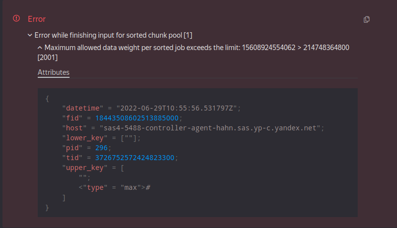

# Ошибки

## Exception in GetMeta(): "Access denied: ..."
Скорее всего поможет кнопка «Add my to token for {{product-name}}(default)»:

{ width="300"}

...или [инструкция по аутентификации](../interfaces/web.md#auth).

## Expected comparable type, but got: Yson
Такое может произойти, если таблица создана в {{product-name}} без схемы, а затем отсортирована. При этом система ({{product-name}}) в схеме таблицы устанавливает столбцу, по которому производилась сортировка, тип `any`, что в терминах YQL эквивалентно типу столбца `Yson` (произвольные YSON-данные).

Например, для запроса
``` yql
SELECT * FROM my_table
WHERE key = 'www.youtube.com/watch?v=Xn599R0ZBwg';
```
...можно сделать workaround:
``` yql
SELECT * FROM my_table
WHERE Yson::ConvertToString(Yson::Parse(key)) = 'www.youtube.com/watch?v=Xn599R0ZBwg';
```
**Недостаток этого решения:**
Запросы из примеров выводят все строки, которые соответствуют какому-то ключу. Если таблица по этому ключу отсортирована, то обычно время работы такого запроса не зависит от объема таблицы. Но для обсуждаемого здесь workaround такая оптимизация не сработает и придется прочитать всю таблицу.



Для [корректно схематизированных](../misc/schema.md) таблиц такой проблемы нет, и если у вас есть такая возможность, — настройте схему или попросите это сделать ответственных за нужные вам таблицы.



Подробнее [про Yson UDF](../udf/list/yson.md).

## Cannot add type String (String?) and String (String?)
Ошибка возникает при попытке конкатенации строк с помощью оператора '+'.
Вместо него следует использовать оператор '||':
``` yql
SELECT "Hello, " || "world" || "!";
```

## Expression has to be an aggregation function or key column, because aggregation is used elsewhere in this subquery
Наиболее частой причиной возникновения проблемы является использование алиасов из `SELECT` в конструкции `HAVING`. Алиасы — названия полей, которые следуют за `AS` в `SELECT`, они являются проекцией и выполняются уже после `HAVING`, поэтому там их использовать невозможно.

Пример некорректного запроса (так работать **НЕ** будет):
``` yql
USE hahn;
SELECT
    region,
    COUNT(age) AS counter
FROM `home/yql/tutorial/users`
GROUP BY region
HAVING counter > 3
```

Для того чтобы избежать дублирование вызова агрегатных функций, рекомендуется использование подзапроса с переносом логики из `HAVING` в `WHERE`:

``` yql
USE hahn;
SELECT *
FROM
    (SELECT
        region,
        COUNT(age) AS counter
    FROM `home/yql/tutorial/users`
    GROUP BY region)
WHERE counter > 3
```

## Value type "double" is not a number
Вероятной причиной появления ошибки, как правило, является деление на ноль, что приводит к значению NaN (Not a number), которое пока не поддерживается в ряде случаев {{product-name}}.

## Row weight is too large
Причиной ошибки является превышение максимального размера памяти, выделяемого для строки. Для изменения этого ограничения стоит использовать соответствующую настройку ([PRAGMA](../syntax/pragma.md#yt)), которая позволяет увеличить ограничение на максимальную длину строки таблицы в {{product-name}}.
Значение по умолчанию — "16M", максимальное значение — "128M". В случае превышения максимального значения необходимо менять логику вычислений, например, разделить таблицу на несколько частей или применить алгоритмы сжатия ([Compress UDF](../udf/list/compress_decompress.md)).
``` yql
PRAGMA yt.MaxRowWeight = "32M";
```

## Key weight is too large
Возникает при слишком большом размере значения в ключевом поле таблицы. Одним из способов решения проблемы является использование настройки ([PRAGMA](../syntax/pragma.md#yt)), которая позволяет увеличить ограничение на максимальную длину ключевых полей таблицы в {{product-name}}, где поле используется для `ORDER BY`, `GROUP BY`, `PARTITION BY`, `DISTINCT`, `REDUCE`
Значение по умолчанию — "16K", максимальное значение — "256K".
``` yql
PRAGMA yt.MaxKeyWeight = "32K";
```


Использование настройки разрешается только после согласования с yt-admin@



## Таблица содержит разнотипные значения в одной колонке {#badtabledata}

При обработке таких таблиц могут возникать разные ошибки, в зависимости от настроек запроса:
* ``` ReadYsonValue(): requirement cmd == Int64Marker failed, message: Expected char: "\2", but read: "\1"```
* ``` { 'Table input pipe failed' { 'Unexpected type of "score" column, expected: "int64" found "uint64"' } }```

Чтобы прочитать или обработать такую таблицу, нужно пропатчить тип колонки на `Yson?` через [WITH COLUMNS](../syntax/select.md#with) и дальше вручную разобрать данные с использованием [Yson UDF](../udf/list/yson.md):
``` yql
SELECT Yson::ConvertToDouble(bad_column, Yson::Options(false as Strict)) ?? CAST(Yson::ConvertToString(bad_column, Yson::Options(false as Strict)) as Double) as bad_column
FROM `path/to/bad_table`
WITH COLUMNS Struct<bad_column: Yson?>;
```

Если типы допускают автоконвертирование, то можно так:
``` yql
SELECT Yson::ConvertToDouble(bad_column, Yson::Options(true as AutoConvert)) as bad_column
FROM `path/to/bad_table`
WITH COLUMNS Struct<bad_column: Yson?>;
```

## Access denied for user <>: "read" permission for node <> is not allowed by any matching ACE {#symlinkaccess}

### Запрос прав в {{product-name}}

Нужно проверить, открывается ли таблица в интерфейсе {{product-name}}.

Если прав нет, их нужно запросить.

### Права на Symlink таблицы

Если в {{product-name}} интерфейсе таблица открывается, но YQL ее не видит, то проблема может быть в symlink-ах на таблицы, когда у пользователя есть права доступа на нижележащую таблицу, но нет доступа на чтение самого symlink. Для резолвинга нижележащей таблицы в {{product-name}} не требуются права на чтение symlink, поэтому в {{product-name}} содержимое отображается нормально. Но YQL помимо резолвига еще читает атрибуты symlink-а, потому что в атрибутах может переопределяться, например, схема таблицы. Для решения данной проблемы необходимо запросить права на чтение symlink.



## У внешнего сотрудника не открывается интерфейс YQL / не запускаются запросы {#outstaff}

смотрите [инструкцию](../quickstart.md#outstaff)

## Сохраненный запрос падает с ошибкой Client is missing credentials {#query_missing_creds}

Когда сохраненный запрос запускается Реактором на исполнение, то он пытается использовать токен `default_yt` из профиля владельца запроса. Если токен не найден, то запрос исполняется с credentials робота Реактора. Запрос в последнем случае падает с ошибкой `Client is missing credentials` при попытке обратиться к {{product-name}} кластеру. Что бы исправить ошибку, владелец запроса должен добавить токен `default_yt` к себе в [профиль](https://cluster-name.yql/docs/yt/interfaces/web#auth). В качестве {{product-name}} токена можно использовать свой YQL токен.

## Maximum allowed data weight per sorted job exceeds the limit {#key_monster}

В большинстве случаев ошибка возникает при исполнении `JOIN`, если в его входах есть ключ-монстр (очень много записей с одним и тем же значением ключа). Диагностировать наличие ключа-монстра можно перейдя на соответствующую операцию {{product-name}}, кликнув на красный кружок в плане исполнения запроса. Далее в интерфейсе {{product-name}} необходимо открыть вкладку `Partition sizes` упавшей операции:


Если есть крупные партиции (больше 200Gb), то это сигнализирует о наличии ключей-монстров. Само значение проблемного ключа, как правило, можно узнать раскрыв сообщение об ошибке на вкладке `Details` операции:



В данном примере проблемный ключ это пустая строка. Другие способы узнать проблемные ключ описаны в разделе [Производительность](performance).

Основной способ решения данной проблемы - это фильтрация проблемных значений ключя на входах JOIN. Как правило, ключи-монстры содержат нерелевантные значения (NULL, пустая строка), которые безболезненно можно отфильтровать. Если значения ключей-монстров важны, то их можно обработать отдельно.

Помимо JOIN, такая ошибка может возникать еще в следующих случаях:
1. Очень большой объем данных в `GROUP BY`, `JOIN`. Решение: нужно попытаться уменьшить объем.
2. В [окно](../syntax/window) попала вся таблица целиком. Решение: пересмотреть условия партицирования оконной функции
3. Для каких-то значений ключа `GROUP BY` получилось слишком много данных. Диагнастика проблемного ключа здесь такая же, как и для `JOIN`. Решение: отфильтровать проблемный ключ, добавить дополнительные колонки в ключ группировки.

## Reading multiple times from the same source is not supported
DQ не может исполнить запрос, так как в построенном плане присутствует раздвоение входного потока данных на несколько. Корректно выполнять такое мы пока не умеем, подробнее смотрите YQL-13817

## Too large table(s) for evaluation pass: NNN > 1048576 {#eval_error}

смотрите описание [этапов исполнения запроса](../misc/exec_steps.md)
