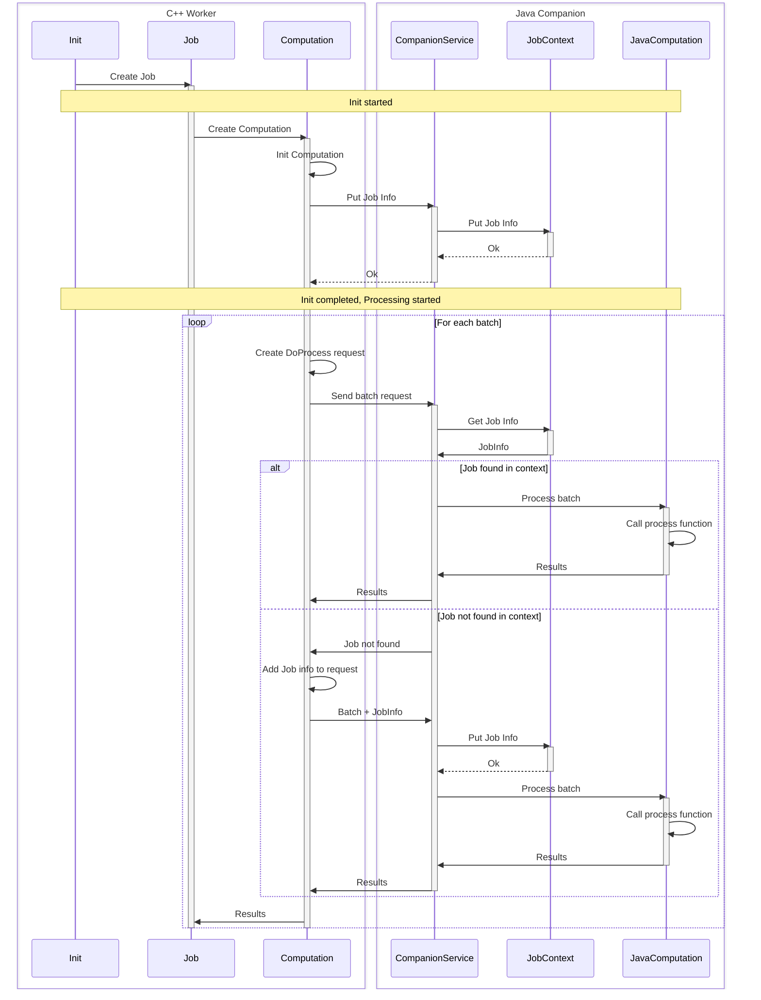

# Flow Server Module

This module contains the server-side components of the YT Flow Java SDK.

## Flow C++ server to Flow Java server communication

```mermaid
sequenceDiagram
    box C++ Worker
    participant Init
    participant Job
    participant Computation
    end
    box Java Companion
    participant CompanionService
    participant JobContext
    participant JavaComputation
    end

    Init ->> Job: Create Job
    activate Job

    Note over Init,JavaComputation: Init started
    Job ->> Computation: Create Computation
    activate Computation
    Computation ->> Computation: Init Computation
    Computation ->> CompanionService: Put Job Info
    activate CompanionService
    CompanionService ->> JobContext: Put Job Info
    activate JobContext
    JobContext -->> CompanionService: Ok
    deactivate JobContext
    CompanionService -->> Computation: Ok
    deactivate CompanionService

    Note over Init,JavaComputation: Init completed, Processing started
    
    loop For each batch

    Computation ->> Computation: Create DoProcess request
    Computation ->> CompanionService: Send batch request
    activate CompanionService

    CompanionService ->> JobContext: Get Job Info
    activate JobContext
    JobContext ->> CompanionService: JobInfo
    deactivate JobContext

    alt Job found in context
    CompanionService ->> JavaComputation: Process batch
    activate JavaComputation
    JavaComputation ->> JavaComputation: Call process function
    JavaComputation ->> CompanionService: Results
    deactivate JavaComputation
    CompanionService ->> Computation: Results
    
    else Job not found in context
    
    CompanionService ->> Computation: Job not found
    Computation ->> Computation: Add Job info to request
    Computation ->> CompanionService: Batch + JobInfo
    CompanionService ->> JobContext: Put Job Info
    activate JobContext
    JobContext -->> CompanionService: Ok
    deactivate JobContext
    CompanionService ->> JavaComputation: Process batch
    activate JavaComputation
    JavaComputation ->> JavaComputation: Call process function
    JavaComputation ->> CompanionService: Results
    deactivate JavaComputation
    CompanionService ->> Computation: Results
    deactivate CompanionService

    end

    Computation ->> Job: Results
    
    end
    
    deactivate Computation
    deactivate Job
```
