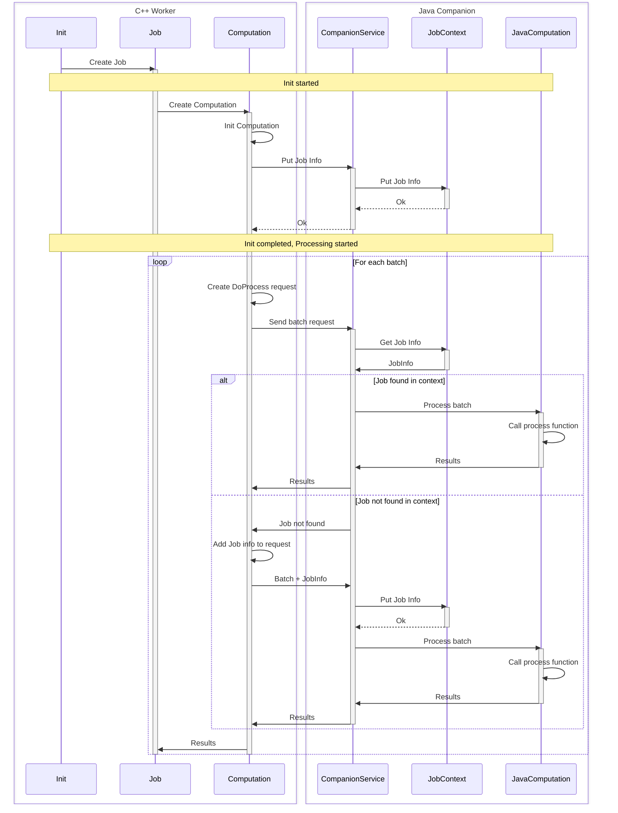

# Flow Server Module

This module contains the server-side components of the YT Flow Java SDK.

## Request and resource ownership

`GrpcCompanionServerStarter` assembles a `ResourceStore`, a `CompanionRequestProcessor`, and the
`CompanionService` gRPC adapter. The runtime owns the store and closes it after stopping gRPC.
The compatibility constructors still create a standalone processor/store when used directly.

The batch path is linear: resolve or recreate the job, acquire its exact resource references,
decode the request, run the computation, encode the response, and release the lease.
`ExecutionMeter` returns the callback result together with CPU time and allocations on the calling
thread. Work dispatched to other threads is not included.

### Three independent resource lifetimes

| Component | Owns |
|---|---|
| `ResourceProtocol` | Incarnation fencing and the last successfully applied specs, generation and dependency references; no user objects. |
| `ResourceSlot.ready` | One ready publication and its owning reference; null means unavailable to new batches. |
| `ResourceInstance` | The Java object, static parameters, dependency lease and reference count. |
| `ResourceLease` | The instances acquired by a batch or dependent resource; close is idempotent. |

The worker's init command is convergent. Repeated init is a no-op, newer incarnations fence older
commands before loading, and failed loads can be retried. Losing a physical instance does not erase
the static-spec history of its incarnation. A changed dependency reference rebuilds a dependent even
when its own configuration generation is unchanged. Unload retains an incarnation tombstone.

Jobs store exact references, not resolved objects. All references are validated at acquisition,
including transitive references without aliases; only aliased references are exposed to computations.
Dependency contexts additionally use the resource id as the fallback name for an unaliased dependency.

### Synchronization and cleanup

- Commands serialize per resource id. A command recursively re-entered on the same id is rejected.
- One short lifecycle monitor protects registry membership, ready publications, acquisition and
  closure. User load, reconfigure and unload hooks never run under that monitor.
- Acquisition validates and retains the entire reference set before releasing the monitor. It does
  not take command locks and does not run cleanup hooks on a missing-reference path.
- Reconfigure withdraws the publication and transfers ownership to the command. A successful command
  republishes only while the store is open; a failed or late command releases its instance instead.
- Shutdown closes admission and withdraws publications without waiting for command locks or leases.
  Final-owner unload hooks run synchronously and may block. Its boolean result reports quiescence,
  not a timeout guarantee, and includes already retired instances and admitted commands.
- A dependent releases its dependencies only after its own unload hook has run. Failed factories and
  partial loads release everything they acquired.

Reconfiguration is **in place**. Existing batches and dependent resources may still use the same
object while its reconfigure hook runs. Leases guarantee lifetime, not an immutable configuration
snapshot; resource implementations must synchronize their mutable state. Do not cache resource
objects in a computation across batches or use them after releasing the batch lease.

Expected resource failures remain in-band; missing resources in a batch retain the worker-healing
status. Unexpected RPC failures use one bounded error formatter. Cleanup attempts every action and
preserves failures as suppressed exceptions, prioritizing `VirtualMachineError`, then other `Error`
instances, then ordinary exceptions. A fatal JVM error is rethrown even if reporting it fails.

The computation test harness uses the same store and lifecycle but supplies a private factory map;
it never registers temporary resource factories in the caller's `PipelineContext`.

### Verification

Protocol decisions have table-driven tests; resource tests exercise ownership, retirement, shutdown
and blocked hooks independently of gRPC. Server tests verify transport statuses and runtime cleanup
order. The resource pipeline E2E lives under `yt/yt/flow/tests/companion/resource/java`.
`ResourceStoreBenchmark` in the Flow JMH module measures acquisition/release with 0, 1 and 8 shared
resource references; compare the same JVM options, caller thread counts and warmup settings.

## Flow C++ server to Flow Java server communication

