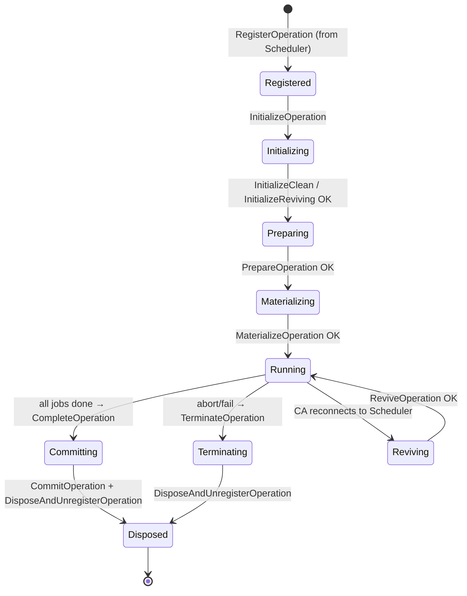
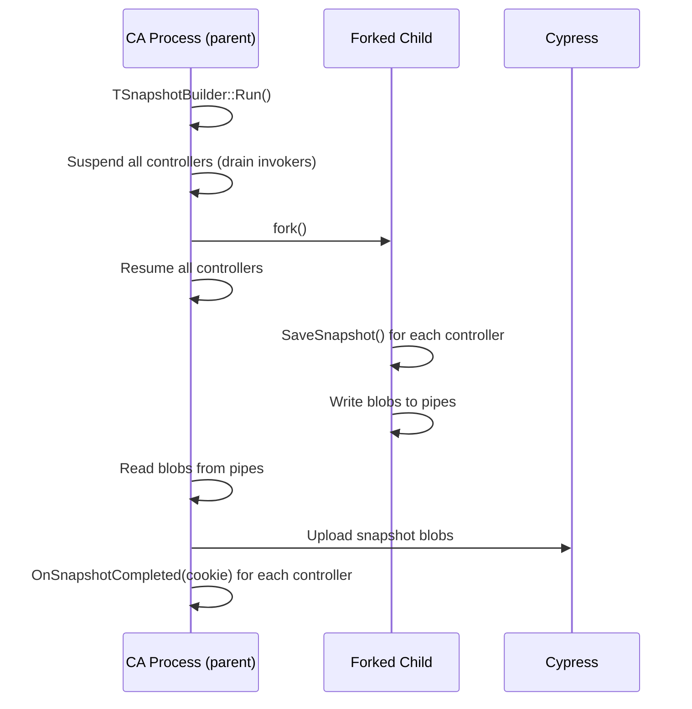

# Controller Agent — Architecture

## Purpose

The **Controller Agent** (CA) is a standalone YT daemon responsible for the *brain* of every
running operation (Map, Reduce, Sort, MapReduce, Merge, RemoteCopy, Vanilla, …).  It owns the
full lifecycle of an operation's controller: input reading, job scheduling decisions, job-spec
building, job-event processing, output committing, and snapshot persistence.

The CA is intentionally separated from the Scheduler so that a CA crash or restart does not
affect the Scheduler's ability to keep accepting new operations or to continue scheduling jobs
for operations whose controllers are hosted on other CA instances.

---

## Position in the System

```
┌──────────────────────────────────────────────────────────────────────────────┐
│                              YT Cluster                                      │
│                                                                              │
│  ┌──────────────┐   ControllerAgentTrackerService   ┌──────────────────────┐│
│  │  Scheduler   │◄─────────────────────────────────►│  Controller Agent    ││
│  │              │   (RegisterAgent / Heartbeat /     │  (TControllerAgent)  ││
│  │  schedules   │    ScheduleAllocation / …)         │                      ││
│  │  allocations │                                    │  hosts N operation   ││
│  └──────┬───────┘                                    │  controllers         ││
│         │ alloc events                               └──────────┬───────────┘│
│         ▼                                                       │            │
│  ┌──────────────┐   JobTrackerService (heartbeat/settle)        │            │
│  │  exec_node   │◄────────────────────────────────────────────►│            │
│  │  (per node)  │                                               │            │
│  └──────────────┘                                               │            │
│                                                                 │ Cypress    │
│  ┌──────────────┐                                               │ R/W        │
│  │    Master    │◄──────────────────────────────────────────────┘            │
│  │  (Cypress)   │  operation nodes, snapshots, chunk unstage, live preview   │
│  └──────────────┘                                                            │
└──────────────────────────────────────────────────────────────────────────────┘
```

Key communication channels:

| Channel | Direction | Protocol | Purpose |
|---------|-----------|----------|---------|
| `ControllerAgentTrackerService` | CA ↔ Scheduler | RPC heartbeat | Register CA, report operation state, receive allocation events |
| `JobTrackerService` | exec_node → CA | RPC | Node heartbeats with job events; `SettleJob` to fetch job spec |
| `ControllerAgentService` | Scheduler → CA | RPC | Operation lifecycle commands (Initialize/Prepare/Materialize/Revive/Commit/Terminate) |
| `JobProberService` | external → CA | RPC | Abandon/interrupt individual jobs by user request |
| Cypress (Master) | CA → Master | Native client | Read/write operation nodes, snapshots, chunk trees, live preview |

---

## Key Abstractions

### Component Map

```
TBootstrap
└── TControllerAgent  (singleton, owns everything)
    ├── TJobTracker           — node heartbeat processing & job state machine
    ├── TMasterConnector      — Cypress R/W (operation nodes, snapshots, chunk unstage)
    ├── TMemoryWatchdog       — periodic memory limit enforcement
    ├── TSnapshotBuilder      — fork-based snapshot serialization
    ├── TSnapshotDownloader   — snapshot download on revival
    ├── TChunkListPool        — pre-allocated output chunk lists
    ├── TZombieOperationOrchids — orchid for recently finished operations
    ├── TJobMonitoringIndexManager — per-operation job monitoring slot allocation
    └── TOperation[]          — one per registered operation
        ├── IOperationController  (polymorphic, created by CreateControllerForOperation)
        │   └── TOperationControllerBase  (in controllers/)
        │       ├── TTask[]       — one per logical stage (Map, PartitionMap, Sort, …)
        │       ├── TInputManager — input table reading & chunk pool feeding
        │       ├── TSpecManager  — operation spec parsing & validation
        │       ├── TAlertManager — operation alert accumulation
        │       ├── TAutoMergeDirector — auto-merge policy
        │       └── TDataFlowGraph — DAG of data flow vertices
        └── TOperationControllerHost  — bridges IOperationController ↔ TControllerAgent
```

### Operation Controller Interface Hierarchy

```
IOperationControllerSchedulerHost   IOperationControllerSnapshotBuilderHost
         │                                        │
         └──────────────┬─────────────────────────┘
                        │
               IOperationController
                        │
              TOperationControllerBase   (controllers/operation_controller_detail.h)
                        │
         ┌──────────────┼──────────────────────────┐
         │              │                           │
  TMapController  TSortController  TOrderedMergeController
  TReduceController  TMapReduceController  TVanillaController
  TRemoteCopyController  TUnorderedMergeController  …
```

`IOperationControllerSchedulerHost` — methods called by the Scheduler side:
`InitializeClean`, `InitializeReviving`, `Prepare`, `Materialize`, `Revive`, `Commit`,
`Terminate`, `Complete`, `ScheduleAllocation`, `OnAllocationAborted`, `OnAllocationFinished`.

`IOperationControllerSnapshotBuilderHost` — methods called by `TSnapshotBuilder`:
`OnSnapshotStarted`, `OnSnapshotCompleted`, `SaveSnapshot`, `Suspend`, `Resume`.

`IOperationController` — full interface used internally; adds `SettleJob`, `OnJobInfoReceivedFromNode`,
`AbortJobByJobTracker`, `GetNeededResources`, `GetGroupedNeededResources`, `GetAlerts`, etc.

---

## Operation Lifecycle



Each phase is driven by an RPC call from the Scheduler via `ControllerAgentService`.
The CA executes the corresponding `IOperationControllerSchedulerHost` method on the
controller's cancelable invoker and returns the result proto back to the Scheduler.

---

## Core Classes

### [`TControllerAgent`](controller_agent.h)

The central singleton.  Pimpl pattern (`TImpl`).  Owns:
- Thread pools: `ControllerThreadPool`, `ChunkScraperHeavyThreadPool`, `JobSpecBuildPool`,
  `StatisticsOffloadPool`, `ExecNodesUpdatePool`, `SnapshotIOPool`.
- `TJobTracker` — processes all node heartbeats.
- `TMasterConnector` — all Cypress interactions.
- `TMemoryWatchdog` — kills operations when CA memory exceeds limit.
- `TSnapshotBuilder` — periodic fork-based snapshot.
- The `TOperationIdToOperationMap` registry.
- Signals: `SchedulerConnecting`, `SchedulerConnected`, `SchedulerDisconnected`.

### [`TOperation`](operation.h)

Thin wrapper holding operation metadata (Id, Type, Spec, AuthenticatedUser, ACL, …) plus
references to `IOperationController` and `IOperationControllerHost`.

### [`TOperationControllerBase`](controllers/operation_controller_detail.h)

~1500-line base class implementing `IOperationController`.  Key responsibilities:
- Manages `TTask` list and `TDataFlowGraph`.
- Implements `ScheduleAllocation` → delegates to tasks via `TTask::ScheduleJob`.
- Implements `SettleJob` → returns pre-built `TJobStartInfo` (JobId + serialized spec blob).
- Processes job events: `OnJobInfoReceivedFromNode`, `OnAllocationAborted`, `OnAllocationFinished`.
- Manages Cypress transactions (`ETransactionType`: Async/Input/Output/Debug/OutputCompletion/DebugCompletion).
- Builds and caches progress YSON (`GetProgress`, `GetBriefProgress`).
- Implements snapshot serialization (`SaveSnapshot`, `LoadSnapshot`).
- Uses `IMPLEMENT_SAFE_METHOD` macro to wrap all virtual methods in assertion-failure guards
  (prevents a single controller crash from taking down the whole CA process).

### [`TTask`](controllers/task.h)

Represents one logical stage of an operation (e.g., `PartitionMap`, `SortedReduce`).
Owns a `IChunkPool` (input), output stream descriptors, and a `TJobSplitter`.
Key methods: `ScheduleJob`, `OnJobCompleted`, `OnJobFailed`, `OnJobAborted`,
`GetPendingJobCount`, `GetNeededResources`.

Implements `ICompetitiveJobManagerHost` to support speculative, probing, and experiment jobs
via `TSpeculativeJobManager`, `TProbingJobManager`, `TExperimentJobManager`.

### [`TJobTracker`](job_tracker.h)

Processes exec_node heartbeats on a dedicated `JobTrackerQueue` (single-threaded).
Maintains per-node `TNodeInfo` with `TNodeJobs` (allocation → job state map).
Key flows:
- `ProcessHeartbeat` — parses `TReqHeartbeat`, groups job summaries by operation,
  dispatches `OnJobInfoReceivedFromNode` to each controller's cancelable invoker.
- `SettleJob` — called by exec_node to fetch the job spec for a new job within an allocation;
  waits on a `TInBarrier`/`TOutBarrier` pair to ensure previous job events are processed first.
- Manages node registration/unregistration with heartbeat lease expiry.
- Throttles running-job events per operation when controller is overloaded.

### [`TMasterConnector`](master_connector.h)

Pimpl class.  Mediates all Cypress interactions:
- `FlushOperationNode` — write operation progress/attributes.
- `UpdateInitializedOperationNode` — write initial operation node.
- `AttachToLivePreview` — attach chunk trees to live preview tables.
- `DownloadSnapshot` / `RemoveSnapshot` — snapshot management.
- `AddChunkTreesToUnstageList` — background chunk unstaging.
- `UpdateConfig` — dynamic config reload from Cypress.
- Loads CA tags from Cypress on startup.

### [`TSnapshotBuilder`](snapshot_builder.h)

Inherits `TForkExecutor`.  Periodically forks the CA process:
- Parent: suspends all controllers, sets up pipes, waits for child.
- Child: calls `SaveSnapshot` on each controller, writes to pipe.
- Parent: reads from pipe, uploads blobs to Cypress via `TMasterConnector`.

This fork-based approach gives a consistent snapshot without stopping job scheduling.

### [`TMemoryWatchdog`](memory_watchdog.h)

Periodic executor that checks CA RSS.  When memory exceeds the configured limit,
calls `OnMemoryLimitExceeded` on the heaviest controller, which aborts the operation.

### [`TSchedulingContext`](scheduling_context.h) / [`TAllocationSchedulingContext`](scheduling_context.h)

Value objects passed to `IOperationController::ScheduleAllocation`.  Carry node descriptor,
resource limits, disk resources, and the `TScheduleAllocationSpec` proto.

---

## Scheduler Communication

The CA connects to the Scheduler via `ControllerAgentTrackerService` (implemented in the
Scheduler).  On connection:
1. CA sends `RegisterControllerAgent` with its address and incarnation ID.
2. Scheduler sends operation descriptors via `AssignOperations`.
3. CA sends periodic heartbeats carrying:
   - Operation progress updates (needed resources, pending job counts, alerts).
   - Allocation scheduling results (from `ScheduleAllocation` calls).
   - Running allocation statistics.
4. Scheduler sends allocation events (aborted/finished) back in heartbeat responses.

The `TIncarnationId` is a monotonically increasing GUID that changes on every CA reconnect.
All exec_node connections validate the incarnation ID to reject stale heartbeats.

---

## Node (exec_node) Communication

exec_nodes connect to the CA via `JobTrackerService` (RPC server in the CA):

```
exec_node                          Controller Agent (TJobTracker)
    │                                        │
    │── TReqHeartbeat ──────────────────────►│  ProcessHeartbeat()
    │   (running jobs, finished jobs,        │    group by operation
    │    allocation list, unconfirmed jobs)  │    dispatch to controllers
    │◄── TRspHeartbeat ─────────────────────│    (abort/interrupt/release cmds)
    │                                        │
    │── TReqSettleJob ────────────────────►│  SettleJob()
    │   (allocationId, lastJobId)           │    wait for barrier
    │◄── TRspSettleJob ──────────────────── │    call controller.SettleJob()
    │   (jobId, jobSpecBlob)                │    return spec blob
```

The `SettleJob` barrier (`TInBarrier`/`TOutBarrier`) ensures that if a previous job in the
same allocation just finished, its completion event is fully processed by the controller
before the next job spec is issued (see YT-25343).

---

## Job Spec Building

```
ScheduleAllocation (Scheduler → CA)
    └── TTask::ScheduleJob
        └── TTask::BuildJoblet  →  TJobletPtr (lightweight descriptor)
            └── enqueue to JobSpecBuildPool

JobSpecBuildPool thread:
    └── TOperationControllerBase::BuildJobSpecProto(joblet)
        └── serialize TJobSpec proto → TSharedRef blob
            └── store in joblet

SettleJob (exec_node → CA):
    └── TOperationController::SettleJob(allocationId, lastJobId)
        └── return TJobStartInfo { JobId, JobSpecBlob }
```

Job spec building is offloaded to a dedicated thread pool (`JobSpecBuildPool`) to avoid
blocking the controller's main invoker.  `ShouldSkipScheduleAllocationRequest()` returns
`true` when too many specs are already being built (backpressure).

---

## Snapshot Persistence



On revival, `TSnapshotDownloader` fetches the blob from Cypress and `LoadSnapshot` restores
the controller state.  The `TSnapshotCookie` tracks which snapshot index was last uploaded
so that intermediate chunk unstaging can be deferred until after the snapshot is safe.

---

## Operation Controller Types

| Controller Class | Operation Type | Key Characteristics |
|-----------------|----------------|---------------------|
| `TMapController` | Map | Single-stage, user job per input chunk stripe |
| `TReduceController` | Reduce / JoinReduce | Sorted input, reduce combiner support |
| `TMapReduceController` | MapReduce | Multi-stage: PartitionMap → Sort → Reduce |
| `TSortController` | Sort | Multi-stage: Partition → Sort → Merge |
| `TOrderedMergeController` | OrderedMerge | Merge preserving order |
| `TUnorderedMergeController` | UnorderedMerge | Merge without order guarantee |
| `TSortedMergeController` | SortedMerge | Merge with sorted key ranges |
| `TEraseController` | Erase | Filtered merge (erase rows matching predicate) |
| `TRemoteCopyController` | RemoteCopy | Cross-cluster chunk copy |
| `TVanillaController` | Vanilla | Arbitrary user tasks, no data flow |

All inherit `TOperationControllerBase`.  Each overrides `GetTasks()`, `BuildTasks()`,
`DoInitialize()`, `DoMaterialize()`, etc.

---

## Thread Model

| Thread / Pool | Affinity | Purpose |
|---------------|----------|---------|
| `ControlQueue` (single) | Control | Bootstrap, CA-level operations, Scheduler connection |
| `ControllerThreadPool` (N) | Controller invoker | Per-operation controller logic (cancelable) |
| `JobSpecBuildPool` (M) | JobSpecBuildPool invoker | Serialize job spec protos |
| `StatisticsOffloadPool` | Statistics invoker | Offload statistics aggregation |
| `ExecNodesUpdatePool` | ExecNodesUpdate invoker | Update exec node descriptor cache |
| `SnapshotIOPool` | SnapshotIO invoker | Snapshot upload/download I/O |
| `ChunkScraperHeavyThreadPool` | ChunkScraper invoker | Intermediate chunk scraping |
| `JobTrackerQueue` (single) | JobTracker invoker | All node heartbeat processing |
| `ConnectionThreadPool` | Connection invoker | Native client connection management |

**Thread affinity rules:**
- All `IOperationController` methods run on the controller's cancelable invoker (from `ControllerThreadPool`).
- `TJobTracker` methods run exclusively on `JobTrackerQueue` — no locks needed there.
- `TControllerAgent` public methods are safe to call from any thread (documented per-method).
- `IMPLEMENT_SAFE_METHOD` wraps controller methods to catch `TAssertionFailedException`
  and convert them to operation failures rather than process crashes.

---

## RPC Services

| Service | Implemented In | Callers | Key Methods |
|---------|---------------|---------|-------------|
| `ControllerAgentService` | `controller_agent_service.cpp` | Scheduler | `RegisterOperation`, `InitializeOperation`, `PrepareOperation`, `MaterializeOperation`, `ReviveOperation`, `CommitOperation`, `TerminateOperation`, `UpdateOperationRuntimeParameters`, `PatchSpec` |
| `JobTrackerService` | `job_tracker_service.cpp` | exec_nodes | `Heartbeat`, `SettleJob` |
| `JobProberService` | `job_prober_service.cpp` | Users / CLI | `AbandonJob`, `InterruptJob`, `GetJobShellDescriptor` |

---

## Dependencies

| Dependency | Purpose |
|-----------|---------|
| `yt/yt/server/lib/controller_agent` | Shared structs, persistence helpers, progress counter |
| `yt/yt/server/lib/chunk_pools` | `IChunkPool` implementations (unordered, sorted, ordered) |
| `yt/yt/server/lib/scheduler` | Exec node descriptors, job metrics, transaction structs |
| `yt/yt/ytlib/chunk_client` | Chunk scraper, chunk writer, fetcher |
| `yt/yt/ytlib/api/native` | Cypress client, transaction client |
| `yt/yt/ytlib/scheduler` | Job resources, scheduling tag filter |
| `yt/yt/server/lib/misc` | Job reporter, fork executor |
| `yt/yt/library/event_log` | Structured operation/job event logging |

---

## Invariants & Constraints

1. **Single JobTracker invoker**: All `TJobTracker` state is mutated only on `JobTrackerQueue`.
   Never call `TJobTracker` methods from controller invokers directly — use posted callbacks.

2. **Cancelable controller invoker**: Every controller has a `TCancelableContext`.  When the
   CA disconnects from the Scheduler, all cancelable invokers are cancelled, aborting in-flight
   controller work.  Non-cancelable invoker is used only for `Terminate`/`Dispose`.

3. **Safe methods**: All `IOperationController` interface methods that may call `YT_VERIFY`
   are wrapped with `IMPLEMENT_SAFE_METHOD`.  A failing assertion aborts the operation, not
   the process.

4. **Snapshot barrier**: `TSnapshotCookie` must be passed back to `OnSnapshotCompleted` in
   order.  Intermediate chunk unstaging is deferred until the snapshot containing those chunks
   is safely uploaded (mode `OnSnapshotCompleted`).

5. **SettleJob barrier**: A new job within an allocation must not be settled until all events
   from the previous job in that allocation have been dispatched to the controller.
   `TInBarrier`/`TOutBarrier` enforce this ordering.

6. **Memory limit**: `TMemoryWatchdog` enforces a hard RSS limit.  When exceeded, the heaviest
   operation is aborted.  Controllers must not cache unbounded data structures.

7. **Incarnation ID**: All exec_node connections carry the CA's `TIncarnationId`.  Stale
   heartbeats (wrong incarnation) are rejected by `TJobTracker`.

---

## Anti-patterns (Do NOT)

- **Do not** call `TJobTracker` methods from a controller invoker thread — always post to
  `JobTrackerQueue` via `TJobTrackerOperationHandler`.
- **Do not** hold locks across `TTask::ScheduleJob` — it may call back into the controller.
- **Do not** store raw `TOperation*` pointers outside the control thread — use `TOperationPtr`
  (ref-counted) or `TWeakPtr<IOperationController>`.
- **Do not** perform blocking Cypress I/O on the controller invoker — use async futures and
  the connection invoker.
- **Do not** add new `YT_VERIFY` calls in controller code without wrapping the method with
  `IMPLEMENT_SAFE_METHOD` — unguarded assertions crash the entire CA process.
- **Do not** skip the `TSnapshotCookie` round-trip — omitting `OnSnapshotCompleted` will
  prevent intermediate chunk unstaging and leak disk space.

---

## Extension Points

- **New operation type**: Add a new `TXxxController` inheriting `TOperationControllerBase`,
  implement `GetTasks()` / `BuildTasks()` / `DoMaterialize()`, register in
  `CreateControllerForOperation` factory (`operation_controller.cpp`).
- **New task type**: Subclass `TTask`, override `ScheduleJob`, `BuildJobSpec`,
  `OnJobCompleted`; register output/input stream descriptors.
- **New job manager**: Implement `ICompetitiveJobManagerHost` and plug into `TTask`'s
  `JobCollectiveManager` (see `TJobCollectiveManager`).
- **Dynamic config**: Add fields to `TControllerAgentConfig`; they are hot-reloaded via
  `TMasterConnector::UpdateConfig` → `TControllerAgent::UpdateConfig` → per-controller
  `UpdateConfig`.
