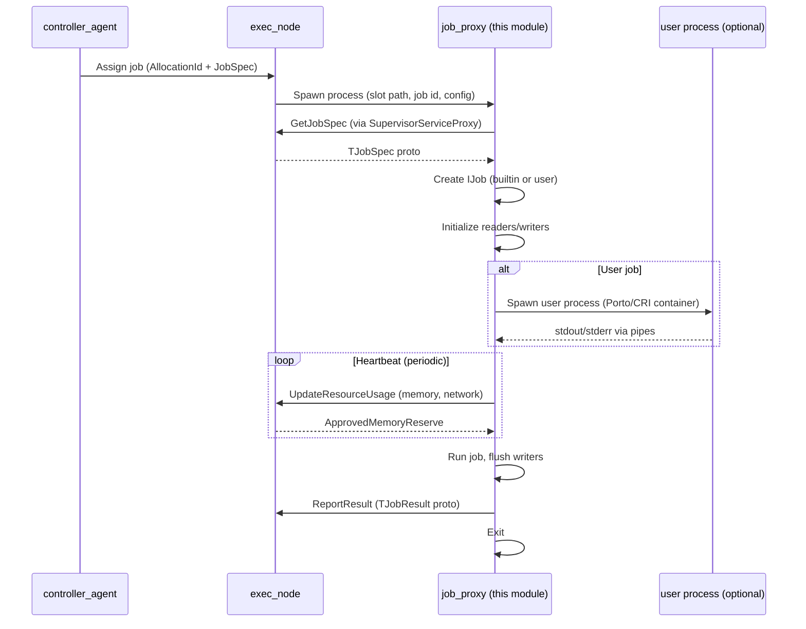
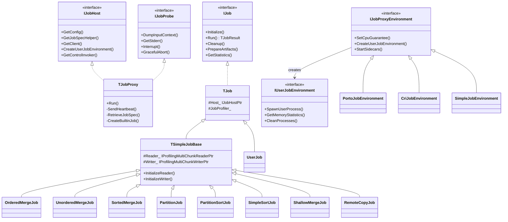
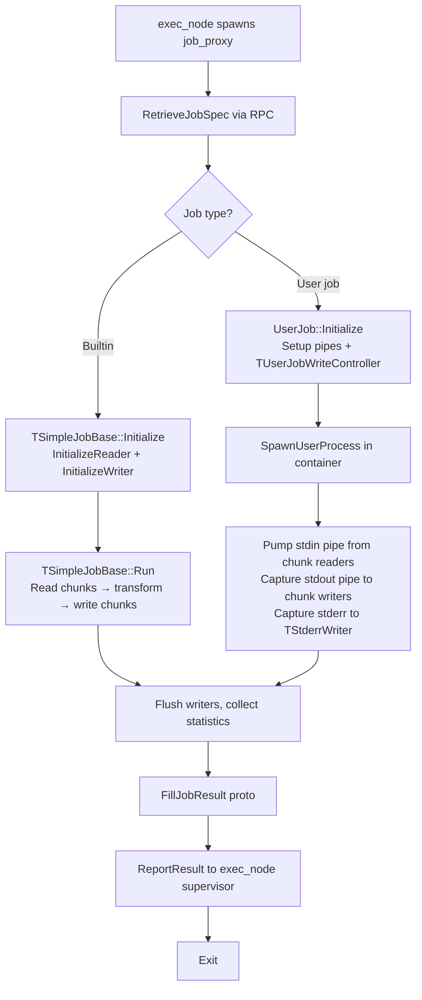

# Job Proxy

## Purpose

Job Proxy (`yt/yt/server/job_proxy/`) is a **short-lived per-job process** spawned by exec_node for each individual job execution. It acts as the execution engine and resource guardian for a single job: it retrieves the job spec from exec_node, sets up I/O pipelines (chunk readers/writers), manages the user process lifecycle (for user jobs), enforces resource limits, and reports the result back to exec_node upon completion.

The key reason job_proxy exists as a **separate process** (rather than running inside exec_node) is isolation: a crashing or OOM-killed job_proxy does not affect exec_node or other jobs on the same node. It also simplifies resource accounting — the OS process boundary provides a natural unit for memory, CPU, and I/O tracking.

## Position in the System



See also: [`../node/ARCHITECTURE.md`](../node/ARCHITECTURE.md), [`../controller_agent/ARCHITECTURE.md`](../controller_agent/ARCHITECTURE.md).

## Key Abstractions

### Class Hierarchy



### Core Classes

**[`TJobProxy`](job_proxy.h)** — the central orchestrator. Implements both `IJobHost` (provides services to the running `IJob`) and `IJobProbe` (exposes external control surface). Owns the job lifecycle: spec retrieval → job creation → run → result reporting. Manages two thread pools: `JobThread_` for job execution and `ControlThread_` for heartbeats and external RPC.

**[`IJobHost`](job.h)** — interface through which `IJob` implementations access proxy services: native YT client, chunk reader/writer infrastructure, throttlers, environment factory, and path utilities. `TJobProxy` is the sole implementation.

**[`IJob`](job.h)** — interface for all job types. Key methods: `Initialize()` (set up readers/writers), `Run()` (execute and return `TJobResult`), `Cleanup()` (best-effort teardown on abnormal exit), `PrepareArtifacts()`, `GetStatistics()`.

**[`TJob`](job_detail.h)** — base class providing common infrastructure: profiler, chunk read options, stderr/fail-context access, core info collection.

**[`TSimpleJobBase`](job_detail.h)** — extends `TJob` for all builtin data-processing jobs. Owns a `IProfilingMultiChunkReader` and `IProfilingMultiChunkWriter`; subclasses implement `InitializeReader()` and `InitializeWriter()` to configure the specific read/write strategy.

**[`IJobProxyEnvironment`](environment.h)** — abstracts the container backend (Porto, CRI, Simple/cgroup-only). Manages CPU limits, creates `IUserJobEnvironment` for the user process container, and starts/stops sidecars.

**[`IUserJobEnvironment`](environment.h)** — per-user-process environment handle. Spawns the user process, provides memory/CPU/network statistics, manages process cleanup.

## Job Types

| Class | Factory | Operation types served |
|---|---|---|
| `OrderedMergeJob` | `CreateOrderedMergeJob` | Ordered merge |
| `UnorderedMergeJob` | `CreateUnorderedMergeJob` | Unordered merge |
| `SortedMergeJob` | `CreateSortedMergeJob` | Sorted merge |
| `PartitionJob` | `CreatePartitionJob` | Partition phase of sort/MapReduce |
| `PartitionSortJob` | `CreatePartitionSortJob` | Combined partition+sort |
| `SimpleSortJob` | `CreateSimpleSortJob` | Simple (single-partition) sort |
| `ShallowMergeJob` | `CreateShallowMergeJob` | Metadata-only merge (no data rewrite) |
| `RemoteCopyJob` | `CreateRemoteCopyJob` | Cross-cluster chunk copy |
| `UserJob` | `CreateUserJob` | Map, Reduce, MapReduce, Vanilla, and all user-code operations |

`TJobProxy::CreateBuiltinJob()` dispatches on `EJobType` from the job spec to instantiate the correct factory. User jobs are identified by the presence of a `TUserJobSpec` extension in the job spec.

## Data Flow



For builtin jobs, data flows entirely within job_proxy: chunk data is read from the cluster via `IMultiChunkReader`, processed in-process, and written back via `IMultiChunkWriter`.

For user jobs, job_proxy acts as a **pipe bridge**: it reads input chunks and pumps them into the user process's stdin; it reads the user process's stdout and writes it to output chunks. `TUserJobWriteController` manages the output-side writers and value consumers.

## Environment & Isolation

Job proxy supports four environment backends, selected via `EJobEnvironmentType` in config:

- **Porto** (`TPortoJobEnvironment`) — full container isolation using Porto. Supports rootfs layers, GPU access, network namespaces, PID namespaces, and resource limits enforced by the kernel. The primary production backend.
- **CRI** (`TCriJobEnvironment`) — container runtime interface backend (e.g., containerd). Similar capabilities to Porto but via a different API. Note: currently job_proxy and user job share the same cgroup in CRI mode, making their statistics indistinguishable (tracked as a known limitation in `environment.h`).
- **Simple** (`TSimpleJobEnvironment`) — cgroup-based isolation without full container support. Used in environments where Porto/CRI is unavailable.
- **Testing** (`TTestingJobEnvironment`) — no isolation, for unit tests.

**Sidecars** (`TSidecarEnvironmentBase`) are auxiliary processes that run alongside the user job (e.g., GPU monitoring daemons). They are started by `IJobProxyEnvironment::StartSidecars()` and shut down after job completion. A fatal sidecar failure triggers job failure via `failedSidecarCallback`.

## Resource Management

All resource subsystems report to `TJobProxy` and communicate with exec_node via the supervisor RPC channel:

- **Memory** (`TMemoryTracker`): polls `IUserJobEnvironment::GetMemoryStatistics()` and `/proc` for per-process RSS. Tracks peak and cumulative (MB·sec) usage. `TJobProxy::CheckMemoryUsage()` runs periodically; if job_proxy's own memory exceeds `JobProxyMemoryOvercommitLimit_`, it calls `Abort(ResourceOverdraft)`.
- **Tmpfs** (`TTmpfsManager`): tracks usage across all tmpfs volumes mounted in the job slot. Distinguishes tmpfs device IDs to exclude them from RSS accounting.
- **CPU** (`TCpuMonitor`): periodically samples CPU usage, applies exponential smoothing, accumulates votes (Increase/Decrease/Keep), and calls `TJobProxy::TrySetCpuGuarantee()` to adjust the container's CPU limit dynamically. Prevents CPU overcommit while allowing bursting.
- **Network throttlers** (`job_throttler.h`): `InBandwidth`, `OutBandwidth`, `OutRps`, and `ContainerCreation` throttlers. Each throttler proxies `Throttle()` calls to exec_node via RPC, so the node can coordinate total bandwidth across all jobs.

## RPC Services

Job proxy exposes several RPC services on Unix domain sockets (private) and optionally a TCP port (public):

| Service | File | Clients | Purpose |
|---|---|---|---|
| `JobApiService` | [`job_api_service.h`](job_api_service.h) | User job process, external tools | YT API access from within the job (table reads/writes, etc.) |
| `JobProberService` | [`job_prober_service.h`](job_prober_service.h) | exec_node, operators | External probing: dump input context, get stderr, poll job shell |
| `UserJobSynchronizerService` | [`user_job_synchronizer_service.h`](user_job_synchronizer_service.h) | `yt_executor` (exec helper) | Synchronization: executor signals when user process is prepared (PID handoff) |
| `OrchidService` | (via `TJobProxy::InitializeOrchid`) | Monitoring | Structured introspection of job state |
| `ShuffleService` (optional) | `server/lib/shuffle_server` | User job | In-job shuffle for MapReduce operations |

The private RPC server listens on a Unix domain socket (`GetJobProxyUnixDomainSocketPath()`). The public RPC server listens on a TCP port and exposes only the `JobProberService`.

## Heartbeat & Lifecycle

```mermaid
stateDiagram-v2
    [*] --> Spawned: exec_node forks job_proxy
    Spawned --> SpecRetrieved: GetJobSpec RPC
    SpecRetrieved --> Prepared: OnSpawned() + OnArtifactsPrepared()
    Prepared --> Running: IJob::Run()
    Running --> Running: Heartbeat every N seconds\n(UpdateResourceUsage → exec_node)
    Running --> Completed: IJob::Run() returns TJobResult
    Running --> Aborted: Memory overdraft / supervisor error
    Completed --> ResultReported: ReportResult RPC to exec_node
    Aborted --> [*]: Exit with EJobProxyExitCode
    ResultReported --> [*]: Exit 0
```

`TJobProxy::SendHeartbeat()` runs on `ControlThread_` via `HeartbeatExecutor_`. Each heartbeat sends current memory usage to exec_node and receives back `ApprovedMemoryReserve_`. If the supervisor channel fails, job_proxy exits with `SupervisorCommunicationFailed`.

`OnSpawned()` and `OnArtifactsPrepared()` are callbacks from exec_node (via `SupervisorServiceProxy`) that gate job execution: job_proxy waits for artifact preparation before starting the job.

## Observability

- **Stderr** (`TStderrWriter`): captures user process stderr as a ring buffer (configurable head + tail). Uploaded to YT as a chunk on job completion. `TAsanWarningFilter` strips ASAN noise before capture.
- **Profiling** (`IJobProfiler`): CPU/memory profiling of the job process. Supports user-job profiler spec from the job spec. Profiles are returned as `TJobProfile` blobs in the job result.
- **Tracing** (`TJobTraceEventProcessor`, `TTraceConsumer`): collects trace events from the job and forwards them to Jaeger. Root span is created in `TJobProxy::DoRun()`.
- **Core dumps** (`TCoreWatcher`): watches a directory for core dump pipes (Linux cores + GPU cores via `TGpuCoreReader`). Uploads cores to a YT blob table. Finalized after job completion with an optional timeout.
- **Orchid**: `TJobProxy::CreateOrchidService()` exposes structured job state (statistics, memory, progress) via the Orchid protocol for real-time monitoring.
- **Solomon metrics**: `TSolomonExporter` is initialized in `TJobProxy` and exports Prometheus-compatible metrics.

## Dependencies

- **Depends on:**
  - `yt/yt/server/lib/job_proxy/` — configs (`TJobProxyInternalConfig`), `IJobProbe` interface, shared enums (`EJobEnvironmentType`, `EJobProxyExitCode`)
  - `yt/yt/server/lib/exec_node/` — `TSupervisorServiceProxy` (RPC to exec_node), `TRefCountedChunkSpec`
  - `yt/yt/ytlib/job_proxy/` — `IJobSpecHelper`, `IProfilingMultiChunkReader/Writer`
  - `yt/yt/ytlib/chunk_client/` — chunk reading/writing infrastructure
  - `yt/yt/ytlib/table_client/` — schemaless readers/writers, value consumers
  - `yt/yt/ytlib/api/native/` — native YT client for API access
  - `yt/yt/library/containers/` — Porto resource tracker, process management
  - `yt/yt/ytlib/controller_agent/proto/` — `TJobSpec`, `TJobResult` protobuf definitions

- **Depended upon by:**
  - `yt/yt/server/node/exec_node/` — spawns job_proxy processes and communicates via supervisor RPC
  - Nothing else at compile time (job_proxy is a standalone binary)

## Invariants & Constraints

1. **One job per process**: `TJobProxy` holds exactly one `IJob` at a time (`Job_` atomic ptr). Never attempt to run multiple jobs in one job_proxy instance.
2. **Thread affinity**: Job execution runs on `JobThread_`; heartbeats and external RPC run on `ControlThread_`. Do not call job methods from `ControlThread_` without going through `GetControlInvoker()`.
3. **Memory limit enforcement**: `JobProxyMemoryOvercommitLimit_` is a hard cap. Exceeding it causes immediate `Abort(ResourceOverdraft)`. Do not allocate large buffers without accounting for them.
4. **Supervisor channel is critical**: Loss of the supervisor channel (exec_node) is fatal. Job proxy must exit — it cannot operate without the ability to report results.
5. **Cleanup must be best-effort**: `IJob::Cleanup()` is called during abnormal termination. It must not throw and must not block indefinitely.
6. **Exit codes are meaningful**: `EJobProxyExitCode` values are parsed by exec_node to determine failure reason. Use the correct exit code; do not call `exit()` directly.

## Anti-patterns (Do NOT)

- **Do NOT** add state to `TJobProxy` that persists across job runs — the process is single-use.
- **Do NOT** call `IUserJobEnvironment` methods after `CleanProcesses()` — the container may no longer exist.
- **Do NOT** read from `Job_` without using `FindJob()`/`GetJobOrThrow()` — the atomic ptr requires proper load semantics.
- **Do NOT** perform blocking I/O on `ControlThread_` — it handles heartbeats and must remain responsive.
- **Do NOT** add new environment-specific logic directly to `TJobProxy` — extend `IJobProxyEnvironment` instead.
- **Do NOT** bypass throttlers for chunk I/O — all network traffic must go through the throttler chain to avoid starving other jobs on the node.

## Extension Points

**Adding a new builtin job type:**
1. Create `my_job.h/cpp` implementing a class that inherits `TSimpleJobBase` (or `TJob` for non-standard I/O).
2. Implement `InitializeReader()`, `InitializeWriter()`, and override `Run()` if needed.
3. Add a factory function `IJobPtr CreateMyJob(IJobHostPtr host)`.
4. Register the new `EJobType` case in `TJobProxy::CreateBuiltinJob()` in [`job_proxy.cpp`](job_proxy.cpp).
5. Add to `ya.make`.

**Adding a new environment backend:**
1. Create a class implementing `IJobProxyEnvironment` (and `IUserJobEnvironment` for the per-job container).
2. Add a new `EJobEnvironmentType` value in [`yt/yt/server/lib/job_proxy/public.h`](../lib/job_proxy/public.h).
3. Add the corresponding config struct inheriting `TJobEnvironmentConfigBase`.
4. Register in `CreateJobProxyEnvironment()` factory in [`environment.cpp`](environment.cpp).
